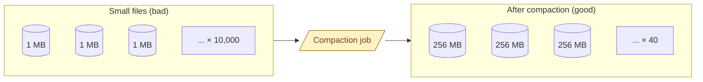

Object stores charge per file operation and metadata lookup. Query engines spend more time opening 10,000 1-MB files than 100 100-MB files, even though the total bytes are identical. This is the small-files problem. Every streaming pipeline produces it. Every analyst notices it. The fix is compaction.

**What this page will cover.**

- Where small files come from: streaming, partitioned writes, every-row inserts.
- The 128 MB to 512 MB sweet spot per file for most engines.
- Manual compaction: rewrite a partition's files into fewer larger ones.
- Auto-compaction: Delta's `OPTIMIZE`, Iceberg's rewrite_data_files, Hudi's clustering.
- Why partitioning too aggressively guarantees small files.
- The "10x bytes scanned for 0.1x rows returned" debug signature.

*Page coming soon.*

This concept sits in **Stage 5 (Storage and file formats)** of the [Data Engineering Roadmap](/practice/data-engineering/roadmap/).
