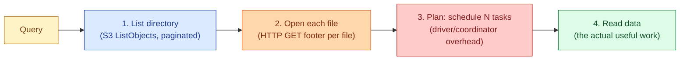
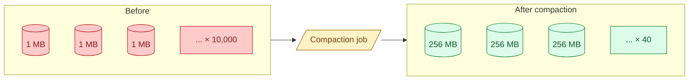

Object stores charge per file operation. Query engines spend more time opening 10,000 1-MB files than 100 100-MB files, even though the total bytes are identical. This is the small-files problem. Every streaming pipeline produces it. Every over-partitioned table produces it. Every CDC sink produces it. The fix is compaction, and the rule is to run it before performance falls off a cliff.

## Why small files are slow

Three costs add up. None of them is the data size.



**Listing.** S3 `ListObjects` returns 1000 keys per call. A partition with 10,000 files takes 10 round trips just to list. Glue, BigQuery, and Snowflake all pay similar listing costs.

**File opening.** Parquet stores its footer at the end. Opening a file means at least one HTTP GET to read the footer, then more GETs for the column chunks. Per-file overhead is roughly 50-200 ms on S3. 10,000 files = up to 30 minutes spent on opens alone.

**Planning.** Spark builds one task per file (roughly). 10,000 files = 10,000 tasks, each with scheduling and serialisation overhead at the driver. Trino, Dremio, and Athena have similar planning costs. The plan itself can take longer than the scan.

**Reading.** The actual useful work, often the smallest slice of total time.

On a healthy table (a few hundred well-sized files) the read dominates. On a small-files table the first three steps dominate, and the query is slow even though the data is small.

## Where small files come from

Almost always one of these four patterns.

**Streaming ingestion.** A Kafka sink commits every minute. Each commit produces one file per partition. After a day you have 1440 files per partition. After a year, 525,000.

**Over-partitioning.** A table partitioned by `user_id` with 10 million users creates 10 million partitions. Each one might hold a single 2 KB record. Catastrophic, and the most common partitioning anti-pattern. See [#020 Partitioning vs bucketing vs clustering](/practice/data-engineering/concepts/020-partitioning-vs-bucketing-vs-clustering/).

**Unbatched ingestion.** A pipeline writes one file per row, or one file per API response, instead of batching. Naive `INSERT INTO ... VALUES` in Spark or Hive.

**Frequent commits in a table format.** Delta, Iceberg, and Hudi all commit per write. A Structured Streaming job committing every 30 seconds produces 2880 files per partition per day, plus 2880 metadata files.

The underlying force is the same: every system that produces files tends to produce too many of them by default.

## The target size

The sweet spot for analytics file size is 128 MB to 1 GB. That range comes from balancing two costs.

- **Below 128 MB** the per-file overhead (list, open, plan) starts to dominate.
- **Above 1 GB** parallelism suffers; engines split work by file and very large files become hot tasks.
- **Above 5 GB** some engines choke on the file at all (out-of-memory in the reader, footer reads timing out).

The default to copy: aim for 256 MB or 512 MB per file, with 128 MB row groups inside. Most engines tune well there. BigQuery's internal capacitor format and Snowflake's micro-partitions sit roughly in the same range.

## Detecting the problem

The clearest signal is "bytes scanned per row returned" being absurd.

```sql
-- Query returns 10,000 rows. Bytes scanned: 50 GB. Ratio: 5 MB per row.
-- Something is very wrong.
```

Other signs:

- Query planning time is comparable to execution time.
- `LIST` operations dominate S3 cost.
- Spark UI shows thousands of tiny tasks, each finishing in milliseconds.
- A `SELECT COUNT(*)` on a small table takes minutes.
- Re-running the same query has the same latency cold and warm (because the bottleneck is file overhead, not actual reads).

When you see two of these together, run a file-size audit. In Delta or Iceberg you can query the file metadata directly:

```sql
-- Delta: distribution of file sizes
SELECT
  CASE
    WHEN size < 16 * 1024 * 1024  THEN '< 16 MB'
    WHEN size < 64 * 1024 * 1024  THEN '< 64 MB'
    WHEN size < 256 * 1024 * 1024 THEN '< 256 MB'
    ELSE '>= 256 MB'
  END AS bucket,
  COUNT(*) AS file_count,
  ROUND(SUM(size) / 1024.0 / 1024.0, 1) AS total_mb
FROM (DESCRIBE DETAIL my_table)
GROUP BY bucket
ORDER BY bucket;
```

If most files fall in the `< 16 MB` bucket, you have the problem.

## The fix: compaction

Compaction rewrites a partition's many small files into fewer larger ones. The data does not change; only the file layout does.



Each table format has a built-in command:

```sql
-- Delta
OPTIMIZE orders
WHERE date >= '2026-06-01' AND date <= '2026-06-30';

-- Delta with Z-order (compact + cluster)
OPTIMIZE orders ZORDER BY (customer_id);

-- Iceberg
CALL system.rewrite_data_files('orders');

-- Iceberg, sized targeting
CALL system.rewrite_data_files(
  table => 'orders',
  options => map('target-file-size-bytes', '268435456')
);

-- Hudi
CALL run_clustering(table => 'orders');
```

Raw Parquet without a table format means writing a Spark job that reads the partition, repartitions to the target file count, and overwrites:

```python
df = spark.read.parquet("s3://bucket/orders/dt=2026-06-01/")
(df.repartition(8)  # 8 files for ~2 GB partition → 256 MB each
   .write
   .mode("overwrite")
   .parquet("s3://bucket/orders/dt=2026-06-01/"))
```

The overwrite is not atomic in raw Parquet (a reader during the rewrite sees a mess). Table formats handle this with snapshot isolation; raw Parquet does not.

## How often to compact

Depends on write rate.

- **Streaming pipelines.** Compact hourly or daily, on a rolling window of recent partitions. Older partitions stay compacted.
- **Batch pipelines.** Compact the affected partitions right after the load if the load produced many small files. Otherwise weekly is fine.
- **CDC sinks (high churn).** Compact several times a day on the active partition. Hudi's merge-on-read does this incrementally.

The cost of running compaction is real (it is essentially a full rewrite of the affected partitions), so do not run it more often than the table receives meaningful writes.

## Preventing small files at the source

Compaction is the cure. The prevention is to write fewer, bigger files in the first place.

- **Batch streaming writes.** Commit every 5-10 minutes, not every 30 seconds. Trade some latency for far fewer files.
- **Coalesce before writing.** In Spark, `df.coalesce(N)` before `write` produces N files instead of the default 200.
- **Stop over-partitioning.** Day-level partitioning is fine for most tables. Hour-level only if you have meaningful hourly query patterns.
- **Use auto-optimize where available.** Delta has auto-optimize and auto-compact. Iceberg has commit-time compaction in some setups. Turn them on.

## A worked recovery

Inherited table: 50 GB total, 80,000 files, partitioned by `event_type` (200 values) and `dt` (365 days), so 73,000 partitions, most holding under 1 MB. Query latency on a 1-day filter: 4 minutes.

Steps to fix:

1. **Stop the bleeding.** Change the partition spec to `dt` only (drop `event_type` from partitioning). New writes will land in 365 partitions, not 73,000.
2. **Backfill into the new layout.** Read the old table, write into the new one with `dt` partitioning. Repartition to target ~256 MB files per partition. Use `OPTIMIZE` or `rewrite_data_files` after.
3. **Switch readers** to the new table.
4. **Verify.** Same query: 4 seconds. Bytes scanned dropped from 50 GB to ~200 MB.

This is the canonical small-files recovery and it shows up in almost every team's history at least once.

## Common mistakes

- **Ignoring the problem until queries fall over.** File counts grow linearly with time on streaming pipelines. By the time it hurts, it has hurt for months.
- **Compacting only the latest partition.** Old partitions stay broken. Compact the rolling window of partitions that gets queried.
- **Over-partitioning to "make queries faster."** It does the opposite when partition values are high-cardinality. See [#020 Partitioning vs bucketing vs clustering](/practice/data-engineering/concepts/020-partitioning-vs-bucketing-vs-clustering/).
- **Compacting without a target file size.** A naive rewrite can produce 200 large files when you wanted 40. Pass `target-file-size-bytes` or use `repartition(N)` with a real number.
- **Running compaction during peak query load.** Compaction is heavy. Schedule it off-peak or use auto-optimize during quiet windows.
- **Skipping vacuum after compaction.** Compaction produces new files; old files stay around for time-travel retention. Without vacuum, storage doubles.
- **Compacting raw Parquet with an overwrite while readers are live.** Without snapshot isolation, readers see inconsistent state. Either use a table format or schedule a maintenance window.

## Quick recap

- Small files kill query performance through listing, opening, and planning overhead, not through bytes read.
- Aim for 128 MB to 1 GB per file. 256 MB is a safe default.
- Streaming, over-partitioning, unbatched writes, and frequent commits are the four common causes.
- Compaction (`OPTIMIZE`, `REWRITE`, `rewrite_data_files`) merges small files into right-sized ones.
- Compact regularly on the rolling window of recent partitions; once per day is the usual cadence.
- Prevention is better than cure: batch writes, drop unnecessary partition columns, turn on auto-optimize.

This concept sits in **Stage 5 (Storage and file formats)** of the [Data Engineering Roadmap](/practice/data-engineering/roadmap/).
