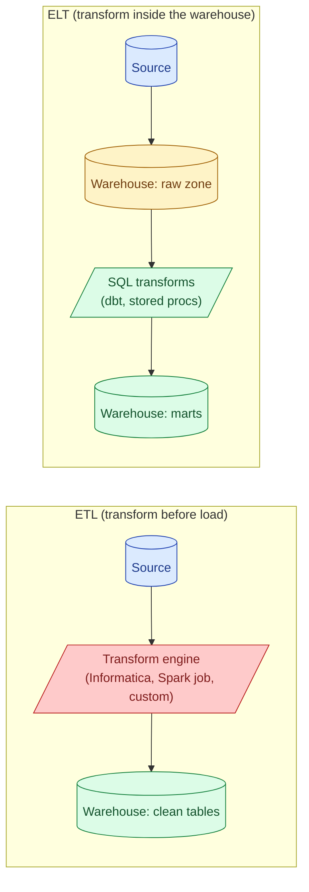
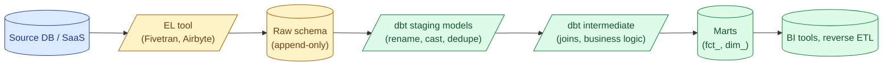
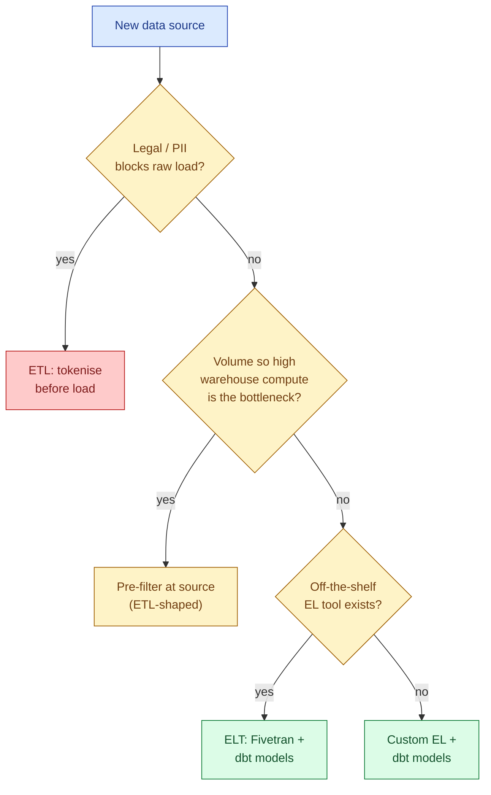

ETL transforms data before loading it into the warehouse. ELT loads everything raw, then transforms inside the warehouse using SQL. The order of the T is the entire argument, and ELT won the 2020s for one reason: cloud warehouses got fast and cheap enough that "transform with SQL on raw data" beat "transform with a separate compute engine you have to operate."

## The two shapes



In ETL, the raw source data never lands in the warehouse. A separate engine reads from the source, cleans and reshapes the rows, and writes the finished product. The warehouse only ever sees the polished version.

In ELT, the source rows land in the warehouse as-is, in a "raw" schema. All cleaning, joining, deduping, and shaping happens later, in SQL, inside the warehouse. The warehouse is both the storage and the compute.

## Why ELT won

Three things changed between roughly 2015 and 2020.

**Columnar warehouses got cheap.** BigQuery, Snowflake, Redshift, and Databricks SQL can scan terabytes in seconds. The "transform" half of ETL used to be a dedicated cluster you babysat. Now it is a SQL query against object storage.

**Storage got cheap relative to compute.** Keeping the raw rows around forever used to be expensive. Now S3 storage at a few cents per GB per month is a rounding error against the rest of the bill. You can afford to keep raw.

**dbt institutionalised the SQL-first workflow.** Before dbt, "SQL transforms" meant a folder of stored procedures and a job scheduler glued together with shell scripts. dbt gave us models, refs, tests, docs, and a sensible build order. It made SQL look like real software.

The result: extract-and-load became a commodity (Fivetran, Airbyte, Stitch), and transform became dbt models. Most modern stacks have no custom transform engine at all.

## When ETL still makes sense

ELT lost a few niches.

**PII and regulated data.** If you cannot legally land raw customer data in the warehouse (GDPR for some fields, HIPAA, PCI), you tokenise or hash before load. That happens in a separate process. The warehouse only ever sees the safe version.

**Extreme volume with cheap source-side compute.** If the source is already a Spark cluster sitting on raw events and you only need 1% of the rows, doing the filter in Spark and loading the slim result is cheaper than loading everything and filtering in the warehouse.

**Schema drift you want to police before it hits analysts.** Some teams want raw rows to be vetted (column types, required fields, allowed values) by a transform step before they reach any SQL model. That validation is the T in ETL.

**Legacy.** A working Informatica or SSIS pipeline that has been refined for ten years is not worth rewriting just to follow fashion.

## The modern hybrid: EL plus dbt T



The default 2026 shape is four layers:

1. **Source.** Operational database, SaaS app, event stream.
2. **Raw.** Loaded as-is by the EL tool. One row per source row, plus metadata columns (`_loaded_at`, `_source_file`).
3. **Staging.** Thin dbt models that rename columns, cast types, drop duplicates. One staging model per source table.
4. **Marts.** Business-shaped tables for analytics. Joined, aggregated, grain documented.

Each layer is just SQL. The staging layer is where most of the old ETL cleanup work now lives.

## A worked example

Source table from Stripe, loaded raw by Fivetran:

```sql
-- raw.stripe__charges (Fivetran appends rows; never updates in place)
charge_id      text
amount         integer    -- in cents
currency       text
status         text
created        timestamp
_fivetran_synced timestamp
```

The staging model that turns it into something usable:


```sql
-- models/staging/stg_stripe__charges.sql
{{ config(materialized='view') }}

select
    charge_id,
    amount / 100.0          as amount_usd,
    upper(currency)         as currency,
    status,
    created                 as charged_at,
    _fivetran_synced        as loaded_at
from {{ source('stripe', 'charges') }}
where status in ('succeeded', 'refunded')
```


The mart model that joins it to customers:


```sql
-- models/marts/fct_charges.sql
select
    c.charge_id,
    c.charged_at,
    c.amount_usd,
    cust.customer_id,
    cust.country
from {{ ref('stg_stripe__charges') }} c
left join {{ ref('stg_stripe__customers') }} cust
    on c.customer_id = cust.customer_id
```


No separate compute. No transform server. Two SQL files. That is ELT in 50 lines.

## What ELT costs you

ELT is not free.

**Warehouse compute bill.** The transform work that used to run on a fixed-cost EC2 cluster now runs on metered warehouse compute. Snowflake credits and BigQuery slot-seconds add up. A bad join in a dbt model can cost real money per run.

**SQL as a programming language.** SQL is great for set work and bad for control flow, recursion, complex string handling, and ML. Teams that push too much logic into SQL end up with 800-line models that nobody can read.

**Schema-on-read brittleness.** Because raw rows land as-is, any upstream schema change shows up as a downstream test failure or a silent NULL. The contract is implicit.

**Testing is harder.** dbt tests help (uniqueness, not-null, accepted values) but they run after the transform, not before. Unit tests for SQL still feel awkward in 2026.

## How to pick



Three questions, in order. Default answer: ELT with Fivetran or Airbyte for EL and dbt for T.

## Common mistakes

- **Calling a Spark batch job "ETL" and a SQL model "ELT".** The shape of where the T runs is what matters, not the tool. A Spark job that reads from raw S3 and writes back to S3 is doing ELT inside a data lake.
- **Treating raw as a finished product.** Analysts running queries directly against the raw schema is how you end up with five definitions of "active customer." Make staging the lowest layer analysts touch.
- **Skipping the staging layer.** Going straight from raw to marts saves files but loses every chance to centralise type casts and column renames. The first refactor will hurt.
- **Leaving full source dumps in raw forever without partitioning.** A 10 TB raw table that nobody queries selectively is a daily scan tax. Partition by load date.
- **Putting business logic in the EL tool.** Fivetran transforms and Airbyte normalisation creep are how you end up with logic split across two systems. Keep EL dumb; put logic in dbt.
- **Using ELT for genuinely sensitive PII without a separation layer.** Warehouses are auditable, but a poorly scoped role can still see raw SSNs. Hash or tokenise before the warehouse for fields where the unsanitised value should never exist in analytics.

## Quick recap

- ETL transforms before load. ELT loads raw and transforms inside the warehouse.
- ELT won because cloud warehouses got fast, storage got cheap, and dbt made SQL transforms a real workflow.
- ETL still fits for PII you cannot land, extreme volume with cheap source-side compute, and regulated cases.
- The modern stack is Fivetran or Airbyte for EL, dbt for T, four-layer schema (source, raw, staging, marts).
- ELT costs you warehouse compute and pushes complexity into SQL. Test models hard.
- Default to ELT. Pick ETL only when a hard constraint forces it.

This concept sits in **Stage 3 (Batch pipelines and orchestration)** of the [Data Engineering Roadmap](/practice/data-engineering/roadmap/).
