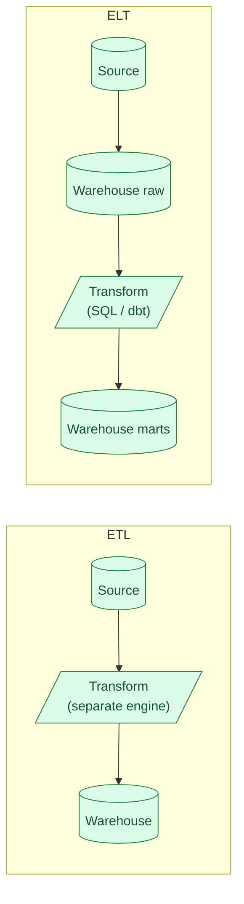

ETL transforms data before loading it into the warehouse. ELT loads everything raw, then transforms inside the warehouse using SQL. ELT won the 2020s because warehouses got fast enough that "transform with SQL" beat "transform with a separate compute engine you have to manage." dbt institutionalised this.

**What this page will cover.**

- Why fast columnar warehouses (BigQuery, Snowflake, Databricks SQL) changed the math.
- The dbt workflow: extract-load via Fivetran or Airbyte, transform via SQL models.
- When ETL still makes sense: PII you can't load raw, low-volume bursty sources, regulated industries.
- The hybrid: extract-load-transform-extract-load (the "data activation" pattern).
- Why ELT pushes complexity into SQL and what that means for testing.
- The honest 2026 default: ELT, dbt, columnar warehouse. Pick ETL only when forced.

*Page coming soon. Until then, see [#007 ETL vs ELT and why ELT won](/practice/data-engineering/007-etl-vs-elt-and-why-elt-won/) for the practice problem.*

This concept sits in **Stage 3 (Batch pipelines and orchestration)** of the [Data Engineering Roadmap](/practice/data-engineering/roadmap/).
