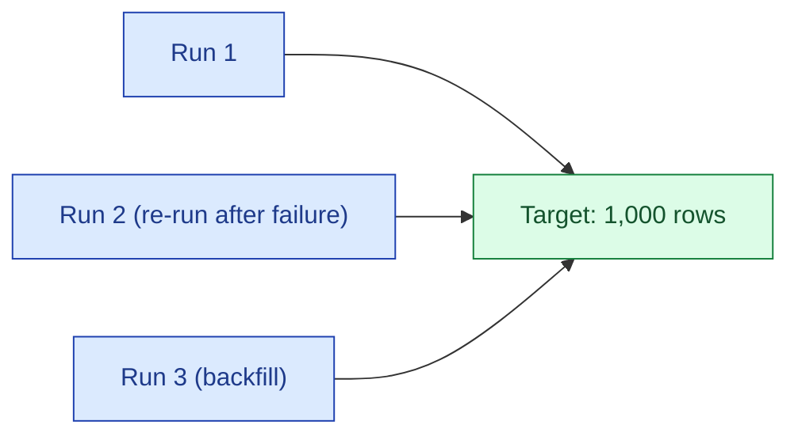
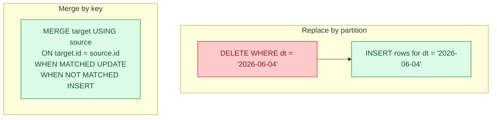
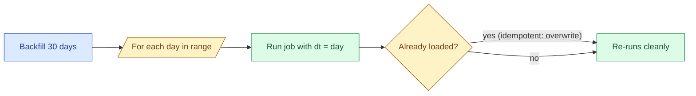

A batch job is idempotent if running it twice produces the same result as running it once. This sounds boring until you have lived through a 3 a.m. pipeline failure where the safe move is to just re-run. Idempotency is what makes that re-run actually safe. It is the single property that turns batch pipelines from anxious to boring, and boring is what you want.

## What "idempotent" means in batch

The strict definition: an operation `f` is idempotent if `f(f(x)) = f(x)`. For a batch job, that means:

- The output of run number 2 equals the output of run number 1.
- A retried job after partial failure produces the same final state as a clean run.
- A backfill of yesterday on top of an already-backfilled yesterday is a no-op, not a duplication.

The opposite is what you get when you wire up `INSERT INTO target SELECT * FROM source` on a cron. Run it twice and you get every row twice.



The target table looks the same after every run. That is the property you are after.

## Why it matters

Three reasons, in order of how often they bite.

**Retries.** Every orchestrator (Airflow, Dagster, Argo) retries failed tasks. If retries are unsafe, you have to disable them, and then every transient blip becomes a paged engineer. If retries are safe, you sleep.

**Backfills.** "Re-run the last 30 days through the new logic" is the most common ask in the life of a data team. If your job is idempotent, the answer is one CLI command. If it is not, you are planning a release.

**Partial failures.** A job that wrote 7 of 10 partitions before crashing leaves the warehouse in a half-state. With idempotent writes, you re-run and the 7 done partitions get overwritten with the same data while the 3 missing ones get written. Total state matches a clean run.

## The two canonical patterns

There are two patterns that cover 95% of batch idempotency in practice: replace-by-partition and merge-by-key.



**Replace by partition.** The job declares "I own the partition for `dt = X`." It deletes everything in that partition, then inserts the freshly computed rows. Re-running just deletes and re-inserts the same rows.

**Merge by key.** The job has a row-level key (`order_id`, `event_id`). For each row, if a row with that key exists, update it; otherwise insert. Re-running is a no-op when the inputs have not changed.

Choose by what you are loading. Fact-style tables with a date column: replace by partition. Slowly changing dimension or upsert from a transactional source: merge by key.

## Replace by partition: worked SQL

```sql
-- 1. Compute the new rows into a temp / CTE
with new_rows as (
    select
        order_id,
        customer_id,
        amount_usd,
        date_trunc('day', created_at)::date as dt
    from raw.orders
    where date_trunc('day', created_at)::date = date '2026-06-04'
)

-- 2. Delete + insert as one transaction
begin;
    delete from analytics.fct_orders where dt = date '2026-06-04';
    insert into analytics.fct_orders
    select * from new_rows;
commit;
```

The whole thing is wrapped in a transaction so a crash between the delete and the insert leaves the table untouched. On warehouses without multi-statement transactions (BigQuery historically), the same shape is expressed as `INSERT OVERWRITE PARTITION`:

```sql
-- BigQuery
INSERT OVERWRITE TABLE analytics.fct_orders
    PARTITION (dt = DATE '2026-06-04')
SELECT order_id, customer_id, amount_usd, dt
FROM raw.orders
WHERE dt = DATE '2026-06-04';
```

This is the dbt incremental pattern with `insert_overwrite` strategy. Spark has the same idea: write with `mode("overwrite")` and `partitionOverwriteMode = "dynamic"`.

## Merge by key: worked SQL

```sql
MERGE INTO analytics.dim_customers t
USING (
    select
        customer_id,
        email,
        country,
        signup_date,
        current_timestamp as updated_at
    from raw.customers
    where _loaded_at > '2026-06-03'
) s
ON t.customer_id = s.customer_id
WHEN MATCHED THEN UPDATE SET
    email = s.email,
    country = s.country,
    updated_at = s.updated_at
WHEN NOT MATCHED THEN INSERT (customer_id, email, country, signup_date, updated_at)
    VALUES (s.customer_id, s.email, s.country, s.signup_date, s.updated_at);
```

Run this once: every changed row in the source produces an update or insert. Run it again with no new source data: zero rows match, zero rows change. Run it after fixing a bug in the source query: the new values overwrite the old.

The key requirement: `customer_id` must be a stable, deterministic identifier. If you generate a surrogate key with `row_number()` over an unordered query, idempotency is gone.

## What breaks idempotency

These are the four most common bugs.

**`INSERT` without `DELETE`.** The classic. Run twice, get every row twice. Solution: replace-by-partition or merge-by-key.

**Non-deterministic surrogate keys.** `row_number() over (order by created_at)` looks deterministic but is not when `created_at` has ties or when the input query order changes. Use a hash of the natural key instead: `md5(order_id || event_type)`.

**`now()` or `current_date` baked into the transform.** Two runs of the same logical day produce different timestamps in the output rows. The output rows are different. Idempotency lost. Pass the run date in as a parameter instead.

**External state.** "I already processed this file" tracked in a separate metadata table or DynamoDB. Now the job is only idempotent if you also reset that state. Avoid. Make the warehouse itself the source of truth for what is loaded.

## The backfill payoff



Once a job is idempotent, backfill becomes trivial: a loop that calls the same job with a different date parameter. No "is this day already done" check needed. No "what if it ran half-way" recovery. Just re-run.

This is why teams that obsess over idempotency early move so much faster later. Every new pipeline gets the same backfill wrapper. New engineers ship features instead of writing one-off recovery scripts.

## Common mistakes

- **Trusting `INSERT IGNORE` or `ON CONFLICT DO NOTHING` for idempotency.** They hide duplicates instead of preventing them. The second run silently drops legitimately changed rows.
- **Mixing `now()` into transform logic.** Any column derived from `now()` makes the output non-deterministic. Pass the run date in.
- **Using `created_at` as the watermark for an incremental load that uses replace-by-partition.** A row's `created_at` does not move, but a late-arriving row for yesterday will not be picked up by today's partition. Use the partition column the table is actually partitioned on.
- **Multi-statement deletes and inserts outside a transaction.** A crash in the middle leaves the table in a half-state and the next run is no longer idempotent.
- **Idempotent transforms feeding non-idempotent sinks.** A clean dbt model that writes via an append-only API to a downstream system loses the property at the boundary.
- **Renaming the partition column between releases.** Old runs targeted `event_date`, new runs target `dt`. The delete-by-partition does not match the old data, and you double-write.
- **Treating "the row count went up" as evidence the job worked.** It also goes up when you accidentally double-loaded.

## Quick recap

- Idempotent means re-running yields the same result as running once.
- The two patterns: replace-by-partition (for fact tables on a date grain) and merge-by-key (for dimension or upsert loads).
- Wrap delete-then-insert in a transaction so a crash mid-job leaves the table untouched.
- Kill `now()`, `current_date`, and external state from your transforms. Pass the run date in.
- Idempotency makes retries safe, backfills trivial, and partial failures recoverable.
- The dbt incremental and `INSERT OVERWRITE PARTITION` patterns are idempotent by construction. Default to one of them.

This concept sits in **Stage 3 (Batch pipelines and orchestration)** of the [Data Engineering Roadmap](/practice/data-engineering/roadmap/).
