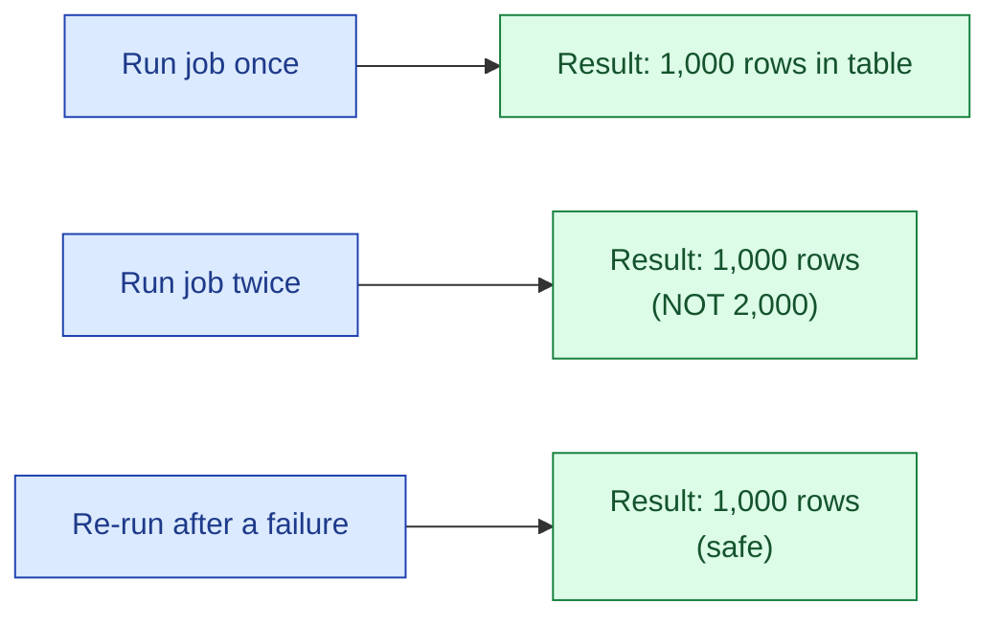

A job is idempotent if running it twice produces the same result as running it once. Idempotency is what lets you re-run a failed job at 3 a.m. without worrying. It is what lets you backfill the last 30 days without thinking. It is the most underrated property of a data pipeline.

**What this page will cover.**

- The two main ways: replace partition (delete + insert) and merge (upsert).
- The natural-key requirement: idempotency needs a deterministic primary key.
- Why "INSERT IGNORE" hides bugs but "MERGE" surfaces them.
- The `dbt run` model: every model is full-replace or incremental-merge by default.
- The state stored outside the warehouse (filenames consumed, offsets processed) that breaks idempotency.
- The "right way to backfill" that falls out of idempotency for free.

*Page coming soon. Until then, see [#009 Idempotency in data pipelines](/practice/data-engineering/009-idempotency-in-data-pipelines/) for the practice problem.*

This concept sits in **Stage 3 (Batch pipelines and orchestration)** of the [Data Engineering Roadmap](/practice/data-engineering/roadmap/).
