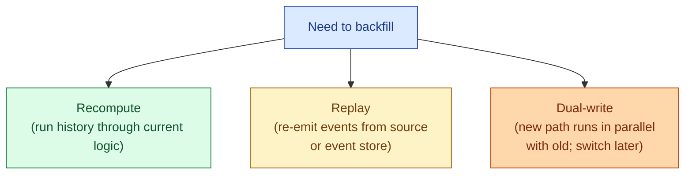
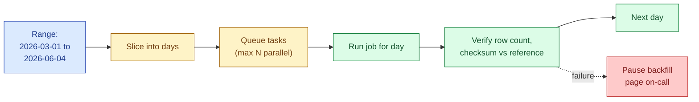

A backfill is rerunning a pipeline for a period in the past. New column, fixed bug, forgotten source, schema change, an SLA you missed. Three strategies cover almost every case: recompute from source, replay events through the pipeline, and dual-write while the new path catches up. Picking the wrong one is how a "quick backfill" becomes a three-day incident.

## The three strategies



**Recompute.** The source data is still there. You run the current transform over the historical partitions. This is the default for warehouse-native pipelines: source rows live in `raw.*`, you re-run the dbt model for each historical day, and the partition gets overwritten. Cheap, idempotent, no source-side coordination.

**Replay.** The transform consumes a stream (Kafka, Kinesis, a Debezium feed). You replay the historical events from the broker or the event store, and the transform processes them again. Works when the broker retains long enough; works less well when retention is one day and you need 90.

**Dual-write.** The new pipeline runs alongside the old one. Both write to different target tables. You compare for a week or two, then flip readers to the new table. The "backfill" is just letting the new path run forward in time until it reaches now. Best when the old path is too entangled to recompute against, but expensive (you are paying for both pipelines).

## When each one fits

| Strategy | Fits when | Avoid when |
|---|---|---|
| Recompute | Source rows are immutable and still in storage | Source has been mutated since (UPDATE in place) |
| Replay | Event store retains long enough; events are immutable | Broker retention is shorter than backfill window |
| Dual-write | Logic change is large; you cannot prove equivalence offline | Cost-sensitive; you cannot afford to run both |

Most batch warehouse work is recompute. Replay shows up in event-sourced systems and CDC pipelines. Dual-write is the migration tool, not the daily one.

## The partition-at-a-time playbook

Whatever the strategy, the operational shape is the same: do it one partition (usually one day) at a time, in a loop, with throttling.



Five rules that make this work in practice.

1. **One partition per task.** Day-grain is the default. If a day is too big, hour. If too small, week. The size matches what one task can reliably finish in 10-30 minutes.
2. **Cap concurrency.** Two to five concurrent tasks is usually right. More and you starve the live daily run. Less and the backfill takes forever.
3. **Isolate compute.** Run the backfill on a separate warehouse, Spark pool, or Airflow queue. Live dashboards keep their compute. The backfill cannot starve production.
4. **Verify each partition.** After each day, check row count against an expected number (last good run, source count, or sibling pipeline). Fail loudly if the gap is more than 1%.
5. **Make it kill-switchable.** A flag in config or a paused Airflow DAG that stops new tasks from being enqueued. Always have one.

## A recompute example

The classic case: you added a `country` column to `fct_orders` and need to populate it for the last 90 days.

```bash
# Backfill loop (pseudocode, would run via Airflow or a shell driver)
for day in $(seq_days 2026-03-01 2026-06-04); do
    while [ "$(running_tasks)" -ge 5 ]; do sleep 30; done
    dbt run --select fct_orders \
            --vars "{'run_date': '$day'}" \
            --target backfill_warehouse &
done
wait

# Verify
for day in $(seq_days 2026-03-01 2026-06-04); do
    expected=$(query "select count(*) from raw.orders where dt = '$day'")
    actual=$(query   "select count(*) from analytics.fct_orders where dt = '$day'")
    if [ "$expected" != "$actual" ]; then
        echo "MISMATCH on $day: raw=$expected fct=$actual"
    fi
done
```

The dbt model itself is idempotent (replace-by-partition). The backfill loop just calls it once per day with the date variable. Five tasks in flight at a time. Verification at the end. Nothing fancy.

## A replay example

Pipeline consumes from a Kafka topic. Yesterday's transform had a bug; you need to re-run it for the last seven days.

```python
# Pseudocode
from kafka import KafkaConsumer

consumer = KafkaConsumer(
    'orders',
    group_id='backfill-orders-20260604',  # NEW group so we don't disturb live
    auto_offset_reset='earliest',
)

# Seek to a timestamp seven days ago
seven_days_ago_ms = int((time.time() - 7 * 86400) * 1000)
partitions = consumer.partitions_for_topic('orders')
for p in partitions:
    tp = TopicPartition('orders', p)
    offsets = consumer.offsets_for_times({tp: seven_days_ago_ms})
    consumer.seek(tp, offsets[tp].offset)

# Drain into the (idempotent) transform
for msg in consumer:
    if msg.timestamp_ms > now_ms:
        break
    transform_and_write(msg)
```

A separate consumer group means the live pipeline is unaffected. The transform must be idempotent, because every event will land in the target table whether the live pipeline already processed it or not.

## A dual-write example

You are migrating from a legacy daily Spark job to a new dbt model. The two produce slightly different numbers and you cannot tell which is right.

1. Both pipelines write to different tables (`analytics.fct_orders_legacy` and `analytics.fct_orders_new`).
2. A reconciliation query runs nightly:
   ```sql
   select dt,
          sum(legacy.amount) - sum(new.amount) as diff_usd
   from analytics.fct_orders_legacy legacy
   full outer join analytics.fct_orders_new new
       using (order_id, dt)
   where dt >= current_date - 14
   group by dt
   order by abs(diff_usd) desc
   ```
3. When the diff is consistently under a threshold for two weeks, swap the BI layer to read from `_new` and decommission `_legacy`.

You pay for both pipelines for the duration, but you ship a migration without a flag day.

## The watch-outs

**Idempotency is the prerequisite.** Backfill on a non-idempotent job double-loads. Get idempotency first; backfill second. See [idempotent batch jobs](/practice/data-engineering/concepts/025-idempotent-batch/).

**Late-arriving data.** A row for 2026-05-01 that lands in the source on 2026-06-01 is invisible to a backfill of 2026-05-01 if you scope by `created_at`. Scope by ingestion date when possible, or accept the rare drift.

**Dimension drift.** Joining yesterday's facts against today's dimensions is rarely what you want. If `dim_customers` has a current view only, a 90-day-old fact join now reflects current customer state. SCD type 2 dimensions solve this; many setups do not have them and the backfill silently shifts.

**Source mutability.** If the source table is an operational `customers` table that gets UPDATEd in place, recompute against it does not actually reproduce history. Either snapshot the source nightly, or use CDC and replay.

**Cost.** A 90-day backfill is 90 days of compute compressed into a few hours. Set a budget cap. Most warehouses let you set a query timeout or a credit limit per warehouse.

## Common mistakes

- **Running the full backfill in one task.** "Just process the whole range" is how you get a 12-hour query that fails at hour 11. One day per task, always.
- **Running the backfill on the production warehouse pool.** Live dashboards slow down or fail. Always use a separate compute pool.
- **Forgetting to scope the source query by the same partition.** You backfill day X but the transform reads all of source. Either you double the cost, or worse, you blow over today's data with stale logic.
- **Backfilling without verifying.** Row counts and aggregate checks per day catch silent failures (one day produces zero rows because the source had a schema change). No verification means trusting the orchestrator alone.
- **No kill switch.** A backfill that has run away costs money and pages people. A single config flag that stops new task submission is non-negotiable.
- **Mixing live and backfill writes to the same target without isolation.** A late live task can overwrite a backfilled partition. Either pause live during the overlap or write to a separate partition column.
- **Replaying from a broker that has aged out the data.** You start the replay, get the last day of retained data, and call it done. Always check the earliest offset against your target window first.

## Quick recap

- Three strategies: recompute (run history through current logic), replay (re-emit events), dual-write (run both in parallel and compare).
- Default for warehouse pipelines is recompute. Replay fits event-sourced systems. Dual-write fits migrations.
- Operational shape is the same: one partition per task, capped concurrency, isolated compute, verify each partition, kill switch.
- Idempotency is the prerequisite. Late-arriving data, dimension drift, and source mutability are the three subtle traps.
- Set a budget cap. Watch row counts per partition. Pause the backfill at the first sign of drift.

This concept sits in **Stage 3 (Batch pipelines and orchestration)** of the [Data Engineering Roadmap](/practice/data-engineering/roadmap/).
