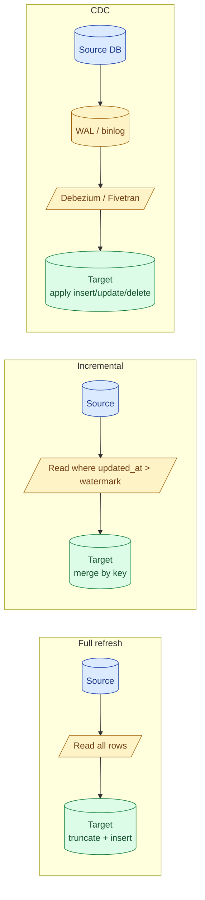
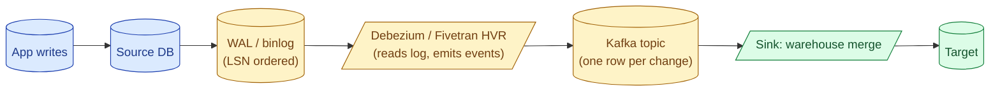
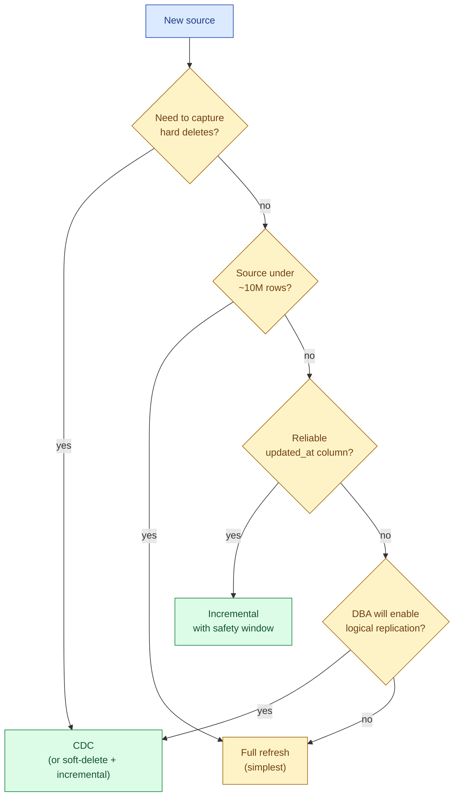

A full refresh rebuilds the whole table every run. An incremental load processes only new or changed rows since the last successful run. A CDC-driven load reads the source database's change log and applies inserts, updates, and deletes as they happened. Each one wins for a specific source shape. Picking wrong is the most common ETL bug.

## The three shapes



## Full refresh

The simplest pattern. Each run truncates the target table and re-inserts everything from the source.

```sql
-- Pseudo full-refresh
begin;
    truncate table analytics.dim_country;
    insert into analytics.dim_country
    select code, name, region from raw.countries;
commit;
```

**Fits when:** the source is small (under a few million rows), or correctness matters more than freshness, or the source has no reliable watermark column.

**Trade-off:** every run reads the entire source. Trivially idempotent. Captures deletes for free (anything not in the source is dropped). Wastes compute when 99.9% of rows did not change.

**Sweet spot:** reference data, dimensions, small lookup tables, anything under a few million rows refreshed nightly.

## Incremental

Process only rows that changed since the last run, using a column on the source (usually `updated_at` or `modified_at`) as the watermark.


```sql
-- Pseudo incremental


merge into analytics.fct_orders t
using (
    select order_id, customer_id, amount, status, updated_at
    from raw.orders
    where updated_at > '{{ last_run }}'
) s
on t.order_id = s.order_id
when matched then update set
    customer_id = s.customer_id, amount = s.amount,
    status = s.status, updated_at = s.updated_at
when not matched then insert
    values (s.order_id, s.customer_id, s.amount, s.status, s.updated_at);
```


**Fits when:** the source has a reliable watermark column and updates change that column. Large tables where re-reading everything is wasteful.

**Trade-off:** fast (read only the delta), needs a watermark column you can trust, does not natively capture deletes.

## The watermark column problem

Incremental loads are only as good as the watermark column. Three things go wrong.

**Clock skew.** Source rows are written with `updated_at = now()` from different application servers. Server B's clock is 30 seconds behind server A's. Row B written at `12:00:00` by server-B-clock is actually `12:00:30` wall clock. Your watermark sees `12:00:00`; next run starts from `12:00:00`; row A written at `12:00:00.5` already loaded gets reloaded (fine), but row B written at `12:00:29` wall-clock with `updated_at = 11:59:59.5` is missed forever.

**Mitigation:** subtract a safety window. Read where `updated_at > last_run - 5 minutes` and rely on the MERGE to deduplicate.

**Updates that do not bump the column.** A nightly batch in the source updates `status` but forgets to touch `updated_at`. The row never shows up in your incremental window. Silent drift.

**Mitigation:** if you control the source, add a database trigger. If you do not, fall back to full refresh on a weekly cadence as a reconciliation safety net.

**Soft deletes vs hard deletes.** Incremental loads never see hard deletes. A row that was in the source last week and is gone today simply does not appear in the delta. Your target still has it.

**Mitigation:** require soft deletes in the source (`is_deleted = true` flag, `deleted_at` timestamp). Then a soft-delete is just another update and the watermark picks it up.

## CDC-driven loads

Change Data Capture reads the source database's transaction log (Postgres WAL, MySQL binlog, SQL Server CDC tables). Every committed change becomes an event: `INSERT`, `UPDATE`, `DELETE`, with before-and-after row images.



The event for an UPDATE typically carries:

```json
{
  "op": "u",
  "ts_ms": 1717497600000,
  "before": { "order_id": 42, "status": "pending",   "updated_at": "..." },
  "after":  { "order_id": 42, "status": "shipped",   "updated_at": "..." },
  "source": { "lsn": "0/16B3E48", "db": "shop", "table": "orders" }
}
```

The downstream sink merges by primary key for `INSERT` and `UPDATE`, and applies a delete for `DELETE`. The LSN (log sequence number) gives a total ordering you can use to break ties.

**Fits when:** you need hard deletes captured, you need every intermediate state of a row (for SCD type 2), or your source is too active for incremental polling.

**Trade-off:** real infrastructure (Debezium, Kafka, connectors). Requires the source DB to enable logical replication or equivalent, which DBAs sometimes resist because of WAL retention. The fastest pattern when set up. Costs the most to operate.

## How to pick



In practice, most teams end up with all three:

- Full refresh on small dimension tables and reference data.
- Incremental on most fact tables (high volume, watermark column is reliable).
- CDC on the few source tables where deletes or audit history matter (orders, payments).

## The hybrid pattern

A common production setup: incremental every 15 minutes, full refresh once a week as a reconciliation.

```text
00:00 Sunday    -> full refresh (catches missed updates, deletes)
every 15 min   -> incremental (fast, fresh)
```

The full refresh covers for the watermark column's failure modes. The incremental keeps latency low between full runs. Costs ~5% extra compute (one weekly full read) for a giant correctness boost.

## Common mistakes

- **Using `created_at` as the watermark column on a table that gets updated.** A row created on day 1, updated on day 3, will not appear in day-3 incremental. Use `updated_at` (or whichever column actually moves on UPDATE).
- **No safety window on the watermark.** Clock skew between source servers means rows arrive with `updated_at` slightly in the past. Always subtract a buffer (5 to 60 minutes) and rely on the merge.
- **Trusting incremental loads to capture deletes.** They cannot. Add soft-deletes upstream, or pair incremental with a weekly full reconciliation, or move to CDC.
- **Picking CDC for a low-volume source.** CDC has high operational fixed cost (Debezium, Kafka, schema registry). For a 100,000-row source updated daily, full refresh is one SQL statement and one cron line.
- **Running incremental with `>=` instead of `>` on the watermark.** Equal timestamps double-load. Use `>` and let the merge handle late equal-timestamps.
- **Forgetting that CDC events arrive out of order across partitions.** If you have multiple Kafka partitions for one source table, applying events in arrival order can apply an old UPDATE after a new one. Sort by LSN within a key before merging.
- **Building a "smart" incremental that scans the whole source to find changed rows.** That is a full refresh in disguise, except slower and with bugs.

## Quick recap

- Three strategies: full refresh (rebuild everything), incremental (delta by watermark), CDC (stream events from the source log).
- Full refresh is the default for small reference data. Trivially correct, captures deletes, wastes compute on big tables.
- Incremental fits big tables with a reliable `updated_at` column. Always use a safety window. Does not capture deletes.
- CDC reads WAL or binlog via Debezium-style tools. Captures deletes and full row history. Highest operational cost.
- Most teams mix all three: dims on full, facts on incremental, audit-critical sources on CDC.
- The hybrid pattern (incremental every 15 min, full refresh weekly) gives you cheap freshness with a correctness safety net.

This concept sits in **Stage 3 (Batch pipelines and orchestration)** of the [Data Engineering Roadmap](/practice/data-engineering/roadmap/).
