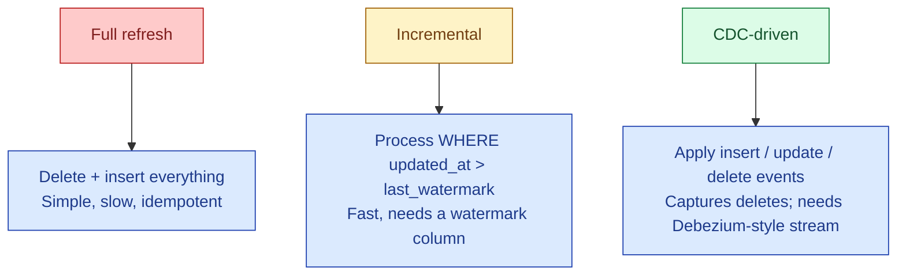

A full refresh rebuilds the whole table every run. An incremental load processes only new rows since the last successful run. A CDC-driven load reads the source database's change log and applies inserts, updates, and deletes. Each one wins in a specific situation. Mixing them up is one of the most common ETL bugs.

**What this page will cover.**

- Full refresh: when the table is small or correctness over freshness matters.
- Incremental: the watermark column rules (must be monotonic, must be reliable).
- CDC: when you need to capture deletes or out-of-order updates.
- The hybrid: full refresh on a schedule + incremental between full refreshes.
- The "late-arriving rows" problem and how each strategy handles it.
- Picking the right one with a 4-question decision tree.

*Page coming soon.*

This concept sits in **Stage 3 (Batch pipelines and orchestration)** of the [Data Engineering Roadmap](/practice/data-engineering/roadmap/).
