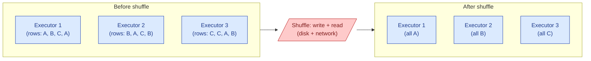

A Spark or Hive job spreads work across many executors. Sometimes the work needs to be regrouped — all rows with the same `customer_id` need to land on the same executor. That regrouping is a shuffle: every executor writes its share to disk, then every executor reads back the parts it now owns. Shuffles cost network, disk, and time.

**What this page will cover.**

- The operations that trigger a shuffle: `groupBy`, `join` (without broadcast), `distinct`, `repartition`, window functions.
- Why a shuffle is often the most expensive step in the whole job.
- Reducing shuffle: filter early, project columns early, use broadcast joins where possible.
- Skew during shuffle: one executor gets 10x the rows and stalls the job.
- Shuffle service tuning in Spark (spill threshold, partition count).
- Reading the Spark UI to find the shuffle that is killing your job.

*Page coming soon.*

This concept sits in **Stage 3 (Batch pipelines and orchestration)** of the [Data Engineering Roadmap](/practice/data-engineering/roadmap/).
