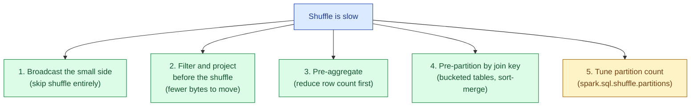

A Spark or Hive job spreads work across many executors. Sometimes the work needs to be regrouped, so all rows with the same key land on the same executor. That regrouping is a shuffle. Every executor writes its share to local disk, every executor reads back the parts it now owns, and the network ferries the bytes between them. Shuffles cost network, disk, serialisation, and time, and they are almost always the most expensive thing in a job.

## What a shuffle actually is

```mermaid
flowchart LR
    subgraph Before["Before shuffle (data on each executor)"]
        E1["Executor 1<br/>(A, B, A, C)"]:::e
        E2["Executor 2<br/>(B, C, A, B)"]:::e
        E3["Executor 3<br/>(C, A, B, C)"]:::e
    end
    Before --> W[/"Shuffle write<br/>(each executor partitions<br/>and spills to local disk)"/]:::r
    W --> N[/"Network fetch<br/>(executors pull their<br/>partitions over wire)"/]:::r
    N --> Read[/"Shuffle read<br/>(deserialise into memory)"/]:::r
    Read --> After
    subgraph After["After shuffle (regrouped by key)"]
        F1["Executor 1<br/>(all A)"]:::e
        F2["Executor 2<br/>(all B)"]:::e
        F3["Executor 3<br/>(all C)"]:::e
    end

    classDef e fill:#dbeafe,stroke:#1e40af,color:#1e3a8a
    classDef r fill:#fecaca,stroke:#b91c1c,color:#7f1d1d
```



The three-step dance is what makes shuffles so expensive.

1. **Shuffle write.** Each executor reads its current partition, hashes each row by the shuffle key, and writes one file per target partition to local disk. If you have 200 reducers, every executor writes 200 small files.
2. **Network fetch.** Each reducer asks every mapper for its share. With M mappers and R reducers, that is `M x R` HTTP-style fetches. The data crosses the network in serialised form.
3. **Shuffle read.** Each reducer deserialises the fetched bytes into memory, possibly sorting or hashing them, and the next stage begins.

Every step touches disk or the wire. CPU spent serialising and deserialising is non-trivial. None of this happens within a single stage; it is the boundary between stages.

## What triggers a shuffle

Any operation that needs rows with the same key on the same executor.

| Operation | Why it shuffles |
|---|---|
| `groupBy(key).agg(...)` | All rows for one key must aggregate together |
| `join(other, on='key')` (non-broadcast) | Matching keys must meet on the same executor |
| `distinct()` | Same key must dedupe together |
| `repartition(n)` or `repartition(col)` | Explicit redistribution |
| `orderBy(col)` (global sort) | Range-partition then sort within partitions |
| Window functions with a `partitionBy` | Each window partition must land on one executor |

Operations that do not shuffle: `filter`, `select`, `withColumn`, `map`, `union` (often), `coalesce` to fewer partitions, broadcast joins.

The mental model: anything that says "all rows where X = Y need to be in the same place" is a shuffle.

## Why it dominates job time

For a typical analytics query in Spark, the cost breakdown looks roughly like this for a 10-minute job over a few hundred GB.

| Step | Time |
|---|---|
| Read Parquet from S3 | 1-2 min |
| Filter, project columns | 30 sec |
| **Shuffle write** | **2-3 min** |
| **Network transfer** | **1-2 min** |
| **Shuffle read + sort** | **1-2 min** |
| Aggregate | 1 min |
| Write output | 30 sec |

Two-thirds of the wall clock is the shuffle. Worse, the shuffle is the thing that does not scale linearly: doubling the cluster size halves the read and the aggregate, but the shuffle stays roughly the same (more parallel writes, more fetches, same total bytes on the wire).

## A concrete example

A join in PySpark:

```python
orders = spark.read.parquet("s3://.../orders/")        # 500M rows
customers = spark.read.parquet("s3://.../customers/")  # 5M rows

joined = orders.join(customers, on="customer_id", how="left")
joined.groupBy("country").sum("amount").show()
```

Two shuffles in this DAG:

1. **The join.** Both sides shuffled by `customer_id` (unless Spark decides to broadcast `customers`).
2. **The groupBy.** Result of the join shuffled by `country`.

In the Spark UI you will see two stage boundaries with `shuffle write` and `shuffle read` metrics. If the input is 50 GB, each shuffle write is roughly 50 GB on disk, and 50 GB on the wire. That is 100 GB of network and 100 GB of disk for two shuffles, before any aggregation happens.

## How to minimise shuffle

Five techniques, in roughly decreasing order of impact.



**Broadcast.** If one side fits in memory (~10-100 MB), ship it to every executor and skip the shuffle. See [broadcast vs shuffle joins](/practice/data-engineering/concepts/030-broadcast-vs-shuffle-joins/).

**Filter and project early.** Push your `where` and `select` above the shuffle. A 100 GB shuffle over rows that get filtered out anyway is wasted. The query optimiser does much of this for you, but check the explain plan.

**Pre-aggregate.** A common pattern: `groupBy(key).agg(sum)` followed by `join`. Aggregating first reduces the join size dramatically. Spark's "partial aggregation" inside the shuffle stage does some of this automatically (a `HashAggregate` node before the exchange).

**Pre-partition by join key.** If you write a table partitioned/bucketed by the join column, subsequent joins on that column can skip the shuffle. Iceberg, Delta, and Hive bucketing all support this.

**Tune `spark.sql.shuffle.partitions`.** Default is 200. Too low for big jobs (each task too large, spills); too high for small jobs (overhead per task dominates). Rule of thumb: aim for partitions of ~128 MB each.

## Reading the Spark UI

The UI is where you diagnose shuffles. Three places to look.

**Stages tab.** Each stage boundary is a shuffle. Click into a stage and look at:

- **Shuffle Write Size.** Bytes written to local disk for the next stage to fetch.
- **Shuffle Read Size.** Bytes pulled over the network. Should roughly equal shuffle write of the previous stage.
- **Shuffle Spill (Disk).** Memory pressure caused data to spill. If non-zero, your executors are under-sized or your partition count is too low.

**SQL tab.** The DAG visualisation shows each `Exchange` node (Spark's name for a shuffle). The metrics under each Exchange tell you exactly how much went where.

**Executors tab.** If shuffle write/read is uneven across executors (one has 10x the others), you have skew. See [data skew](/practice/data-engineering/concepts/029-skew-handling/).

## What "broadcast" buys you

A broadcast join replaces the shuffle with a one-time send of the small side to every executor.

| | Shuffle join | Broadcast join |
|---|---|---|
| Bytes on the wire | ~ size of both sides | size of small side, sent N times |
| Disk I/O | shuffle write + read | none |
| Stage boundaries | 1 (shuffle) | 0 |
| Wins when | both sides large | small side fits in memory |

A 10 MB dimension broadcast to 100 executors costs 1 GB of network total. A 100 GB fact + 10 GB dim shuffle costs ~110 GB. The broadcast is two orders of magnitude cheaper. This is why broadcast is the default for star-schema fact-and-dim joins.

## Common mistakes

- **Calling `repartition()` "to balance" without thinking.** It is a full shuffle. If your data is already reasonable, you just doubled the job time.
- **Tuning `spark.sql.shuffle.partitions` once and forgetting.** A value that works for a 100 GB job is wrong for a 1 TB job. Enable AQE (Spark 3+) and let it adjust dynamically.
- **Joining before filtering.** Filter first, project the columns you actually need, then join. The optimiser usually does this, but verify with `explain()`.
- **Forgetting `coalesce()` after a heavy filter.** A `where` clause that drops 99% of rows leaves you with mostly-empty partitions. `coalesce(20)` (no shuffle) reduces task overhead in the next stage.
- **Using `distinct()` when `groupBy().agg()` would do.** Both shuffle. `distinct()` keeps every column; if you only need a few, project first.
- **Misreading "shuffle write" as "the bug."** Shuffle write is the symptom. The cause is usually a missing broadcast, a too-late filter, or a skew you can salt.
- **Treating shuffle as something to eliminate.** Some shuffles are necessary. The goal is to make them small (few bytes, balanced across keys), not to make them disappear.

## Quick recap

- A shuffle redistributes rows across executors so matching keys end up together. It costs network, disk, and serialisation.
- Triggered by `groupBy`, non-broadcast `join`, `distinct`, `repartition`, global sort, partitioned window functions.
- In a typical job, shuffle is the largest single cost in wall-clock time.
- Five levers, in order: broadcast the small side, filter and project early, pre-aggregate, pre-partition, tune shuffle partition count.
- Read the Spark UI Stages and SQL tabs. Look at shuffle write/read bytes and spill.
- Broadcast joins skip the shuffle entirely when the small side fits in memory. Default to this for star-schema queries.

This concept sits in **Stage 3 (Batch pipelines and orchestration)** of the [Data Engineering Roadmap](/practice/data-engineering/roadmap/).
