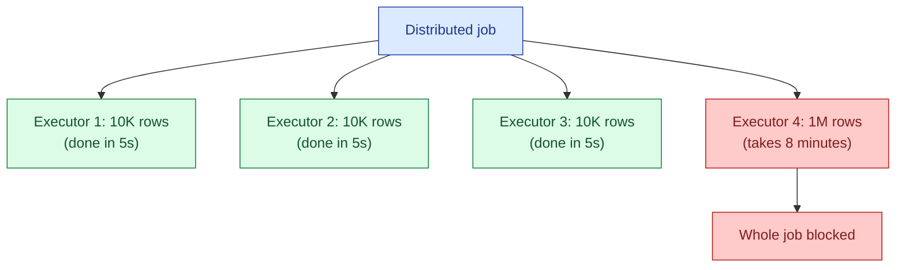

A skewed key dominates a distributed job. Think of an `events` table where one customer has 100x more rows than any other. When the job shuffles by `customer_id`, that one executor processes 100x the work while the others finish in seconds. The job takes as long as the slowest executor.

**What this page will cover.**

- Spotting skew in the Spark UI: one task takes 100x longer than the median.
- Salting: appending a random prefix to skewed keys, joining, then aggregating.
- Adaptive Query Execution (AQE) in Spark 3+ and what it does for skew automatically.
- Broadcast joins as a way to avoid shuffle entirely for the skewed side.
- Pre-aggregating before joining to reduce the row count per skewed key.
- The honest take: salting is the universal fix; the others are nice when they apply.

*Page coming soon.*

This concept sits in **Stage 3 (Batch pipelines and orchestration)** of the [Data Engineering Roadmap](/practice/data-engineering/roadmap/).
