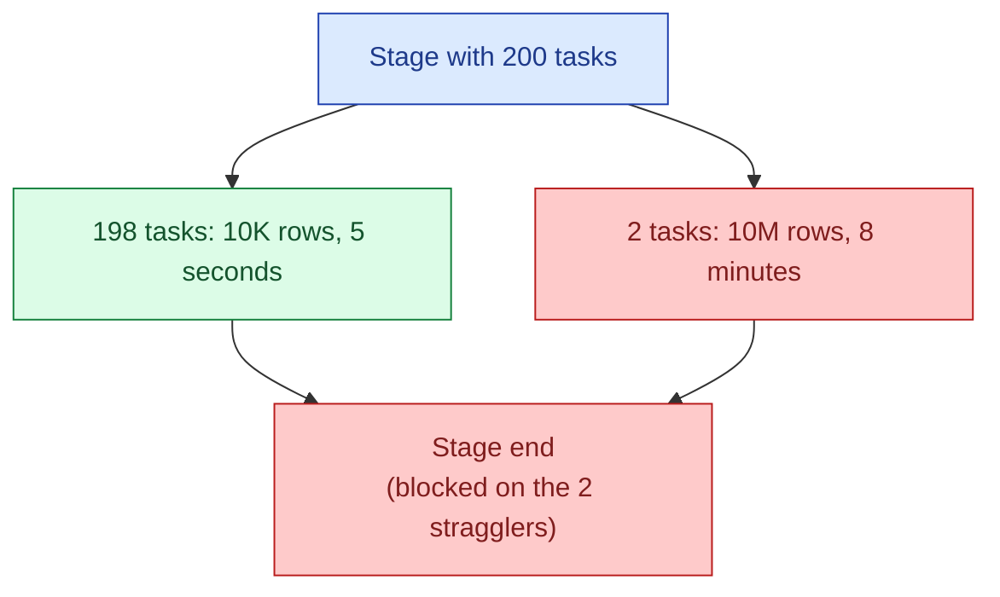
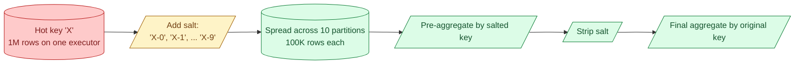
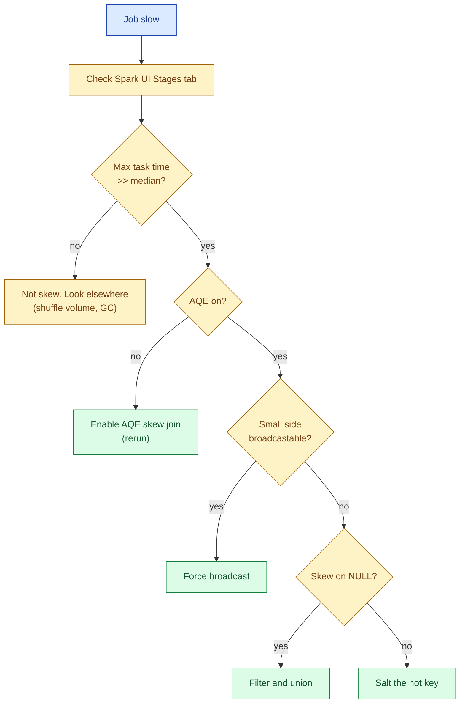

A skewed key dominates a distributed job. Picture an `events` table where one customer has 100x more rows than any other, or a `joined.country` column where 60% of rows are NULL. When the job shuffles by that key, one executor processes 100x the work while the others finish in seconds. The whole job waits on the slowest task. The fix is to either avoid the shuffle, let Spark detect and split the skew, or salt the key to spread the work.

## What skew looks like



In the Spark UI, you see this in the Stages tab. The "Summary Metrics" row for a stage shows percentiles for shuffle read, task duration, and rows per task.

```text
Metric              Min      25%      Median   75%      Max
Duration            4s       5s       5s       6s       7m 50s
Shuffle Read        12 MB    14 MB    14 MB    15 MB    8.2 GB
Records             10K      12K      12K      13K      11M
```

When `Max` is 100x to 1000x `Median`, you have skew. The job's wall-clock time is `Max`, not `Median`.

## Why it happens

Three common root causes.

**A few hot keys.** Some real-world distributions are extremely uneven. One mega-customer in a SaaS table, one bot IP in a logs table, one country in a regional table. Power-law distributions are the rule, not the exception.

**NULL join keys.** A `LEFT JOIN ... ON a.x = b.x` where `a.x` is often NULL pipes every NULL row to the same partition (hash of NULL is NULL or zero, depending on engine). NULL becomes the hottest key.

**Default value bombs.** Columns with sentinel defaults: `customer_id = 0` for guests, `country = 'unknown'`, `category = 'other'`. These sentinels can be 80% of the table.

## How Spark hashes (and why that matters)

Shuffle partitioning is `hash(key) mod num_partitions`. Hash distribution is fine when keys are diverse, but two pathologies bite.

1. **A real hot key.** `customer_id = 42` produces one hash. Every row with that ID lands on the same partition. No spread.
2. **A swarm of similar keys mapping to one bucket.** Less common, but possible with weak hash functions or pathological data.

The first one is what you hit in practice. The second is mostly solved by modern hash functions.

## Fix 1: AQE (Spark 3+ does it for you)

Adaptive Query Execution is Spark's runtime adapter. When AQE detects a skewed shuffle partition, it splits that partition into smaller sub-partitions and joins them in parallel.

```python
spark.conf.set("spark.sql.adaptive.enabled", "true")
spark.conf.set("spark.sql.adaptive.skewJoin.enabled", "true")
# Default thresholds: a partition is skewed if it is
#   > 5x the median size AND > 256 MB.
spark.conf.set("spark.sql.adaptive.skewJoin.skewedPartitionFactor", "5")
spark.conf.set("spark.sql.adaptive.skewJoin.skewedPartitionThresholdInBytes", "256MB")
```

When this fires, the explain plan shows `AQEShuffleRead` with `skewed` annotations. In the UI, the offending stage now has many tasks reading the skewed partition's pieces, and the max task duration drops by 5-10x.

AQE handles most production skew automatically in Spark 3.0+. Turn it on first, see if the problem goes away, then look at the other fixes if it does not.

## Fix 2: Broadcast the small side

If the skew is on the join key and one side of the join is small enough to broadcast, broadcast eliminates the shuffle entirely. No shuffle, no skew.

```python
from pyspark.sql.functions import broadcast

result = events.join(broadcast(dim_users), on="user_id", how="left")
```

This only works when the small side fits in executor memory (default threshold 10 MB, often raised to 100 MB). For star-schema queries (large fact joining medium dim), this is the default and you should not even need to think about skew.

## Fix 3: Salt the skewed key

When AQE cannot help (e.g., a groupBy where the aggregation itself is skewed) and broadcast is not an option, salting is the universal fix.

The trick: append a random suffix to the hot key so its rows spread across multiple partitions. Aggregate in two passes.



Worked example. Suppose `events.user_id = 42` is the hot key and you want to count events per user.

```python
from pyspark.sql import functions as F

N_SALTS = 10   # spread the hot key across 10 buckets

# 1. Add salt to every row (cheap)
salted = events.withColumn(
    "user_id_salted",
    F.concat_ws("-", F.col("user_id"), (F.rand() * N_SALTS).cast("int"))
)

# 2. First aggregate by salted key (parallel, no skew)
partial = (
    salted.groupBy("user_id_salted")
          .agg(F.count("*").alias("partial_count"))
)

# 3. Strip the salt and finish aggregating
final = (
    partial.withColumn("user_id", F.split("user_id_salted", "-")[0])
           .groupBy("user_id")
           .agg(F.sum("partial_count").alias("event_count"))
)
```

The first `groupBy` runs in parallel across 10x more partitions because each hot row gets a random salt. The second is tiny (one row per salted variant, 10 per original user). Total shuffle bytes go up slightly, but the slowest task drops from 8 minutes to 30 seconds.

## Salted join

For a join with skew on one side:

```python
N_SALTS = 20

# Salt the skewed side with a random suffix
big_salted = big.withColumn(
    "salted_key",
    F.concat_ws("-", "key", (F.rand() * N_SALTS).cast("int"))
)

# Explode the small side: one copy per salt value
small_exploded = (
    small.withColumn("salt", F.explode(F.array([F.lit(i) for i in range(N_SALTS)])))
         .withColumn("salted_key", F.concat_ws("-", "key", "salt"))
)

joined = big_salted.join(small_exploded, on="salted_key", how="inner")
```

The small side grows 20x (one row per salt per original row), the big side has its hot key spread across 20 partitions, and the join is balanced. Cost: 20x more rows on the small side. Benefit: a balanced shuffle.

Choose N_SALTS so the small side after explosion still fits in memory, ideally still broadcastable.

## Fix 4: Handle NULLs separately

NULL keys are the easiest skew bug to find and the easiest to fix. Filter them out, join the non-nulls, and re-add the nulls.

```python
non_null = events.where(F.col("user_id").isNotNull())
nulls    = events.where(F.col("user_id").isNull())

joined_non_null = non_null.join(users, on="user_id", how="left")
joined_nulls    = nulls.join(users.limit(0), on="user_id", how="left")  # gives null columns

result = joined_non_null.unionByName(joined_nulls)
```

This is ugly but effective. Better still, filter nulls out upstream or coalesce them to a real key if the rows are legitimately worth keeping.

## Diagnosis flow



The order matters: cheapest fix first. AQE is one config flag. Broadcast is one line of code. Null handling is a small refactor. Salting is the heaviest change, so save it for cases the simpler fixes did not cover.

## Common mistakes

- **Tuning `spark.sql.shuffle.partitions` higher to fix skew.** More partitions does not help when one key wants one partition. The hot partition is still hot; you just made 800 small empty ones around it.
- **Salting without pre-aggregating.** Splitting the hot key across partitions only helps if the per-partition work is independent. For a join, you need to explode the other side too. For a sum, you need a two-step aggregate.
- **Salting on a non-skewed job.** Adds overhead with no benefit. Only salt the key that is actually skewed; profile first.
- **Picking N_SALTS too small.** N=2 barely spreads the hot key. Start at 10-20 and scale to the ratio of (hot key rows / median rows).
- **Forgetting AQE in Spark 2.x clusters.** Most "this job is slow" tickets on Spark 3 disappear with AQE on. If you are on a 2.x cluster, plan the upgrade.
- **Trying to fix NULL skew without filtering.** Hash-of-null is one partition. No amount of tuning fixes that. Filter out and union back.
- **Treating skew as a code review failing.** It is a data shape problem. The same code is fine until next month, when one customer 100x's their volume. Build for it.

## Quick recap

- Skew is one key with massively more rows than the others. One task does 100x the work; the job waits on it.
- Spot it in the Spark UI: max task duration or shuffle read 10x+ the median.
- Three fixes, cheapest first: enable AQE skew join (Spark 3+), broadcast the small side if possible, salt the hot key.
- Salting splits the hot key across N partitions, pre-aggregates, then finishes the aggregate after stripping the salt.
- NULL join keys are a special case: filter, join non-nulls, union nulls back.
- Default to AQE on every Spark 3 job. Save salting for the few cases where it is still needed.

This concept sits in **Stage 3 (Batch pipelines and orchestration)** of the [Data Engineering Roadmap](/practice/data-engineering/roadmap/).
