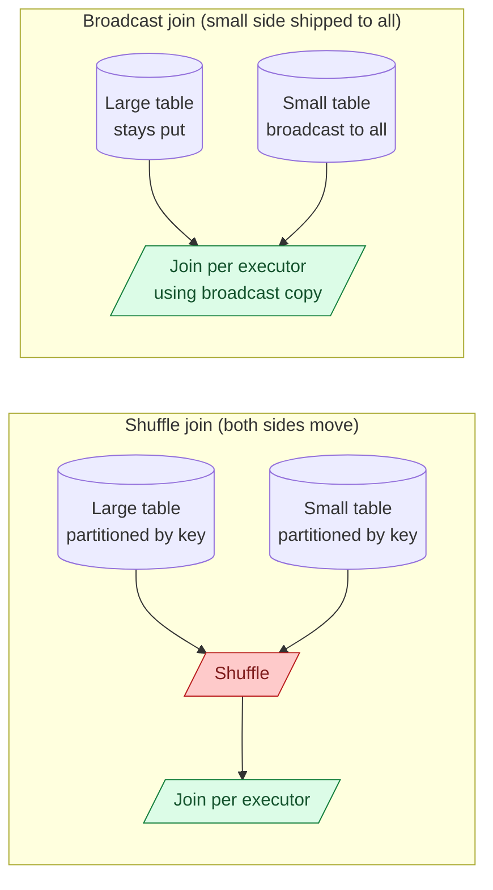

A shuffle join regroups both sides of a join across the cluster so matching keys land on the same executor. A broadcast join skips that: it ships the smaller table to every executor in full, and the larger table never moves. When the smaller table fits in memory, broadcast wins by a wide margin.

**What this page will cover.**

- The Spark threshold (`spark.sql.autoBroadcastJoinThreshold`, default ~10 MB) and when to raise it.
- Manually hinting a broadcast: `broadcast(df)` in PySpark, `BROADCAST` hint in SQL.
- When broadcast goes wrong: small table is actually 2 GB after decompression, executors OOM.
- Cross-join with broadcast as the deliberate way to enumerate combinations.
- Sort-merge join vs shuffle hash join: the two non-broadcast options.
- Why dimension tables on the broadcast side is the default for star-schema queries.

*Page coming soon.*

This concept sits in **Stage 3 (Batch pipelines and orchestration)** of the [Data Engineering Roadmap](/practice/data-engineering/roadmap/).
