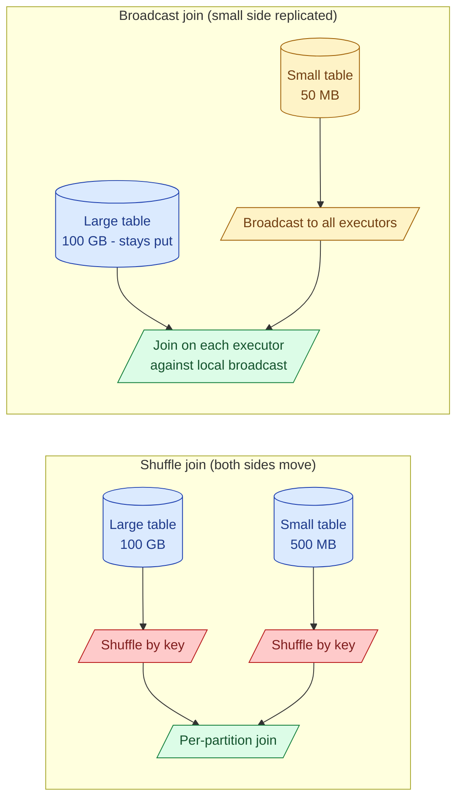
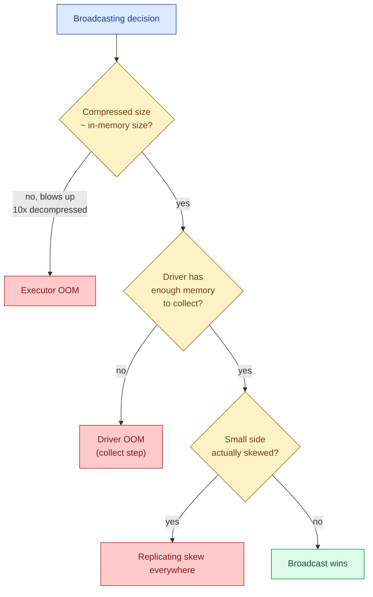

A shuffle join regroups both sides of a join across the cluster so matching keys land on the same executor. A broadcast join skips that entirely: it ships the smaller table to every executor in full, and the larger table never moves. When the smaller table fits in memory, broadcast wins by a wide margin. When it does not, broadcast is a one-way ticket to OutOfMemory. The whole skill is knowing which is which.

## The two shapes



**Shuffle join.** Both sides go through `hash(key) mod N` and the matching pairs land on the same reducer. Two full table scans, two full shuffles, then the join. Bytes on the wire scale with the size of both inputs.

**Broadcast join.** The small side is collected to the driver, serialised, and sent to every executor once. The large side is read in place. Each executor probes its local copy of the small side. Zero shuffle of the large side.

## When Spark picks each

Spark's planner chooses a broadcast hash join automatically when one side is below the threshold `spark.sql.autoBroadcastJoinThreshold` (default 10 MB). Above that, it falls back to sort-merge join, which is the standard shuffle join.

```python
spark.conf.get("spark.sql.autoBroadcastJoinThreshold")
# '10485760'   (bytes; 10 MB)
```

This threshold is conservative. Modern executors can comfortably hold 100-200 MB of broadcast data. Raising the threshold to `100 * 1024 * 1024` (100 MB) is common in production tuning.

```python
spark.conf.set("spark.sql.autoBroadcastJoinThreshold", 100 * 1024 * 1024)
```

The planner uses table statistics to decide. If statistics are missing or wrong (no `ANALYZE TABLE`), the planner cannot know the small side is small and will fall back to shuffle. Forcing the hint is the workaround.

## Forcing a broadcast

When Spark misjudges, you can force the broadcast.

**PySpark / Scala:**
```python
from pyspark.sql.functions import broadcast

result = orders.join(broadcast(customers), on="customer_id", how="left")
```

**SQL hint:**
```sql
SELECT /*+ BROADCAST(c) */ o.*, c.country
FROM orders o
LEFT JOIN customers c ON o.customer_id = c.customer_id;
```

Other hints: `BROADCASTJOIN`, `MAPJOIN`, `SHUFFLE_HASH`, `SHUFFLE_MERGE`. The first three are aliases for broadcast.

Use a hint when you know more about the data than the planner does: a fresh table without statistics, a filter that drastically shrinks one side, a join after an aggregation that produced a small result.

## The three non-broadcast options

When broadcast is off the table (both sides too large), Spark has three shuffle-based join strategies.

| Strategy | How it works | Used when |
|---|---|---|
| **Sort-merge join** | Shuffle both sides by key, sort within each partition, walk in lockstep | Default for two large tables |
| **Shuffle hash join** | Shuffle both sides by key, build a hash table on the smaller side per partition | Smaller side is medium-large, sort cost is higher than hash cost |
| **Cartesian / nested loop** | Compare every row to every row | No equi-join condition; `cross join` |

Sort-merge is the workhorse. Shuffle hash is enabled by `spark.sql.join.preferSortMergeJoin = false` and is rarely chosen by default. Nested loop is what you accidentally get when you write a join condition the optimiser cannot match (e.g., `ON a.x BETWEEN b.lo AND b.hi`).

## When broadcast is the wrong call

Broadcast is not free. The small side is serialised once on the driver, transferred over the wire to every executor, deserialised into memory on every executor, and held for the duration of the join. Four ways this goes wrong.



**The "small" side is actually huge after decompression.** Parquet at 100 MB on disk can be 1-2 GB in memory after decompression and Java object overhead. Spark's statistics estimate the compressed size; the broadcast pays the decompressed size on every executor. Check `Estimated size` in the SQL plan vs reality.

**The driver runs out of memory.** Broadcast collects the small side to the driver before shipping. If the driver heap is 4 GB and the broadcast is 3 GB, you crash before the join starts.

**The small side is highly skewed.** Broadcasting a skewed side does not fix skew; it just makes every executor pay the skew tax locally. If `customers` has one row with a 500 KB JSON blob, you broadcast that blob to every executor.

**You broadcast the wrong side.** PySpark's `broadcast(x)` is a hint, not a check. If you broadcast the large side by mistake, you blow up the cluster.

## A worked example

Star-schema query: a 200 GB `fact_orders` table joined to three dimensions.

```python
result = (
    fact_orders
        .join(broadcast(dim_customers), "customer_id")    # 50 MB
        .join(broadcast(dim_products),  "product_id")     # 20 MB
        .join(broadcast(dim_dates),     "date_id")        # 5 MB
        .groupBy("country", "category")
        .agg(F.sum("amount").alias("revenue"))
)
```

Without broadcasts: four shuffles (three joins + the groupBy). 200 GB on the wire three times, plus shuffles for both small sides.

With broadcasts: one shuffle (the final groupBy). 75 MB total broadcast, 200 GB read once from S3, no large-side shuffle. The job that took 45 minutes drops to under 10.

This is the default shape for analytical queries against a star schema. If your `dim_*` tables are tagged for broadcast, you almost never write the hint explicitly; Spark catches it from statistics.

## Verifying the plan

`EXPLAIN` is the only way to know what Spark actually did.

```python
result.explain()
```

Look for:

- `BroadcastHashJoin` (good, broadcast happened)
- `SortMergeJoin` (shuffle join)
- `BroadcastNestedLoopJoin` (broadcast with a non-equi-join condition; usually a sign you wrote a bad `ON`)
- `BroadcastExchange` (the broadcast step itself; you will see one of these per broadcast)

If you wrote `broadcast(x)` and the plan says `SortMergeJoin`, Spark refused: usually because the table is bigger than the broadcast threshold, even with `autoBroadcastJoinThreshold` raised, or because statistics say so.

## Adaptive Query Execution and broadcasts

In Spark 3.x with AQE enabled, the planner can promote a join to broadcast at runtime, after seeing the actual size of an intermediate result.

```python
spark.conf.set("spark.sql.adaptive.enabled", "true")
spark.conf.set("spark.sql.adaptive.localShuffleReader.enabled", "true")
```

Example: `large_a.join(large_b.filter(...).agg(...), ...)`. The filtered-aggregated `large_b` might be 50 MB at runtime even though the static planner thought it was 50 GB. AQE notices this after the filter stage finishes and switches the join to broadcast for free.

This is the single biggest reason to upgrade off Spark 2. The static planner cannot make this decision.

## Common mistakes

- **Broadcasting a side that is too large.** Driver collects, OOM. Or executor heap fills with the broadcast copy, OOM. Always check decompressed size, not just file size.
- **Raising `autoBroadcastJoinThreshold` to a giant number "just in case."** The planner will broadcast tables you did not intend. Set a sensible cap (100 MB is the usual upper bound) and force broadcasts with the hint where you know better.
- **Forgetting to `ANALYZE TABLE`.** Without statistics, the planner has no idea how big the small side is and uses defaults. The result is a shuffle join when broadcast would have been correct.
- **Broadcasting after a non-deterministic filter.** A filter with `rand()` makes the small side a different size on each run. The planner gets it wrong half the time.
- **Using broadcast hint on both sides of the join.** Spark ignores one and you do not control which. Hint only the small side.
- **Skewed small side.** A small table with one massive row gets replicated everywhere along with its bloat. Trim or split before broadcasting.
- **Reading "BroadcastNestedLoopJoin" in the plan and ignoring it.** That is Spark falling back to comparing every row to every row because the join condition is not an equi-join. Almost always a query bug.

## Quick recap

- Shuffle join moves both sides; broadcast join replicates the small side and leaves the large side alone.
- Spark auto-broadcasts below `spark.sql.autoBroadcastJoinThreshold` (default 10 MB). Raise to ~100 MB in production with healthy memory.
- Force a broadcast with `broadcast(df)` in PySpark or `/*+ BROADCAST(t) */` in SQL.
- Sort-merge join is the default shuffle join. Shuffle hash and nested loop are rarer.
- Broadcast goes wrong when the decompressed size is larger than memory, the driver runs out collecting, or the small side is skewed.
- For star-schema queries, broadcast every dimension. AQE in Spark 3 catches runtime broadcasts the static planner missed.
- Always verify with `EXPLAIN`. The plan tells you what actually happened.

This concept sits in **Stage 3 (Batch pipelines and orchestration)** of the [Data Engineering Roadmap](/practice/data-engineering/roadmap/).
