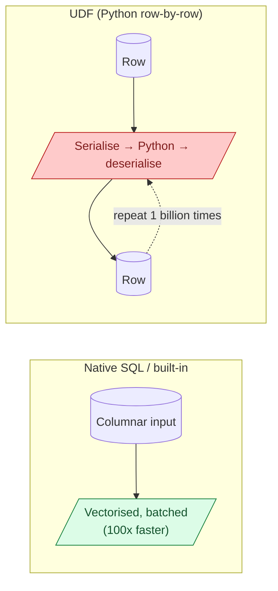

A UDF (user-defined function) lets you call your own code from SQL or Spark. It feels like a free upgrade: write Python or Java, plug it in, done. But UDFs break the engine's ability to optimise: no predicate pushdown, no vectorised execution, often a row-by-row Python interpreter loop. The same job in pure SQL can be 10-100x faster.

**What this page will cover.**

- Why a Python UDF in Spark serialises every row through PySpark, killing throughput.
- Pandas UDFs (vectorised UDFs) as the middle ground: 10-50x faster than row UDFs.
- Native SQL alternatives: regex functions, `transform`, `array_*` functions, JSON helpers.
- BigQuery JavaScript UDFs vs SQL UDFs vs `REMOTE FUNCTION` (Cloud Function).
- Snowflake's Java / Python / SQL UDF tiers and the cost difference.
- The rule of thumb: if a native SQL function can do it, never reach for a UDF.

*Page coming soon.*

This concept sits in **Stage 3 (Batch pipelines and orchestration)** of the [Data Engineering Roadmap](/practice/data-engineering/roadmap/).
