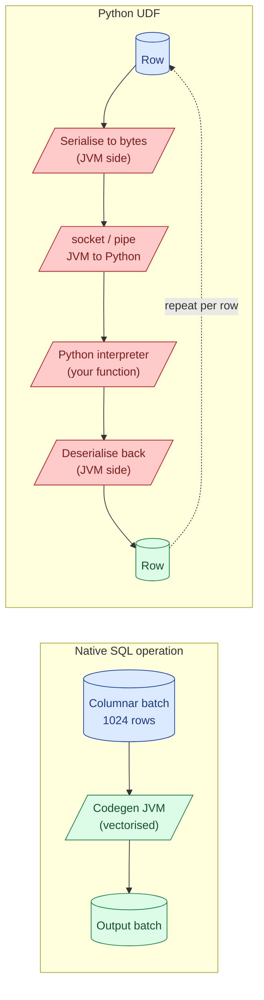
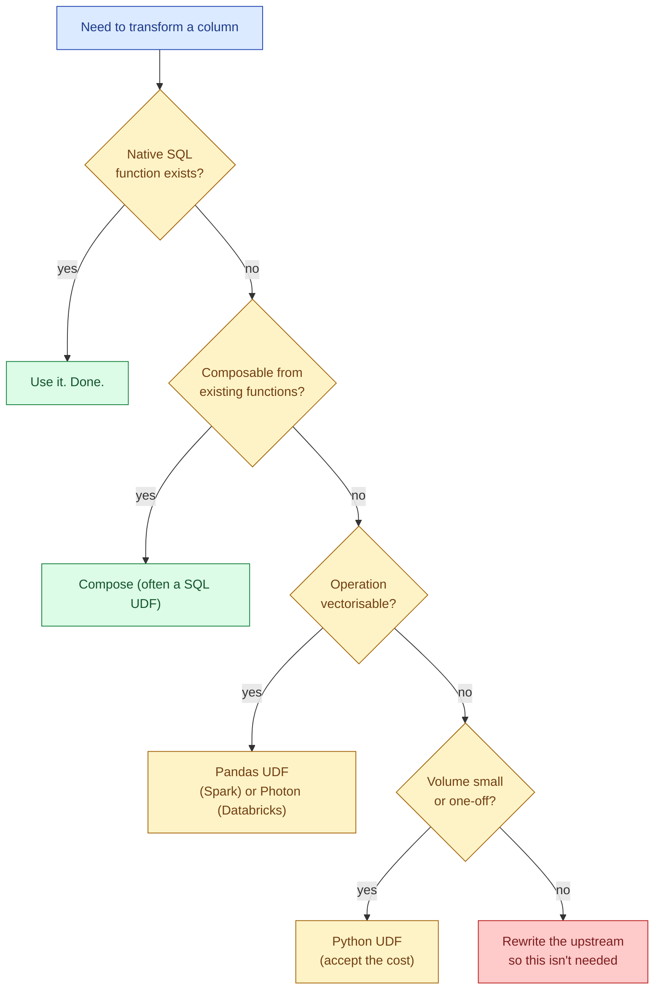

A UDF (user-defined function) lets you call your own code from SQL or Spark. It feels like a free upgrade: write Python or Java, register it, call it from SQL. The cost is invisible until the job that used to run in 5 minutes takes 45. UDFs break the engine's ability to optimise, force per-row interpretation, and in PySpark trigger a serialisation round-trip on every row. The same job in native SQL is usually 10-100x faster.

## What "native" buys you

Native SQL operations run inside the engine. In Spark, that means Catalyst optimised, code-generated JVM bytecode operating on columnar batches. In a warehouse like BigQuery or Snowflake, it means vectorised C++ executing against compressed columnar storage. Both engines:

- Skip rows the optimiser proves cannot match
- Process columns in batches of 1000+ rows at a time
- Reorder operations for cache locality
- Push filters down to the storage layer

A UDF that runs row-by-row bypasses all of this.

## Why Python UDFs in Spark are slow



PySpark runs the JVM. Your Python code does not. For every row touched by a UDF:

1. The JVM serialises the row's columns to a Python-readable format (originally Pickle, now Arrow if you opt in).
2. Bytes cross a socket to a Python worker process running on the same executor.
3. The Python worker deserialises, calls your function, gets a result.
4. The result is serialised back.
5. Bytes cross the socket again.
6. The JVM deserialises.

Six steps per row. At a billion rows, that is six billion socket round-trips and six billion serialisation passes. The function itself can be `x + 1` and the wall-clock will still be 30x slower than the native `x + 1`.

On top of that, Catalyst cannot see inside the UDF. It cannot push the UDF predicate down to Parquet, cannot reorder operations around it, cannot prove that columns the UDF does not read can be skipped.

## A concrete benchmark

A trivial transform: trim whitespace and uppercase a string column on a 100-million-row DataFrame.

```python
# Native (built-in functions)
df.select(F.upper(F.trim(F.col("name"))))
# ~12 seconds on a small cluster

# Python UDF
@F.udf("string")
def clean(s):
    return s.strip().upper() if s else None
df.select(clean(F.col("name")))
# ~6 minutes on the same cluster

# Pandas UDF (vectorised)
@F.pandas_udf("string")
def clean_pandas(s: pd.Series) -> pd.Series:
    return s.str.strip().str.upper()
df.select(clean_pandas(F.col("name")))
# ~25 seconds on the same cluster
```

12 seconds, 6 minutes, 25 seconds. Same logic, three implementations, two orders of magnitude apart.

## Pandas UDFs: the middle ground

A Pandas UDF (vectorised UDF) operates on a batch of rows at a time, transferred via Apache Arrow. The serialisation overhead is paid once per batch (default 10,000 rows), not once per row.

```python
from pyspark.sql.functions import pandas_udf
import pandas as pd

@pandas_udf("double")
def usd_to_eur(amounts: pd.Series) -> pd.Series:
    return amounts * 0.92

df.withColumn("amount_eur", usd_to_eur(F.col("amount_usd")))
```

Three things make this fast.

1. **Arrow transfer.** Columnar bytes flow over the socket, deserialised in one shot per batch.
2. **NumPy under the hood.** The Pandas operation vectorises in C, not Python.
3. **No per-row interpreter.** The Python function is called once per batch.

Pandas UDFs close 90% of the gap to native. When you genuinely need Python (a complex regex, an ML model inference, a library that does not exist in SQL), Pandas UDFs are the right tool.

## Scala / Java UDFs

JVM UDFs do not cross language boundaries. They run inside the same process as Catalyst's generated code. No serialisation tax, no Python interpreter. They are still opaque to the optimiser (Catalyst cannot push predicates through them), but the per-row cost is 2-5x native instead of 30x.

```scala
val cleanName = udf((s: String) => Option(s).map(_.trim.toUpperCase).orNull)
df.select(cleanName($"name"))
```

If your team writes Scala and the logic genuinely needs to be code, this is the cheapest UDF path. Most teams writing Python do not switch to Scala for this; they reach for Pandas UDFs instead.

## Warehouse UDFs

The cost model in cloud warehouses is similar but with different defaults.

| Warehouse | UDF types | Notes |
|---|---|---|
| **BigQuery** | SQL UDFs (inlined, fast), JavaScript UDFs (slower), remote functions (Cloud Function, slowest) | SQL UDFs are essentially free; JS UDFs add per-row overhead |
| **Snowflake** | SQL UDFs, Java UDFs, Python UDFs, JavaScript UDFs | Java/Python UDFs run in a sandboxed Snowpark container; cost is real |
| **Databricks SQL** | SQL UDFs, Python UDFs (Photon-aware) | Photon engine can vectorise some Python UDFs automatically |
| **Redshift** | SQL UDFs, Python UDFs (Lambda or local), Lambda UDFs | Lambda UDFs invoke an external function per row; very slow |

The pattern holds: SQL UDFs are inlined and fast. Anything that calls out to another language or another service is slow because of the same serialise-call-deserialise loop.

A BigQuery SQL UDF:

```sql
CREATE OR REPLACE FUNCTION clean_name(s STRING) AS (
    UPPER(TRIM(s))
);
```

This is inlined into the query plan. The optimiser treats it as if you wrote `UPPER(TRIM(s))` directly. No cost.

A BigQuery JavaScript UDF:

```sql
CREATE OR REPLACE FUNCTION parse_user_agent(ua STRING)
RETURNS STRUCT<browser STRING, os STRING>
LANGUAGE js AS r"""
    // ... parsing logic ...
    return { browser: b, os: o };
""";
```

This runs a V8 sandbox per row. Always slower than equivalent SQL. Sometimes the only option for genuinely complex parsing.

## When a UDF is worth it

Three honest cases.

**The operation is not expressible in SQL.** A non-trivial regex, complex JSON traversal, calling an ML model, a third-party library. Reaching for a UDF here is the right call. Use Pandas UDF or the warehouse's vectorised equivalent.

**Readability for a one-off.** A 5-minute job run once a week, where a 20-line Python function is clearer than a 200-line nested `CASE`. Trade compute for engineering time.

**Performance gap is small.** A UDF on a 100k-row table runs in seconds either way. The cost difference is invisible at small scale. Save the optimisation for the queries that matter.

## When to refuse

| Pattern | What to do instead |
|---|---|
| String trim, upper, lower, replace | Built-in string functions |
| Math (+, *, sqrt, log) | Built-in math functions |
| Date arithmetic | `date_add`, `date_diff`, `date_trunc` |
| JSON field extraction | `get_json_object`, `json_extract`, `:` operator |
| Array operations (filter, transform) | Higher-order functions: `transform`, `filter`, `aggregate` |
| Conditional logic | `CASE WHEN ... END`, `IF()` |
| Hashing | `md5`, `sha256`, `xxhash64` |

If your UDF is doing one of these, rewrite it. The native version is always faster, often considerably so.

## The decision flow



The first question is always: does a built-in function exist? Read the docs. The standard library is bigger than most people think.

## Common mistakes

- **Reaching for a UDF without checking the function library.** Most "I need a UDF for this" turns out to be `regexp_extract`, `transform`, or `from_json` with a schema.
- **Writing a Python UDF for arithmetic.** `x * 0.92` runs at native speed in any engine. A UDF for it is a 30x slowdown for zero benefit.
- **Using a UDF inside a `WHERE` clause.** The optimiser cannot push the predicate through the UDF, so the engine evaluates the UDF on every row before filtering. Always filter first, then apply the UDF on what survives.
- **Forgetting to set the return type on a Spark Python UDF.** Default return type is `string`. If you return a number, it gets stringified and you lose precision and type-aware optimisations.
- **Passing whole rows to a UDF when you only need one column.** `udf(row)` serialises every column even if your function reads one. Project first.
- **Skipping the Pandas UDF upgrade.** A Pandas UDF is almost always a one-line change from a Python UDF and 10x faster. There is almost no reason to ship a row-by-row Python UDF in 2026.
- **Building a Lambda-backed UDF on Redshift for hot-path queries.** Every invocation is a Lambda cold start in the worst case. Reserve this for very expensive computations or external API calls, never simple transforms.

## Quick recap

- Native SQL operations run vectorised inside the engine. UDFs almost never do.
- Python UDFs in Spark are slow because every row crosses a JVM-to-Python socket and gets serialised twice.
- Pandas UDFs use Arrow to batch rows; 10-30x faster than Python UDFs and within 2-3x of native.
- Scala / Java UDFs avoid the language boundary but are still opaque to Catalyst.
- Warehouse SQL UDFs are inlined and free. JavaScript / Python / Java UDFs in warehouses pay similar per-row costs.
- Rule of thumb: SQL first; reach for a UDF only when the operation is genuinely not expressible in native functions.
- A UDF inside `WHERE` blocks predicate pushdown. Filter first, then transform.

This concept sits in **Stage 3 (Batch pipelines and orchestration)** of the [Data Engineering Roadmap](/practice/data-engineering/roadmap/).
