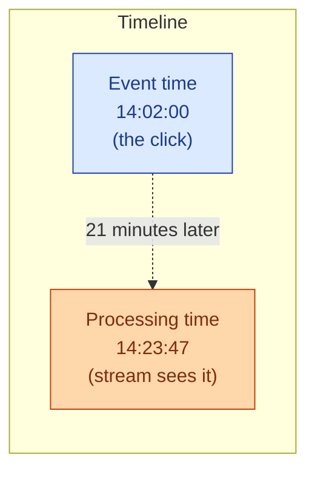

Event time is when the thing happened: the click, the sensor reading, the trade. Processing time is when the streaming system sees it: now. The two are often minutes, sometimes hours apart. Phones go offline. Devices buffer. Networks lag. Streaming pipelines that treat the two as the same one silently produce wrong answers for hours.

**What this page will cover.**

- Why grouping by processing time is easy but wrong for any time-bucketed metric.
- The "rolling 5-minute count" that quietly drops late events.
- Event-time windows: the right default, but requires watermarks.
- Allowed lateness: a grace period for late-arriving events.
- The trade between freshness (low watermark delay) and completeness (high watermark delay).
- The two questions every streaming design needs to answer up front: when do we close a window, what do we do with what arrives after.

*Page coming soon.*

This concept sits in **Stage 4 (Streaming and event-driven)** of the [Data Engineering Roadmap](/practice/data-engineering/roadmap/).
