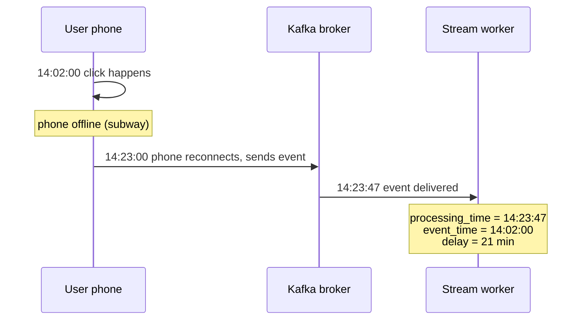
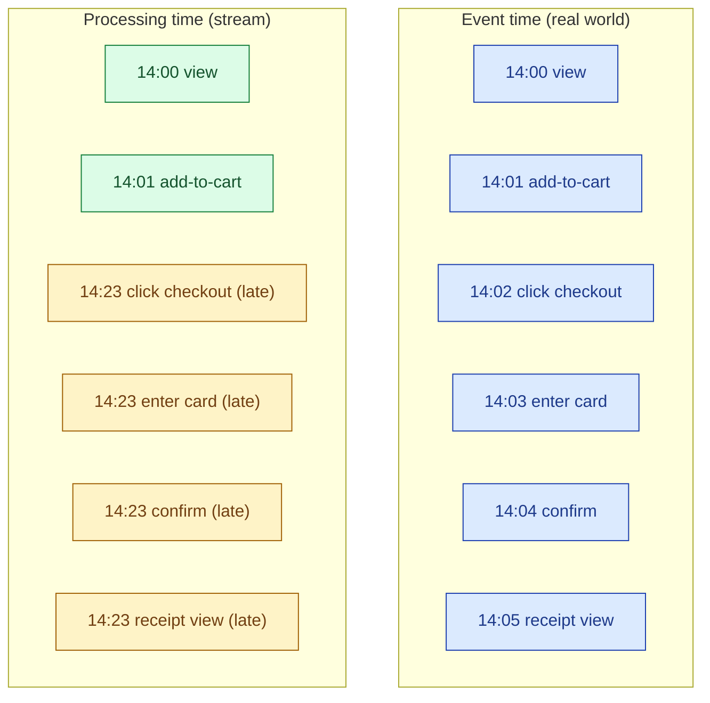
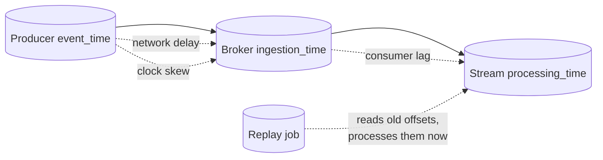

Event time is when the thing happened: the click, the sensor reading, the trade. Processing time is when the streaming system sees it: now. The two are often minutes, sometimes hours apart. Phones go offline. Devices buffer. Networks lag. Streaming pipelines that treat the two as the same one silently produce wrong answers for hours.

## The two clocks

Every event in a stream has at least two timestamps. Most pipelines need a third.

| Clock | What it records | Set by |
|---|---|---|
| **Event time** | When the action happened in the real world | The producer (phone, sensor, browser) |
| **Ingestion time** | When the event arrived at the broker | The broker (Kafka, Kinesis) |
| **Processing time** | When the stream operator handled it | The stream worker's wall clock |

For any time-bucketed metric you actually care about (orders per minute, signups per hour, errors per second), the only correct clock is event time. Processing time is what is easy. Event time is what is right.



The 21 minutes is not unusual. Mobile, IoT, and any cross-region pipeline routinely see delays in this range, and tail delays in hours.

## Why processing-time aggregates are wrong

Take the simplest possible question: how many orders per minute?

```sql
-- the easy, wrong version
SELECT
    DATE_TRUNC('minute', NOW()) AS minute,
    COUNT(*) AS orders
FROM stream
GROUP BY 1;
```

This counts events into whichever processing-time minute the worker happens to see them in. The 14:02 click that arrived at 14:23 lands in the 14:23 bucket. So does the 14:05 click and the 14:14 click that all reconnected at the same time. The 14:02 bucket says "0 orders" because every real 14:02 order had not arrived yet. The 14:23 bucket says "47 orders" because three real minutes of backlog collapsed into it.

The dashboard now shows a flat line followed by a giant spike. There was no spike. There was a subway.

```sql
-- the harder, correct version
SELECT
    DATE_TRUNC('minute', event_time) AS minute,
    COUNT(*) AS orders
FROM stream
GROUP BY 1;
```

This counts each event into the minute it really happened. The 14:02 bucket gets all 14:02 clicks once they arrive. The 14:23 bucket only gets real 14:23 clicks. The dashboard now reflects reality, at the cost of being a few minutes behind when the network is bad.

## A worked timeline

Six events from one user. Two columns: when they happened, when the stream saw them.



A processing-time count of "checkouts per minute" puts four checkout-related events in the 14:23 bucket and none in 14:02 to 14:05. An event-time count puts each event in the right minute and reports the funnel correctly: one view, one add-to-cart, one click, one card entry, one confirm, one receipt, all within five minutes of each other. Same data, different answers.

## Why the two clocks diverge

Three independent reasons, all of which can happen at once:

1. **Network and device delays.** Phones buffer offline. IoT devices retry over flaky links. Cross-region brokers add round-trips. None of this is rare. All of it shows up as event-time-before-processing-time.
2. **Clock skew.** The producer's clock and the broker's clock disagree. NTP keeps it under a second on healthy fleets, but bad clients (cheap IoT, old browsers, tampered devices) can be hours off. Always trust the broker's ingestion time as a sanity check on the producer's event time.
3. **Replay.** When you reprocess history (see [Reprocessing and replay](/practice/data-engineering/concepts/037-reprocessing-replay/)), processing time is "now" and event time is "last week." If your pipeline mixes the two clocks, replay produces nonsense.



## The rule: always carry event_time

The single hard rule that makes everything else easier:

**Every event in your pipeline has an `event_time` column, set by the producer, present from the first byte to the last. Never drop it. Never overwrite it.**

This costs you 8 bytes per event and saves you weeks of debugging. The moment you lose event time, you cannot reprocess correctly, you cannot debug "why did this metric spike at 14:23," and you cannot move to a streaming engine that does event-time windowing (every modern one does).

If the producer cannot be trusted to set event time (some IoT, some legacy clients), use ingestion time from the broker as the event time. It is a slightly worse approximation but it is monotonic and it is at least bounded by the network round-trip.

## When processing time is fine

Processing time is the correct clock for exactly three things:

- **Latency SLOs.** "99% of events are processed within 30 seconds of arrival." That is a processing-time statement and should be measured in processing time.
- **Operational metrics.** Throughput, lag, error rate per worker. These are about the system, not the data.
- **Triggers that should fire on a wall clock.** "Send a reminder if no confirmation event arrives within 10 minutes." This is processing time relative to a reference event time.

For everything else, default to event time.

## Common mistakes

- **Defaulting to `NOW()` in the time bucket.** The single most common bug in beginner streaming code. It is easy. It is wrong. Use `event_time` from the payload.
- **Dropping event_time at the first transformation.** A map that produces `{customer_id, total}` loses the time the order happened. Now no downstream consumer can window correctly.
- **Trusting the producer's event_time without sanity checks.** A 1970 timestamp or a 2099 timestamp is a clock-skew bug. Clip to a reasonable window and log the outliers.
- **Mixing event time and processing time in joins.** A stream-to-stream join where one side keys on event time and the other on processing time will misalign whenever the network blinks.
- **Forgetting that replay changes the meaning of processing time.** A pipeline that uses `NOW()` is a pipeline that cannot be replayed correctly.
- **Treating ingestion time and event time as interchangeable.** Ingestion time hides client-side delays. It is fine for an operational view, wrong for a business metric.
- **Building dashboards on processing-time aggregates because they update faster.** Faster updates of the wrong number is still the wrong number.

## Quick recap

- Event time is when it happened. Processing time is when the stream saw it. The gap is real and often large.
- The only correct clock for time-bucketed business metrics is event time.
- The two clocks diverge for three reasons: network delays, clock skew, and replay.
- Every event in the pipeline carries an `event_time` column, end to end. No exceptions.
- Processing time is fine for SLOs and operational metrics. Not fine for "orders per minute."
- A pipeline that can run on history (replay) must key on event time. Pipelines on `NOW()` cannot be replayed.

This concept sits in **Stage 4 (Streaming and event-driven)** of the [Data Engineering Roadmap](/practice/data-engineering/roadmap/).
