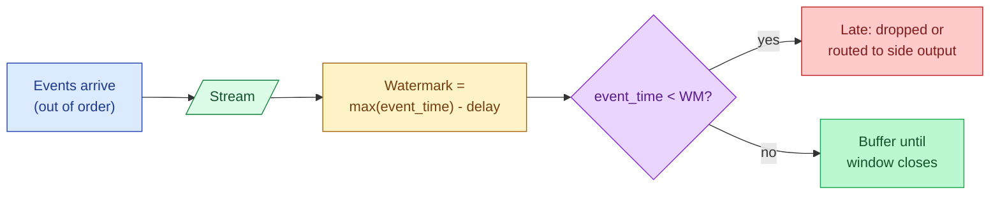

A watermark is the streaming system's bet that no events older than time `T` will arrive any more. It is what lets the system close a window and emit a result instead of waiting forever. Pick a watermark that is too aggressive and you drop late events. Pick one too conservative and your dashboards lag.

**What this page will cover.**

- The watermark formula: `max event_time seen` minus a delay.
- Why a 5-second delay drops most mobile events and a 5-minute delay is more honest.
- Bounded-out-of-orderness in Flink vs the watermark generator in Kafka Streams.
- The trade between dashboard freshness and capturing late stragglers.
- The "allowed lateness" setting: emit a result, then update it when late events arrive.
- The side output for events past the cut-off, so you never lose them entirely.

*Page coming soon. Until then, see [#092 Late events after the partition closed](/practice/data-engineering/092-late-events-after-the-partition-closed/) for the practice problem.*

This concept sits in **Stage 4 (Streaming and event-driven)** of the [Data Engineering Roadmap](/practice/data-engineering/roadmap/).
