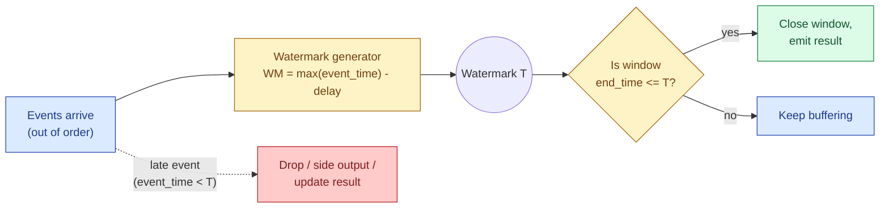
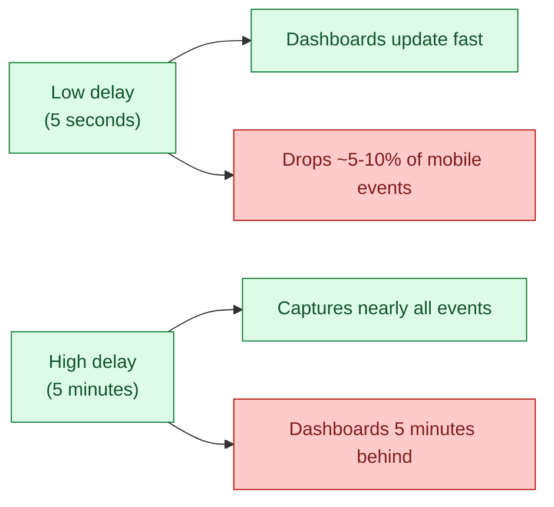
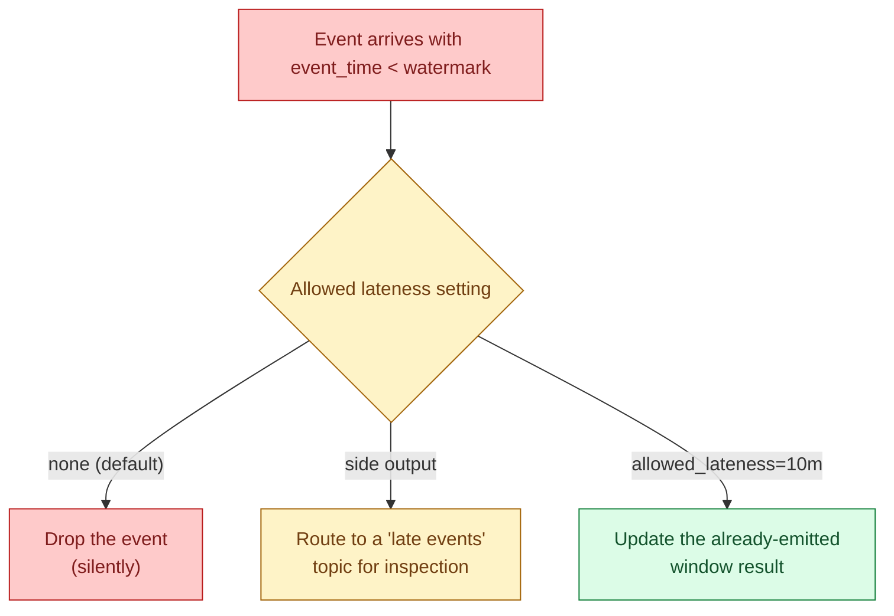
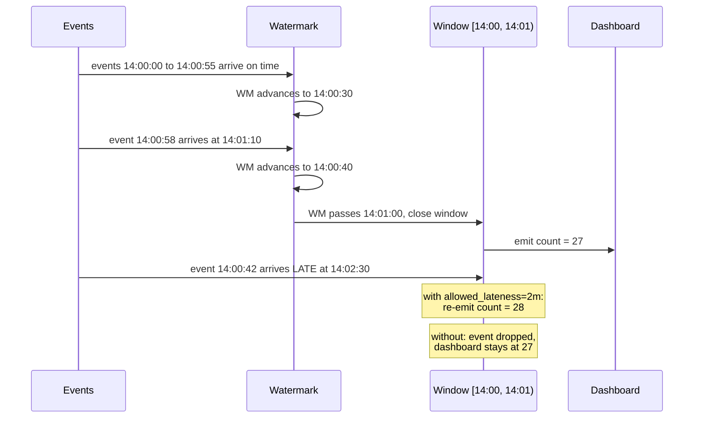

A watermark is the streaming system's bet that no events older than time `T` will arrive any more. It is what lets the system close a window and emit a result instead of waiting forever. Pick a watermark that is too aggressive and you drop late events. Pick one too conservative and your dashboards lag. There is no choice that avoids the trade.

## The waiting problem

A streaming system wants to compute "orders in the 14:02 minute." It is now 14:03 in processing time. Can it emit the answer?

Not yet. A phone that buffered offline might still send a 14:02 click at 14:23. If the system emits at 14:03 and the click arrives at 14:23, the answer was wrong. If the system waits forever for stragglers, the answer never gets emitted.

The watermark is the formal answer to this question. It is a promise the system makes to itself: "from now on, no event with event_time older than `T` will arrive." Once the watermark passes the end of a window, the window is closed and the result is emitted.



## The formula

The simplest watermark generator, used by Flink, Kafka Streams, and Spark Structured Streaming under the hood:

```text
watermark = max(event_time seen so far) - allowed_delay
```

If the largest event time seen is 14:05:00 and the allowed delay is 30 seconds, the watermark is 14:04:30. Any window ending at or before 14:04:30 can close. Any event arriving with event_time before 14:04:30 is late.

The `allowed_delay` is the tunable knob. It is the system's guess at how out-of-order the stream actually is.

```python
# Flink (PyFlink) example
from datetime import timedelta

watermark_strategy = (
    WatermarkStrategy
    .for_bounded_out_of_orderness(timedelta(seconds=30))
    .with_timestamp_assigner(lambda event, ts: event["event_time"])
)
```

```sql
-- Spark Structured Streaming
SELECT window, COUNT(*) AS orders
FROM stream
  WATERMARK event_time '30 seconds'
GROUP BY window(event_time, '1 minute')
```

In both, the watermark says "I will wait up to 30 seconds for stragglers before I close a window."

## Picking the delay

The delay is a freshness vs completeness trade.



Rules of thumb that hold up in practice:

- **Backend-to-backend (service events on the same network).** 1 to 5 seconds. Lateness is rare.
- **Mobile clients.** 30 seconds to a few minutes. Phones go offline.
- **IoT.** Minutes to hours. Devices buffer aggressively and reconnect on power.
- **Cross-region replication.** Whatever the replication SLA is, plus a margin.

The right way to pick is to measure: compute `processing_time - event_time` over a week of data, plot the distribution, and pick a delay that captures the 99th percentile. The 1% you give up is what "allowed lateness" exists for.

## Allowed lateness: a second chance for late events

The watermark cuts off "normal" lateness. Beyond it, you still have three options.



The three options:

1. **Drop.** The default in most engines. Cheap, lossy. Fine for "orders per minute" where one missed mobile event does not matter. Disastrous for billing.
2. **Side output (Flink) or late record table (Spark).** The event is routed to a separate stream you can monitor or backfill later. The cheapest way to keep your options open.
3. **Allowed lateness.** Keep the window state around for a grace period (say, 10 minutes after the watermark passes). Each late event re-fires the aggregation and emits an updated result. Downstream consumers need to handle updates, not just inserts.

Allowed lateness costs state. A 1-minute window with 10 minutes of allowed lateness keeps 11 minutes of state in memory at all times. Multiply by partitions and keys.

## The price of being wrong



The dashboard difference is one event in 27. The cumulative difference over a day, multiplied by every windowed metric in the company, is what makes streaming pipelines quietly diverge from batch pipelines that read the same source.

## Picking a watermark in practice

A four-step recipe that works for almost every new pipeline:

1. **Measure.** Run for a week without a watermark constraint. Compute `processing_time - event_time` per event. Look at p50, p95, p99, p99.9.
2. **Pick the delay at p99.** Capture 99% of events at the watermark. The 1% beyond is for the other tools.
3. **Always enable a side output.** Even if you do not act on late events immediately, you want a record of which events were late and by how much.
4. **Set allowed_lateness only if downstream supports updates.** If your sink is a Kafka topic with append semantics or an OLAP table that handles upserts, allowed_lateness is cheap insurance. If your sink is a CSV file or an immutable parquet partition, an update is a rewrite, and that may cost more than the lost events.

## Common mistakes

- **Picking a watermark from gut feel.** 30 seconds because that "sounds reasonable." Measure first.
- **Forgetting that the watermark only advances when events arrive.** A quiet period (no events) leaves the watermark frozen. Windows do not close. Add an idle-source policy or a periodic dummy event.
- **A per-partition watermark that does not converge.** Flink takes the minimum watermark across partitions. One slow partition holds back the whole job. Monitor partition watermarks.
- **Dropping late events silently.** Always route them to a side output, even if you never read it. The day you need it, you will need it badly.
- **Confusing watermark delay with allowed lateness.** Delay decides when the window first emits. Allowed lateness decides how long the window state hangs around after that for updates. Both are real, both cost different things.
- **Setting allowed_lateness on a sink that cannot handle updates.** The window will re-fire; the sink will reject the second write or duplicate the row. Match the sink's semantics.
- **Tying watermark to wall clock instead of event time.** During replay, wall clock has nothing to do with the data. Wall-clock watermarks make replay produce empty windows.

## Quick recap

- A watermark is a promise: "no event older than `T` will arrive." It is what lets a window close.
- The formula is `max(event_time) - delay`. The delay is the only knob.
- Low delay means fresh dashboards and dropped late events. High delay means complete answers and lagged dashboards.
- Pick the delay from the p99 of `processing_time - event_time` measured on real data.
- Late events have three fates: dropped (default), routed to a side output, or used to update an already-emitted window (allowed lateness).
- Always enable a side output. Always.
- Per-partition watermark progress is taken as the minimum. One slow partition stalls the job.

This concept sits in **Stage 4 (Streaming and event-driven)** of the [Data Engineering Roadmap](/practice/data-engineering/roadmap/).
