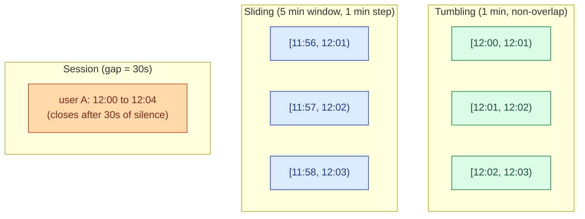

A stream is unbounded: it never ends. To compute anything useful, you have to chop it into bounded chunks called windows. Tumbling windows are fixed and non-overlapping. Sliding windows overlap. Session windows close after a gap of inactivity. Each one answers a different question.

**What this page will cover.**

- Tumbling: "events per minute" dashboards. Simplest, most common.
- Sliding: "rolling 5-minute average updated every 30 seconds." More state, more cost.
- Session: per-user activity bursts. The window length is data-dependent.
- Custom windowing: "all events for this order ID" or "until the cart closes."
- Window state size and why a 1-day session window can explode memory.
- The Flink and Kafka Streams APIs for each, side by side.

*Page coming soon.*

This concept sits in **Stage 4 (Streaming and event-driven)** of the [Data Engineering Roadmap](/practice/data-engineering/roadmap/).
