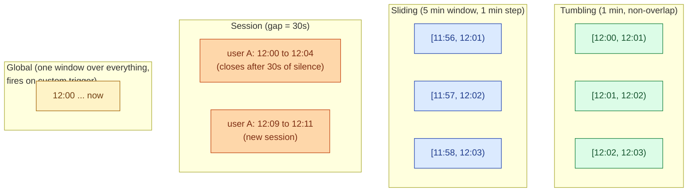
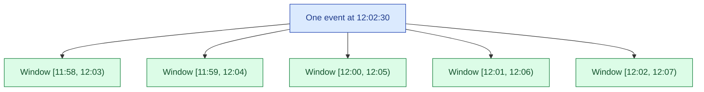
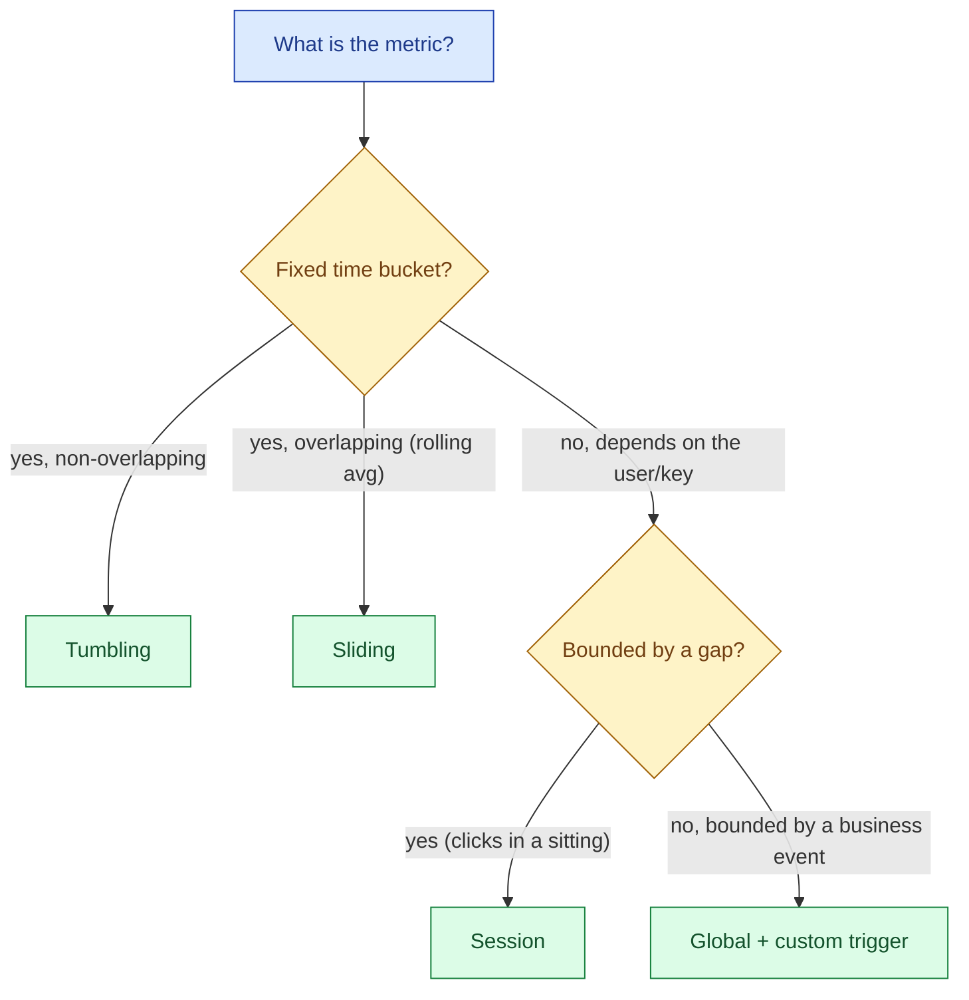

A stream is unbounded: it never ends. To compute anything useful you have to chop it into bounded chunks called windows. Tumbling windows are fixed and non-overlapping. Sliding windows overlap. Session windows close after a gap of inactivity. Global windows hold everything until you tell them to fire. Each one answers a different question and costs different amounts of state.

## The four window types



| Window | Shape | Best for |
|---|---|---|
| **Tumbling** | Fixed length, non-overlapping | "Orders per minute", standard time-series dashboards |
| **Sliding** | Fixed length, overlapping by a step | "Rolling 5-minute average updated every 30 seconds" |
| **Session** | Gap-driven, variable length, per key | "User activity bursts", "shopping sessions" |
| **Global** | One window forever, fires on trigger | Custom aggregations, "all events for this order" |

## Tumbling: the default

A tumbling window of size `W` produces back-to-back, non-overlapping intervals. Every event lands in exactly one window. This is what almost every "events per X" dashboard wants.

```sql
-- Spark Structured Streaming
SELECT
    window.start AS minute,
    COUNT(*) AS orders
FROM stream
  WATERMARK event_time '30 seconds'
GROUP BY window(event_time, '1 minute');
```

```java
// Flink
stream
    .keyBy(e -> e.getRegion())
    .window(TumblingEventTimeWindows.of(Time.minutes(1)))
    .aggregate(new CountAgg());
```

State cost is small: one accumulator per key per active window. When the watermark passes the window end, state is released.

## Sliding: rolling averages, overlapping

Sliding windows have a `size` and a `step`. A 5-minute window with a 1-minute step produces a window every minute, each one covering the previous 5 minutes.

```sql
-- Spark
SELECT
    window.start AS slide_start,
    AVG(latency_ms) AS avg_latency_5m
FROM stream
  WATERMARK event_time '30 seconds'
GROUP BY window(event_time, '5 minutes', '1 minute');
```

```java
// Flink
stream
    .keyBy(e -> e.getServiceName())
    .window(SlidingEventTimeWindows.of(Time.minutes(5), Time.minutes(1)))
    .aggregate(new AvgAgg());
```

The catch: each event belongs to `size / step` windows simultaneously. A 5-minute window with a 1-minute step puts each event in 5 windows. The state cost is 5x the equivalent tumbling window. With a 1-second step it would be 300x. Pick the step honestly; "update every second" sounds cheap and is not.



## Session: when the window length depends on the data

A session window is per key. It opens with the first event and stays open as long as new events keep arriving within a gap timeout. Once `gap_timeout` passes with no events, the session closes and the aggregation fires.

```sql
-- Spark (session window, Spark 3.2+)
SELECT
    user_id,
    session_window(event_time, '30 seconds').start AS session_start,
    session_window(event_time, '30 seconds').end AS session_end,
    COUNT(*) AS clicks
FROM stream
  WATERMARK event_time '5 minutes'
GROUP BY user_id, session_window(event_time, '30 seconds');
```

```java
// Flink
stream
    .keyBy(e -> e.getUserId())
    .window(EventTimeSessionWindows.withGap(Time.seconds(30)))
    .aggregate(new ClickCountAgg());
```

Sessions are how you ask "what did one user do in one sitting" without picking an arbitrary cutoff. The cost: state is unbounded per active session. A user who keeps clicking forever keeps the session open forever.

In practice, you set a maximum session length (allowed_lateness or a custom trigger) and accept that pathologically long sessions get cut.

## Global: custom triggers, custom semantics

A global window holds every event for a key and never closes on time. You attach a custom trigger that decides when to emit.

```java
// Flink: fire when order is marked complete
stream
    .keyBy(e -> e.getOrderId())
    .window(GlobalWindows.create())
    .trigger(new CompleteOrderTrigger())
    .aggregate(new OrderAgg());
```

Use cases that need this: "fire when the order goes to status=shipped," "emit when the cart is checked out," "compute once per game round of variable length." The shape is the same in every engine; the trigger is the interesting part.

## Picking a window type



When in doubt, start with tumbling. It is the cheapest, simplest, and most legible window. Switch to sliding only when a smooth rolling metric is the actual requirement. Switch to session only when the question is genuinely per-user-burst. Reach for global only when none of the others fit.

## State cost, in one table

| Window type | State per key per window | Notes |
|---|---|---|
| **Tumbling 1m** | 1 accumulator at a time | Cheapest |
| **Sliding 5m / 1m step** | 5 accumulators per key | 5x cost |
| **Sliding 5m / 1s step** | 300 accumulators per key | Almost always wrong |
| **Session, 30s gap** | 1 accumulator while session is open | Unbounded if user never stops |
| **Global** | 1 accumulator from start of key | Unbounded until you purge |

When state size shows up in your incident review, it is almost always sliding with too small a step or session with no max length.

## Worked example: a Flink job per window type

```java
// Tumbling: clicks per minute, per region
clicks
    .keyBy(c -> c.region)
    .window(TumblingEventTimeWindows.of(Time.minutes(1)))
    .aggregate(new ClickCount());

// Sliding: 5-min average latency, refreshed every 30s
latencies
    .keyBy(l -> l.service)
    .window(SlidingEventTimeWindows.of(Time.minutes(5), Time.seconds(30)))
    .aggregate(new AvgLatency());

// Session: shopping session per user, 5-min gap
events
    .keyBy(e -> e.userId)
    .window(EventTimeSessionWindows.withGap(Time.minutes(5)))
    .aggregate(new SessionStats());

// Global: aggregate per order until it ships
orderEvents
    .keyBy(o -> o.orderId)
    .window(GlobalWindows.create())
    .trigger(new OrderShippedTrigger())
    .aggregate(new OrderAgg());
```

## Common mistakes

- **Sliding when tumbling would do.** "Updated every 10 seconds" was a wish, not a requirement. Sliding multiplies state. Ask if the consumer actually needs the overlap.
- **Session windows without a max length.** A bot or a long-poll user keeps the session open for days, and the state never releases. Always cap.
- **Forgetting watermarks.** A window without a watermark either never closes (event time) or closes at wall-clock time (wrong answer). See [Watermarks](/practice/data-engineering/concepts/033-watermarks/).
- **Mismatched window and trigger.** Sliding with a "fire on every event" trigger sends huge updates per event. Pick one or the other.
- **Picking a window that does not match the storage.** Sliding windows produce overlapping rows; a sink that expects one row per minute will reject or duplicate.
- **A 1-day tumbling window in event time.** This holds 1 day of state per key. With millions of keys, this is gigabytes. Use incremental aggregates and shorter windows where possible.
- **Treating session windows as time-bucketed.** Sessions are per key. Aggregating sessions back into time buckets needs a second windowed job.

## Quick recap

- Four window types: tumbling (fixed, non-overlap), sliding (overlap), session (gap-driven, per key), global (custom trigger).
- Default to tumbling. It is the cheapest and most legible.
- Sliding state cost is `size / step`. A small step is expensive.
- Sessions are per key and unbounded by default. Always set a maximum session length.
- Global windows hold state forever until your trigger fires. Use only when no other window fits.
- Window choice and watermark choice are paired. Pick both, document both.

This concept sits in **Stage 4 (Streaming and event-driven)** of the [Data Engineering Roadmap](/practice/data-engineering/roadmap/).
