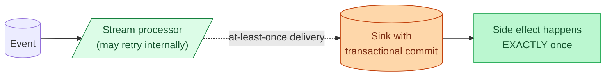

"Exactly-once" is the most over-claimed phrase in streaming. What it actually means: the side effects of processing an event happen exactly once, even if the system retries the event many times under the hood. Which is real, useful, and very different from "no event is ever processed twice."

**What this page will cover.**

- The honest definition: exactly-once effects, not exactly-once delivery.
- Kafka transactions: how the producer writes atomic batches the consumer reads atomically.
- Flink's checkpoints + transactional sinks: the canonical exactly-once setup.
- Spark Structured Streaming's idempotent sink + checkpoint pattern.
- The two-generals fundamental limit: across network boundaries, exactly-once is built, not given.
- When at-least-once + idempotency is the simpler, often better answer.

*Page coming soon. Until then, see [#014 Exactly-once delivery](/practice/data-engineering/014-exactly-once-delivery/) for the practice problem.*

This concept sits in **Stage 4 (Streaming and event-driven)** of the [Data Engineering Roadmap](/practice/data-engineering/roadmap/).
