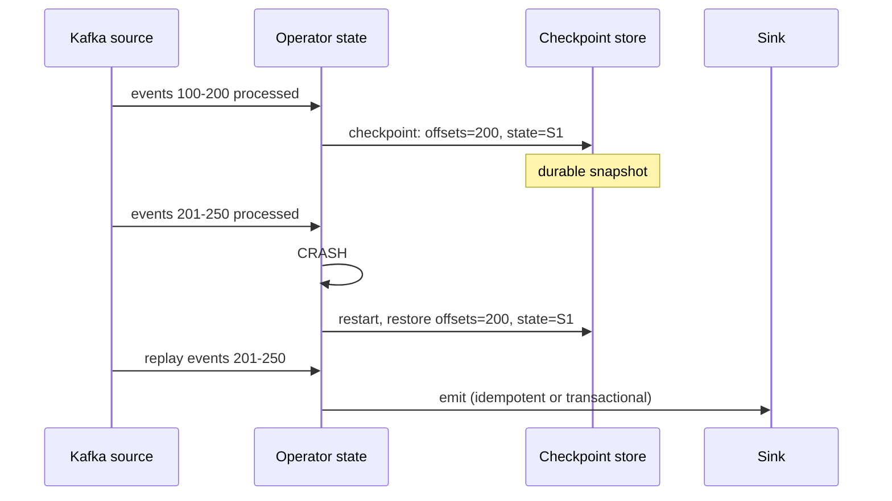
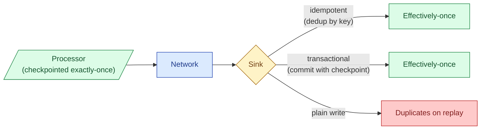
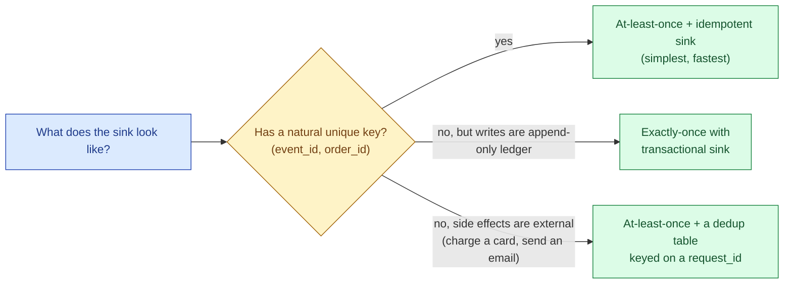

"Exactly-once" is the most over-claimed phrase in streaming. What it actually means: the side effects of processing an event happen exactly once, even if the system retries the event many times under the hood. Which is real, useful, and very different from "no event is ever processed twice." Read the fine print or you will ship a billing pipeline that double-charges customers and then argue about whose fault it was.

## Three delivery guarantees

The honest taxonomy. Every streaming system sits in one of three buckets.

| Guarantee | What can happen | Example sink |
|---|---|---|
| **At-most-once** | Events can be lost. Never duplicated. | Fire-and-forget UDP, dropping non-critical logs |
| **At-least-once** | No events lost. Duplicates possible. | Default Kafka producer, default consumer commit |
| **Exactly-once** | No loss, no duplicates (in effect) | Kafka transactions + Flink checkpoints + transactional sink |

"Effectively-once" is the more accurate name for what people mean by exactly-once. The system may process an event many times internally; what is guaranteed is that the observable effect is the same as processing it once.


## Why exactly-once at the processing layer is solved

Modern stream processors (Flink, Spark Structured Streaming, Kafka Streams) give you exactly-once within their own boundaries. The trick is a checkpoint protocol that snapshots both the input offsets and the operator state atomically.



When the operator crashes, it restores the last checkpoint and replays the events between then and now. The state and the input offsets are restored as a pair, so the operator picks up exactly where the snapshot was taken. No event is lost, no event is double-counted in the state.

The processing layer is now exactly-once. The hard part is the sink.

## Why exactly-once end-to-end is hard

The processor restored to checkpoint 200 and is now replaying events 201-250. If during the first run it had already written event 217 to the sink, the replay will write it again. End-to-end exactly-once requires the sink to either reject the duplicate or commit only when the processor commits.



Two patterns work in practice.

**Idempotent sink.** The sink dedups by a key. Postgres `INSERT ... ON CONFLICT DO NOTHING` with a unique constraint. Iceberg / Delta `MERGE` keyed on `event_id`. Redis `SETNX`. Replays are safe because the second write is a no-op. This is the simpler half of the answer; it works whenever a natural unique key exists.

**Transactional sink.** The sink supports a two-phase commit that ties into the processor's checkpoint. Flink's `TwoPhaseCommitSinkFunction` does this for Kafka, JDBC, Iceberg, and a few others. The sink writes pre-committed data on every event; on checkpoint, the data is committed atomically with the offset advance. On crash, uncommitted writes are discarded.

## The canonical pattern: Kafka transactions + Flink

The most common production setup. Kafka transactions let a producer write a batch of messages atomically; consumers configured with `isolation.level=read_committed` see only committed batches.

```java
// Flink Kafka sink with exactly-once
KafkaSink<Event> sink = KafkaSink.<Event>builder()
    .setBootstrapServers(brokers)
    .setRecordSerializer(...)
    .setDeliveryGuarantee(DeliveryGuarantee.EXACTLY_ONCE)
    .setTransactionalIdPrefix("orders-job")
    .build();
```

What happens under the hood:

1. The operator processes events 201 to 250.
2. For each event, it writes a record into a Kafka transaction (visible to nobody yet).
3. On checkpoint, Flink calls `producer.commitTransaction()`. The records become visible to downstream consumers atomically.
4. If the operator crashes before the commit, Flink calls `producer.abortTransaction()` on restart. The pre-committed records are discarded. The replay re-writes them in a fresh transaction.

```sql
-- consumer side (Kafka or Flink reading the output topic)
SET isolation.level = read_committed;
```

Without `read_committed`, the consumer sees uncommitted records too, and the guarantee is broken.

## Spark Structured Streaming: checkpoint + idempotent sink

Spark takes the simpler-but-more-restrictive path. The processor checkpoints to a directory. On restart, it replays from the last committed offset. The sink is expected to be idempotent or supports a transactional foreach.

```python
(stream
    .writeStream
    .option("checkpointLocation", "s3://bucket/checkpoint/")
    .foreachBatch(idempotent_merge)
    .start())

def idempotent_merge(df, batch_id):
    # Use batch_id as part of the key, or MERGE on event_id
    df.writeTo("target_table").using("iceberg").overwritePartitions()
```

Spark passes a monotonically increasing `batch_id` to the foreach. Idempotent sinks use it (or a natural key) to detect and skip duplicate batches.

## When at-least-once + idempotency is the right answer

Real talk: in most pipelines, full exactly-once is more machinery than the problem needs. At-least-once delivery plus an idempotent sink gives you the same observable result with less moving parts and lower latency.



The teams that benefit most from full transactional exactly-once are append-only ledgers (payments to Kafka, trades to Kafka), where there is no natural key to dedup on and a duplicate write is a real duplicate row downstream.

## The two-generals limit

Across a network boundary, there is a fundamental impossibility result: two processes cannot agree on whether a message was delivered without a third message, and that third message has the same problem. This is why "exactly-once delivery" is impossible in the strict sense.

What systems do instead is move the agreement out of the message and into shared durable state: the Kafka transaction marker, the Flink checkpoint barrier, the Iceberg snapshot pointer. Both sides agree on "did the commit happen" by looking at the same durable artifact. That is what makes effectively-once real.

## Common mistakes

- **Reading "exactly-once" as a property of one component.** It is an end-to-end property of source + processor + sink together. Any link without the right guarantee breaks the chain.
- **Enabling Flink exactly-once but writing to a plain JDBC sink.** The JDBC sink without two-phase commit produces duplicates on every checkpoint replay.
- **Forgetting `isolation.level=read_committed` on downstream consumers.** They see uncommitted transactional records and the chain breaks silently.
- **Trying to dedup on `event_time + payload`.** Hash collisions and legitimate duplicate-content events break this. Use a producer-generated `event_id` (UUID).
- **Picking exactly-once where at-least-once + idempotency would do.** Extra latency, extra cluster complexity, no business benefit. Pick the simpler model when it works.
- **Treating retries as the source of duplicates.** Duplicates also come from rebalances, leader elections, network blips, and crashes. The fix is the same; the cause is broader.
- **Assuming "the sink supports upsert" means "exactly-once is safe."** Upsert handles duplicates on the same key. If the processor is producing rows with different keys per replay (because it generates the key itself), upsert does not save you.

## Quick recap

- Three real guarantees: at-most-once, at-least-once, exactly-once (effectively).
- Exactly-once is solved at the processor layer by checkpoints that snapshot offsets + state atomically.
- End-to-end exactly-once needs the sink to dedup (idempotent) or to commit with the processor (transactional).
- The canonical setup is Kafka transactions + Flink two-phase commit, with `read_committed` consumers downstream.
- At-least-once + idempotent sink is often the simpler answer and the right default.
- The two-generals limit means delivery exactly-once is impossible. Effect exactly-once is achievable through shared durable state.
- "Exactly-once" claims are end-to-end claims. Check every link.

This concept sits in **Stage 4 (Streaming and event-driven)** of the [Data Engineering Roadmap](/practice/data-engineering/roadmap/).
