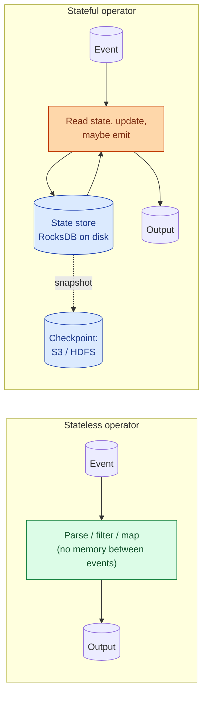
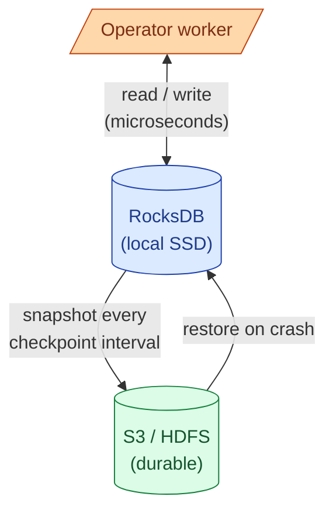
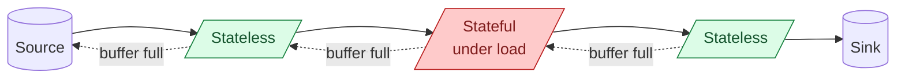

A stateless stream transforms one event at a time and produces one output. Filter, map, parse, format. A stateful stream remembers things across events: counts, joins, windows, dedup sets. State has to live somewhere durable so the job can recover from a crash. State changes everything about how you size, operate, and reason about the pipeline.

## The two shapes



| Property | Stateless | Stateful |
|---|---|---|
| **Memory between events** | None | Per-key state |
| **Crash recovery** | Just restart and resume | Restore state from snapshot |
| **Scaling** | Add workers freely | Re-key and re-shuffle state |
| **Cost** | CPU only | CPU + disk + network for snapshots |
| **Examples** | Parse JSON, filter, project | Count, join, window, dedup |

## What is "stateless," really

A truly stateless operator is one where the output for event `N` depends only on event `N`. The classic examples:

- **Parse / decode.** JSON to a typed record. Avro to a map. No memory needed.
- **Filter.** `WHERE region = 'EU'`. Each event evaluated alone.
- **Project / map.** `SELECT user_id, amount * 1.25 AS amount_with_vat`. One row in, one row out.
- **Mask / redact.** Replace PII fields with hashes. One row in, one row out.

Stateless operators scale linearly. Doubling the workers doubles the throughput. Recovery is free: just restart the worker, advance to the latest offset, and resume. Crashes lose nothing.

```python
# Stateless Flink operator
events = source.map(lambda e: parse_json(e))
filtered = events.filter(lambda e: e["region"] == "EU")
projected = filtered.map(lambda e: {"user_id": e["user_id"], "vat_amount": e["amount"] * 1.25})
```

If your whole pipeline is stateless, you do not need most of what streaming systems offer. You could run it as a serverless function per event.

## What is "stateful"

A stateful operator's output depends on this event plus everything that came before for the same key. The canonical examples:

- **Counts and aggregations.** Sum per user. The running total is state.
- **Joins.** Stream-to-stream join needs to buffer one side until matches arrive on the other.
- **Windows.** A 1-minute window buffers events for a minute before emitting. The buffer is state.
- **Deduplication.** "Have I seen this event_id before?" Needs a set of recently-seen IDs.
- **Sessionisation.** A session is open until a gap closes it. The open sessions are state.
- **Pattern detection.** "Did the user log in, then change password, then log out within 30 seconds?" The current pattern position is state.

Stateful operators are where streaming earns its keep. They are also where streaming pipelines fall over.

## Where state lives

In modern Flink (default) and Kafka Streams: a local embedded RocksDB on each worker's local disk, backed by checkpoints to durable storage (S3, GCS, HDFS).



RocksDB on local SSD gives microsecond read/write latency for any key. The state is partitioned by key: each worker owns a slice of the keyspace and the state for those keys.

Snapshots are taken on every checkpoint (default: every 1 to 10 seconds). Flink does incremental snapshots, so only the changed RocksDB SST files are uploaded. A 1 TB state with 10 GB of churn per checkpoint uploads 10 GB, not 1 TB.

Kafka Streams uses RocksDB locally too, but it also writes every state change to a Kafka **changelog topic**. On restart, the state is rebuilt by replaying the changelog. Slower to start, no need for separate snapshots.

## State size and what it costs

A small state job (under 10 GB) is operationally easy. A large state job (1 TB+) is a different kind of system.

| State size | What it feels like |
|---|---|
| **Under 10 GB** | Fits in heap or small SSD. Snapshots are fast. |
| **10 GB to 100 GB** | RocksDB on SSD is essential. Checkpoint time becomes visible. |
| **100 GB to 1 TB** | Worker provisioning matters: disk IOPS, network for snapshots. |
| **1 TB+** | Specialist territory. Scale state independently of compute, incremental checkpoints, careful re-key. |

The two things that blow up state size:

1. **Long windows on high-cardinality keys.** A 1-day session window on 50 million users with 10 KB per user is 500 GB.
2. **Joins with no TTL.** A stream-to-stream join that keeps every left-side record for a possible match keeps growing forever.

## State TTL: the rule every stateful job needs

The default behaviour of most state stores is to keep state forever. That is almost always wrong. Without a TTL or an explicit expiry, the state grows until the job OOMs or the snapshot becomes uncopyable.

```java
// Flink: time-to-live on a state descriptor
StateTtlConfig ttl = StateTtlConfig
    .newBuilder(Time.hours(24))
    .setUpdateType(UpdateType.OnCreateAndWrite)
    .cleanupInRocksdbCompactFilter(1000)
    .build();
stateDescriptor.enableTimeToLive(ttl);
```

Pick a TTL that matches the business question. "Daily active users" needs 24 hours of state. "Sessions" needs the session gap. "Dedup against last hour" needs an hour. The right TTL is the shortest one that still answers the question.

When TTL is not possible (an audit-log style job that really does need full history), the answer is to externalise the state to a database (Postgres, Cassandra, DynamoDB) rather than holding it in the streaming engine.

## Backpressure: when state runs ahead of compute

Stateful operators read and write RocksDB on every event. If the per-event work goes up (state grows, cache misses, snapshots stall), the operator can no longer keep up with the input. The buffer between operators fills, and backpressure propagates upstream until the source itself slows.



The visible symptom is consumer lag growing on the source topic. The root cause is almost always the largest stateful operator. The fix is usually one of: shorter TTL, more workers (re-key and shuffle), faster local disk (RocksDB on SSD), or shrinking what is stored per key.

## Worked example: counts per user, per hour

```sql
-- Spark Structured Streaming
SELECT
    user_id,
    window.start AS hour,
    COUNT(*) AS events
FROM stream
  WATERMARK event_time '5 minutes'
GROUP BY user_id, window(event_time, '1 hour');
```

What is stateful here:

- Per `(user_id, hour)`, a running count accumulator. With 10 million users and one active window per user, that is 10 million accumulators, each a few bytes.
- Spark's state store keeps each `(user_id, hour)` row until the watermark passes the window end plus allowed lateness.
- Total active state during normal operation: ~10M entries x ~50 bytes = ~500 MB. Manageable.

Now change the window to 1 day with a 7-day allowed lateness. Each user has 7 active windows. State balloons to ~3.5 GB just for the counts, plus index overhead. The same query shape, very different operating cost.

## Common mistakes

- **Treating "stateful" as a one-bit property.** "How much" state matters more than "any" state. A 1 MB stateful job and a 1 TB stateful job are different systems.
- **No state TTL.** The default-forever behaviour is the most common cause of streaming jobs OOMing in week three.
- **Re-keying without rethinking state.** A stateful operator's state is partitioned by key. Changing the key means re-shuffling all state. This is a migration, not a config change.
- **Counting on Kafka Streams to scale state past one TB.** It rebuilds state from the changelog on restart. With 1 TB of state, restart can take hours.
- **Snapshotting too often.** Every checkpoint costs network and disk. A 1-second checkpoint interval on 100 GB of state is a lot of constant I/O. Match the interval to your recovery objective.
- **Forgetting that joins are stateful.** A stream-to-stream join with no TTL on the buffered side grows forever. Always cap the join window.
- **Mixing stateful and stateless work in one operator.** Keep stateless work (parse, filter) upstream so the stateful operator has less work to do per event and a smaller per-event payload to snapshot.

## Quick recap

- Stateless = output depends only on the current event. Cheap, easy to scale, free recovery.
- Stateful = output depends on current event plus history per key. Needs durable state and snapshots.
- State lives in local RocksDB, snapshotted to S3 or rebuilt from a changelog topic.
- State size is the single biggest driver of stateful streaming cost. Track it.
- Always set a TTL or an explicit expiry. The default-forever is almost always wrong.
- Long windows on high-cardinality keys and joins-without-TTL are the two state-explosion patterns.
- Backpressure on the source topic almost always points back to the largest stateful operator.

This concept sits in **Stage 4 (Streaming and event-driven)** of the [Data Engineering Roadmap](/practice/data-engineering/roadmap/).
