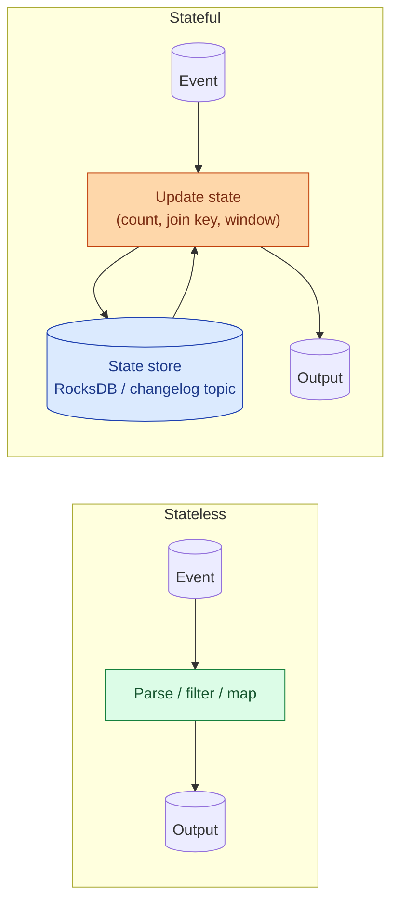

A stateless stream transforms one event at a time and produces one output. Filter, map, parse, format. A stateful stream remembers things across events: counts, joins, windows, dedup sets. State has to live somewhere durable so the job can recover from a crash. State changes everything about how you size, operate, and reason about the pipeline.

**What this page will cover.**

- Examples of stateless: parsing JSON, filtering by region, masking a column.
- Examples of stateful: counts per minute, deduplication, stream-to-stream joins.
- Where state lives: RocksDB on the executor, backed by a Kafka changelog topic.
- Checkpoints: the snapshot that lets the job restart without losing state.
- Why a 30-minute session window for 10 million users needs serious memory planning.
- The "expire old state" rule that every stateful job needs or it OOMs eventually.

*Page coming soon.*

This concept sits in **Stage 4 (Streaming and event-driven)** of the [Data Engineering Roadmap](/practice/data-engineering/roadmap/).
