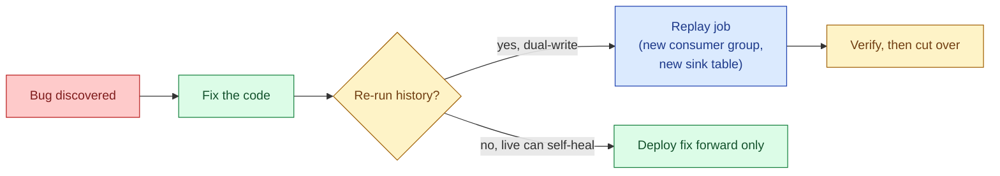
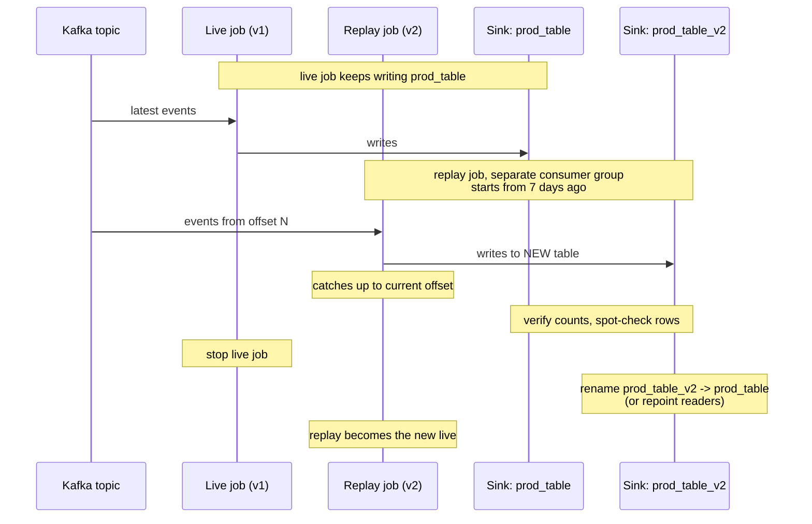
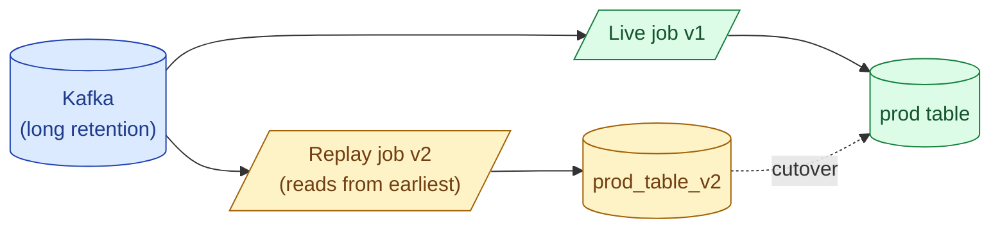
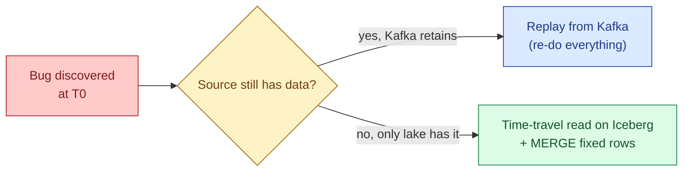

A bug ships in your streaming job. You fix it. Now you need to re-run the last 7 days of events with the new code. Replay is the streaming version of backfill: rewind the source, run the job on history, write to a new output, then cut over. The shape is the same; the operational care is harder because you have a live consumer to protect.

## When you need to replay

Four reasons you will reach for replay, in order of how often they happen:

1. **A bug in the processing logic.** A wrong filter, a misplaced join key, a units mistake. The downstream data is wrong since the day the bug shipped.
2. **A schema change.** A new column derived from the source needs to be backfilled.
3. **A semantic change.** The definition of "active user" changed. The historical aggregate needs to be recomputed.
4. **An onboarding new consumer.** A new dashboard or model needs the last 30 days of computed data, not just from today onward.



## What replay needs from the source

Replay is only possible if the source can be re-read from an earlier point. The two practical sources:

- **Kafka with sufficient retention.** Topics with 7 or 30 days of retention let you start a new consumer group from `earliest` or from a specific offset. This is the default in modern data platforms.
- **Object-store log (Kinesis Firehose to S3, Kafka tiered storage to S3).** Cold storage of historical events, often years deep. Slower to read but unbounded in time.

If neither exists, replay is impossible and the fix has to be applied to whatever derived store does have history (the warehouse, the lake), which is usually a batch job, not a stream replay.

This is the operational case for keeping Kafka retention generous. The cost of 30 days of retention is small. The cost of "we cannot replay, do a batch backfill against Postgres" is enormous, every time.

## The dual-write cutover pattern

The standard pattern that keeps the live consumer untouched while replay runs:



Key choices that make this safe:

- **New consumer group.** Means the replay does not move the offset committed by the live consumer. Live keeps running.
- **New sink table or topic.** Means the replay does not overwrite live output until you choose to.
- **Verify before cutover.** Compare row counts, spot-check primary keys, run the diff-two-tables query from [Set operations](/practice/data-engineering/concepts/006-set-operations/).
- **Cut over by repointing readers, not by overwriting.** Rename tables, swap views, change the route in the BI tool. Always reversible.

## The Kappa architecture

The "everything is a replay" view of streaming.

In a Kappa architecture, there is no batch layer. Every job is a streaming job. Every backfill is a replay from Kafka. There is no separate Spark batch pipeline that recomputes history.



Kappa works when the streaming engine can keep up with a multi-day replay at high throughput, and when the source has enough retention. Flink can replay weeks of data at gigabytes per second when properly sized. Spark Structured Streaming can too, with larger micro-batches during replay.

The honest limit: replays of more than ~30 days are expensive enough that most teams build a batch path for historical recomputation and reserve replay for recent history.

## The other option: time-travel on the lake

Modern table formats (Iceberg, Delta, Hudi) keep snapshot history. You can read the table at any past point in time without replaying anything.

```sql
-- Iceberg
SELECT * FROM events FOR TIMESTAMP AS OF '2026-05-25 00:00:00';

-- Delta
SELECT * FROM events TIMESTAMP AS OF '2026-05-25 00:00:00';
SELECT * FROM events VERSION AS OF 1247;
```

If your historical events are landed into an Iceberg or Delta table by the streaming job, you can:

1. Read the table at the time the bug was discovered.
2. Reprocess just the affected rows with the fixed logic.
3. `MERGE` the corrections back into the live table.

This is "reprocess without replay." It avoids re-reading Kafka and reuses the lake's storage. The cost: you can only reprocess what the lake already has, not anything beyond the lake's earliest snapshot.



## Replay throttling

A replay job is a new consumer group reading from `earliest`. It pulls as fast as Kafka will serve it. If the live producers and live consumers are already saturating Kafka egress, the replay can starve everyone.

Two throttles that work:

- **Max records per second on the consumer.** Flink: `pollTimeoutMs` and `maxRecordsPerSecond`. Spark: `maxOffsetsPerTrigger`.
- **A separate Kafka broker pool for replay.** If you replay often, route replay traffic to dedicated brokers or a separate cluster that mirrors the source. Costs money. Worth it on busy clusters.

The simpler rule: do replays during low-traffic hours when possible, monitor broker egress while replay runs, and have a kill switch.

## Verification before cutover

Never cut over without comparing.

```sql
-- a row-count check
SELECT COUNT(*) FROM prod_table
WHERE event_time BETWEEN '2026-05-25' AND '2026-06-01';

SELECT COUNT(*) FROM prod_table_v2
WHERE event_time BETWEEN '2026-05-25' AND '2026-06-01';

-- a content diff (see Set operations)
(SELECT event_id, total FROM prod_table WHERE event_time BETWEEN '2026-05-25' AND '2026-06-01'
 EXCEPT
 SELECT event_id, total FROM prod_table_v2 WHERE event_time BETWEEN '2026-05-25' AND '2026-06-01')
UNION ALL
(SELECT event_id, total FROM prod_table_v2 WHERE event_time BETWEEN '2026-05-25' AND '2026-06-01'
 EXCEPT
 SELECT event_id, total FROM prod_table WHERE event_time BETWEEN '2026-05-25' AND '2026-06-01');
```

Counts should match (or differ in a known direction: the v2 is the fix, the old was wrong). The content diff should be small and explainable, all rows the bug touched.

## Common mistakes

- **Replaying into the live table.** Now live and replay both write the same rows. Race condition, duplicates, no rollback. Always replay into a new table or a new topic.
- **Reusing the live consumer group for replay.** The replay commits offsets the live job depended on. Live now skips events. Always use a fresh consumer group.
- **No retention margin.** A 7-day retention with a bug discovered on day 7 means you have hours, not days, to replay. Run with 14 to 30 days when you can.
- **Forgetting that stateful operators rebuild state from scratch during replay.** A counter that took a week to grow takes a week of events to rebuild. Plan replay job sizing for the early bursts.
- **Replaying without throttling on a shared Kafka cluster.** The replay saturates broker egress and kills production. Throttle or run during quiet hours.
- **Cutting over without a verification step.** "The job ran without errors" is not verification. Compare counts, diff rows, spot-check.
- **Not keeping the old sink table around after cutover.** Keep it for a few days at minimum. Roll back is "repoint the reader," which only works if the old table still exists.

## Quick recap

- Replay is streaming's backfill. Rewind the source, run the job, write to a new sink, cut over.
- Source retention is the constraint: Kafka with 7 to 30 days of retention is the default enabler.
- Standard pattern: new consumer group + new sink table + verification + repoint-on-cutover. Never touch live.
- Kappa architecture treats every backfill as a replay. Works up to roughly 30 days of history.
- Iceberg / Delta time-travel is "reprocess without replay" for data already landed in the lake.
- Throttle replays on shared clusters. The new consumer pulls as fast as the broker serves.
- Verify before cutover. Counts, diffs, spot checks. "No errors" is not verification.

This concept sits in **Stage 4 (Streaming and event-driven)** of the [Data Engineering Roadmap](/practice/data-engineering/roadmap/).
