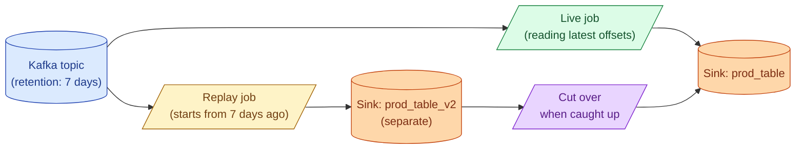

A bug ships in your streaming job. You fix it. Now you need to re-run the last 7 days of events with the new code. Replay is the streaming version of backfill: rewind the Kafka offsets, run the job on history, write to a new output, then cut over. The shape is the same; the operational care is harder because you have a live consumer to protect.

**What this page will cover.**

- The Kappa architecture: replay-as-a-feature, no separate batch layer.
- Required for replay: a Kafka topic with enough retention or a re-readable source.
- The "new consumer group, new sink table" pattern that keeps live untouched.
- Throttling replay so it does not blow the Kafka egress budget.
- Verification before cut-over: do the row counts match? Do the spot checks line up?
- The cost: replay is expensive; rebuild only what you have to.

*Page coming soon.*

This concept sits in **Stage 4 (Streaming and event-driven)** of the [Data Engineering Roadmap](/practice/data-engineering/roadmap/).
