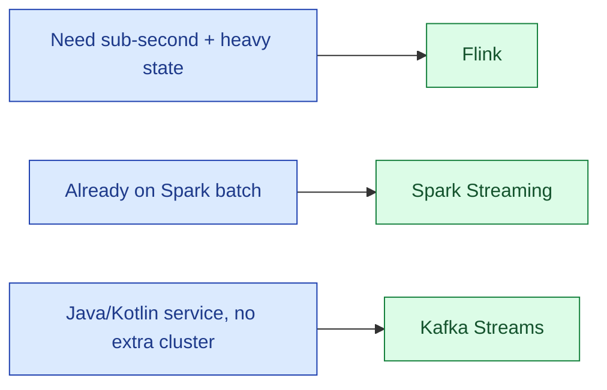

Flink is the high-throughput, low-latency, stateful-streaming heavyweight. Spark Structured Streaming gives the same API as Spark batch, with mini-batch semantics. Kafka Streams is a library that runs inside your JVM application, with no separate cluster. Each one fits a real team shape, and the honest answer for new projects is rarely "use the one everyone already knows."

| | Flink | Spark Streaming | Kafka Streams |
|---|---|---|---|
| **Latency** | Sub-second | Seconds (mini-batch) | Sub-second |
| **Throughput** | Very high | Very high | Moderate |
| **Cluster** | Separate JobManager + TaskManagers | Spark cluster | None, runs in your app |
| **State** | RocksDB + checkpoints, very mature | State store, less flexible | RocksDB + changelog topic |
| **Best at** | True streaming, low-latency, stateful | Batch + streaming sharing one API | Embedded stream processing |

**What this page will cover.**

- The three real positions: dedicated platform (Flink), unified batch+stream (Spark), embedded library (Kafka Streams).
- The "mini-batch vs true streaming" debate, settled.
- Operations cost: Flink needs a real platform team; Kafka Streams is just another deploy.
- State sizes: Flink scales further before you feel the pain.
- The 2026 honest take: Flink for greenfield streaming, Spark Streaming when batch+stream symmetry matters, Kafka Streams for small embedded pipelines.

*Page coming soon.*

This concept sits in **Stage 4 (Streaming and event-driven)** of the [Data Engineering Roadmap](/practice/data-engineering/roadmap/).
