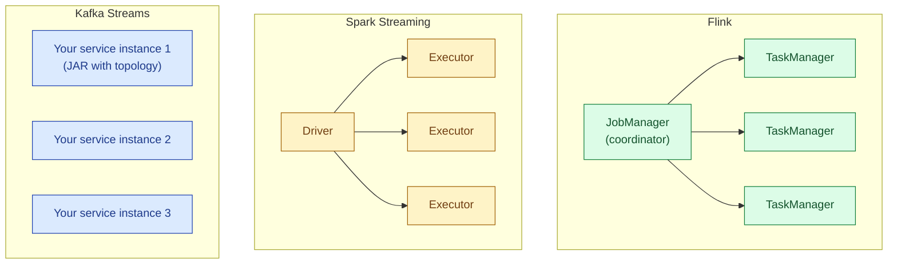
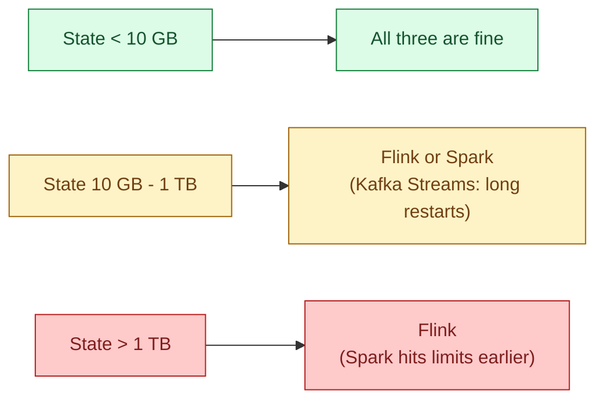
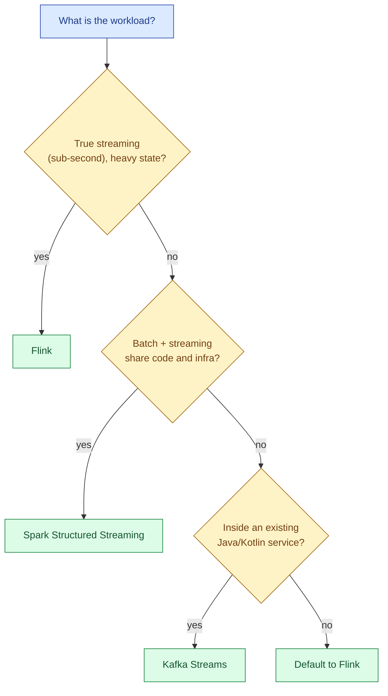

Flink is the high-throughput, low-latency, stateful-streaming heavyweight. Spark Structured Streaming gives the same API as Spark batch, with micro-batch semantics. Kafka Streams is a library that runs inside your JVM application, with no separate cluster. Each one fits a real team shape, and the honest answer for new projects is rarely "use the one everyone already knows."

## The three positions at a glance

| | Flink | Spark Structured Streaming | Kafka Streams |
|---|---|---|---|
| **Model** | True streaming, event-at-a-time | Micro-batch (default), continuous (experimental) | True streaming, event-at-a-time |
| **Latency floor** | Tens of milliseconds | 100 ms to several seconds | Tens of milliseconds |
| **Throughput** | Very high | Very high | Moderate (per app) |
| **Deployment** | Standalone cluster: JobManager + TaskManagers | Spark cluster (batch infra reused) | Library inside your service |
| **State backend** | RocksDB + checkpoints to S3 | State store + checkpoint dir | RocksDB + Kafka changelog topic |
| **SQL** | Flink SQL (mature) | Spark SQL (most mature) | KSQL (separate project) |
| **Sweet spot** | True streaming, heavy state, low latency | Batch+stream sharing one codebase | Embedded streams inside a service |

## How each one processes an event

```mermaid
flowchart TB
    subgraph F["Flink: event-at-a-time"]
        F1[("Event")] --> F2["Operator picks it up<br/>immediately"]:::g --> F3["Updates state, emits"]:::g
    end
    subgraph SP["Spark: micro-batch"]
        SP1[("Events")] --> SP2["Buffer for ~1s"]:::y
        SP2 --> SP3["Run a batch<br/>(Spark job)"]:::y
        SP3 --> SP4["Emit results"]:::y
    end
    subgraph KS["Kafka Streams: event-at-a-time, in your app"]
        KS1[("Event")] --> KS2["Topology in your JVM"]:::a --> KS3["State store local,<br/>changelog to Kafka"]:::a
    end

    classDef g fill:#dcfce7,stroke:#15803d,color:#14532d
    classDef y fill:#fef3c7,stroke:#a16207,color:#713f12
    classDef a fill:#dbeafe,stroke:#1e40af,color:#1e3a8a
```



Flink and Kafka Streams react to each event as it arrives. Spark Structured Streaming, in its default micro-batch mode, accumulates events for some interval (often 1 second) and runs a small Spark job on the batch. The interval is the latency floor. Spark has a continuous mode that processes event-at-a-time, but it has been experimental for years and is not the default anyone runs in production.

## Latency, in honest numbers

| Workload | Flink | Spark Streaming (1s batch) | Kafka Streams |
|---|---|---|---|
| **Filter and forward** | 10-50 ms | 1-3 s | 10-50 ms |
| **Stateful aggregation** | 50-200 ms | 1-5 s | 50-200 ms |
| **Stream-stream join** | 100-500 ms | 2-10 s | 100-500 ms |
| **Bursty input** | Backpressures cleanly | Batches get larger | Backpressures, but per-app |

If you need sub-second p99 latency, Spark Structured Streaming is not the right answer. If you need 1-3 second p99 latency, all three work and the other factors decide.

## Deployment shapes



**Flink** runs as a dedicated cluster: a JobManager and N TaskManagers, usually on Kubernetes or YARN. The cluster is independent of your application code; you submit jobs to it. Operating a Flink cluster is a real platform investment.

**Spark Structured Streaming** runs on a Spark cluster, the same one your batch jobs use. The streaming job is just a long-running Spark application. Teams already on Spark for batch get streaming with no new infrastructure.

**Kafka Streams** has no separate cluster. The library is included in your microservice's JAR. Each instance of the service runs a slice of the topology and owns a slice of the state. Scaling is "deploy more instances." There is no operator overhead beyond what your service already has.

## State, scaled

Flink's RocksDB state backend has been tested into the tens of terabytes in production. Incremental snapshots keep checkpoint cost manageable. The state is partitioned by key across TaskManagers, and Flink handles rescaling (changing parallelism) without losing state.

Spark's state store has improved a lot but is still less battle-tested at very large scale. State joins and large session windows hit limits earlier than in Flink. Most Spark Streaming jobs in production carry under 100 GB of state.

Kafka Streams stores state locally on each instance and writes a changelog to Kafka. On a service restart, the instance rebuilds local state by replaying the changelog topic. With 100 GB of state, restart can take an hour. Kafka Streams is great for state up to a few GB per instance; beyond that, you start paying the restart cost on every deploy.



## SQL surface

All three offer SQL. They are not equally far along.

```sql
-- Flink SQL
CREATE TABLE orders (
    order_id BIGINT,
    user_id BIGINT,
    amount DECIMAL(10,2),
    event_time TIMESTAMP(3),
    WATERMARK FOR event_time AS event_time - INTERVAL '30' SECOND
) WITH ('connector' = 'kafka', ...);

SELECT user_id, COUNT(*) AS orders
FROM orders
GROUP BY user_id, TUMBLE(event_time, INTERVAL '1' MINUTE);
```

```sql
-- Spark Structured Streaming SQL
SELECT user_id, window.start AS minute, COUNT(*) AS orders
FROM orders
  WATERMARK event_time '30 seconds'
GROUP BY user_id, window(event_time, '1 minute');
```

Spark SQL is the most mature, because it is the same SQL Spark batch uses. Flink SQL is mature and feature-complete for streaming-specific operations (windows, watermarks, joins) and is the choice for "SQL-only streaming team." KSQL (now ksqlDB) sits on top of Kafka Streams; it is sufficient for basic use but lags the other two in window types and join semantics.

## The 2026 honest take

After a decade of "true streaming vs micro-batch" debate, the market has settled.

- **Flink is the default for true streaming.** When the question is "low-latency, stateful, dedicated streaming platform," Flink wins. Confluent, Apple, Stripe, Uber, Alibaba all run Flink at very large scale. The community is healthy. Flink SQL has reached the point where greenfield teams pick it over Spark Streaming.
- **Spark Structured Streaming is the choice when batch and streaming share a codebase.** If your team writes Spark batch jobs and wants the streaming version to look the same, Spark Streaming is the right answer. The latency floor is 1-3 seconds; if that is fine, you avoid running a second cluster type.
- **Kafka Streams is a service-internal tool.** It shines inside a Java or Kotlin microservice that wants to maintain a materialised view of a Kafka topic without standing up a streaming cluster. It does not compete with Flink for big standalone pipelines.



## Operational cost, plainly

| | Flink | Spark Streaming | Kafka Streams |
|---|---|---|---|
| **Platform team needed** | Yes, a real one | Yes, but shared with batch | No, just normal service ops |
| **Time to first job** | Weeks (cluster setup) | Days if Spark exists | Days (just a library) |
| **Per-job operational overhead** | Low once platform exists | Low | Lowest |
| **Recovery from a bad deploy** | Job-level redeploy | Job-level redeploy | Service-level redeploy |
| **Multi-tenant cluster** | Yes, native | Yes, native | No, one app per cluster of instances |

Flink's "weeks to first job" is real. The Flink-on-Kubernetes operator (and managed services like Confluent's, Ververica's, AWS MSF, Aiven's) have shortened this, but it is still a real platform investment. Spark Streaming inherits the batch platform. Kafka Streams inherits whatever your service deployment already looks like.

## Worked picks

Three plausible team shapes and the right pick for each.

**A 5-person data platform team at a SaaS company. Most work is batch in Spark, with one streaming use case (real-time order events feeding a dashboard).** Spark Structured Streaming. The streaming job reuses the cluster, the SQL is familiar, the 1-3 second latency is fine for the dashboard. Adding Flink for one job is not worth the platform investment.

**A 15-person data infra team at a fintech with sub-second latency requirements on trade events.** Flink. The platform investment is justified by the latency requirement and the state size. Flink SQL keeps the business-logic surface accessible to a wider team.

**A backend team running a Java microservice that needs a materialised view of a topic for an internal API.** Kafka Streams. No separate cluster, the topology is just code in the service, deploys are normal service deploys. Flink for one materialised view would be overkill.

## Common mistakes

- **Picking the streaming engine your team already runs, regardless of fit.** A Spark shop trying to do sub-second streaming on Spark will fight the engine. A non-JVM team trying to run Kafka Streams will fight the deployment model.
- **Treating Spark Structured Streaming as "the same as Flink."** Same SQL surface, different latency model. The continuous-mode workaround has been experimental for years.
- **Running Kafka Streams for very large state.** A 500 GB state with hour-long restart times is operational pain you do not have to take.
- **Underestimating Flink's platform investment.** "We will spin up a Flink cluster" is a quarter of work, not a week, unless you use a managed service.
- **Ignoring Flink SQL.** Many teams write Flink jobs in Java when SQL would do. The SQL surface is mature; use it when you can.
- **Picking based on benchmarks alone.** All three benchmark well. Operational fit decides production outcomes.
- **Forgetting that Spark Streaming inherits Spark's batch tooling.** Notebooks, the catalyst optimiser, Delta integration. For teams already on Spark, this is a real advantage.

## Quick recap

- Three real choices: Flink (true streaming heavyweight), Spark Structured Streaming (batch+stream unified), Kafka Streams (in-service library).
- Flink and Kafka Streams are event-at-a-time. Spark is micro-batch with a 1-3 second latency floor.
- State scales further in Flink than Spark; Kafka Streams works well under ~100 GB per instance.
- Spark SQL is the most mature SQL surface; Flink SQL is close behind and growing fast.
- Pick by workload: latency + state + team shape. There is no single right answer.
- 2026 reality: Flink dominates dedicated streaming, Spark dominates batch+stream symmetry, Kafka Streams stays a niche for in-service materialised views.

This concept sits in **Stage 4 (Streaming and event-driven)** of the [Data Engineering Roadmap](/practice/data-engineering/roadmap/).
