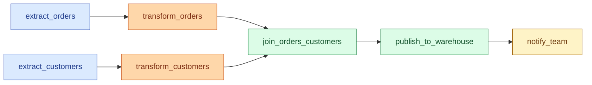
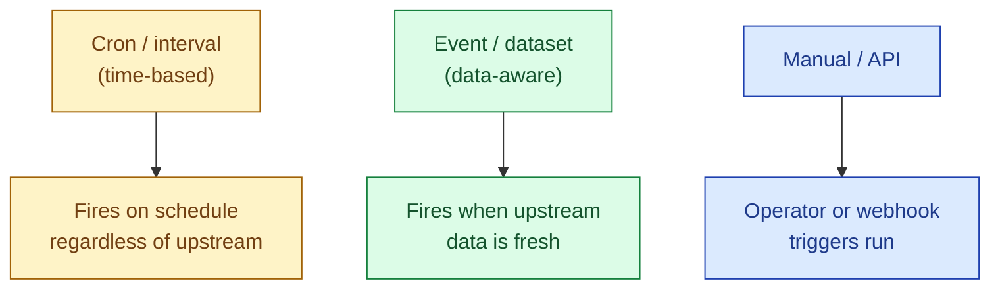
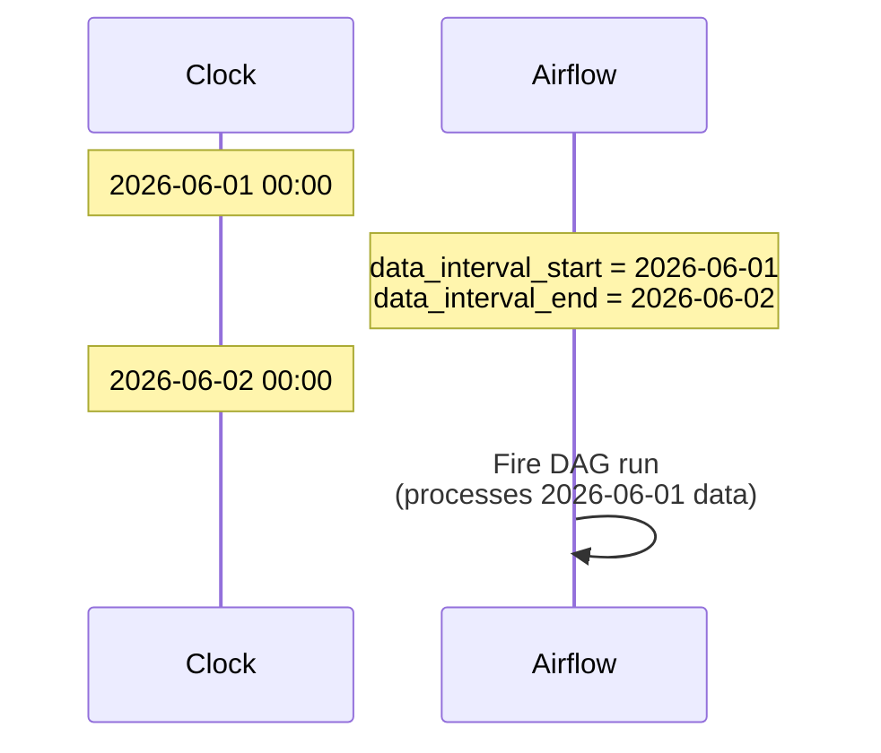

A DAG (directed acyclic graph) is the shape of every modern orchestrator: tasks connected by arrows, no loops, runs in order. The orchestrator's job is to look at the DAG, figure out which tasks are ready, run them, retry the ones that fail, and not lose the thread when something breaks. Airflow, Dagster, Prefect, Argo all do this. The differences sit in how each one expresses the DAG and how it decides what counts as "ready."

## What a DAG actually is

Two parts. **Directed**: every edge has an arrow, the dependency runs one way. **Acyclic**: no path that loops back on itself. A cycle would mean task A waits for task B, which waits for task A, which never starts. The scheduler would deadlock. So every orchestrator validates the graph and refuses to register a DAG with a cycle.



Five concepts cover every orchestrator:

- **Task**: one unit of work. A Python function, a SQL query, a shell command.
- **Dependency**: "this task starts only after that task finishes."
- **Schedule**: when the DAG triggers. Cron, interval, event, or manual.
- **Run**: one execution of the DAG for one specific point in time.
- **Status**: each task lives in a state machine. `queued`, `running`, `success`, `failed`, `upstream_failed`, `skipped`, `retry`.

Everything else is window dressing.

## Cron vs interval vs data-aware schedules

Three families of schedule, in roughly the order they appeared historically.

**Cron schedules** are wall-clock based. `0 6 * * *` means "every day at 06:00." Simple, predictable, and the historical default. The catch: cron does not know whether yesterday's run succeeded, whether the upstream data is ready, or whether the clock just crossed daylight savings.

**Interval schedules** trigger every N minutes or hours from a start time. Airflow's `schedule_interval=timedelta(hours=1)` is this. Same downsides as cron, but easier to reason about for non-daily cadences.

**Data-aware schedules** trigger when the data they depend on changes. Dagster's asset sensors, Airflow's `Dataset` triggers, dbt Cloud's source-driven schedules. The DAG fires because upstream finished, not because the clock said so. This is the direction the whole field has moved in.



A real platform usually mixes all three. The ingest job runs on cron because the source dumps a file at 02:00. Downstream transforms react to ingest finishing. Ad-hoc reruns go through the manual API.

## The Airflow trap: schedule_interval vs data_interval

Airflow is the orchestrator most people meet first, and it confuses everyone the same way. A DAG with `schedule_interval='@daily'` does **not** run at midnight on day X. It runs at the **end** of the interval, so the run that processes day X fires shortly after the start of day X+1.



So the "execution date" or "logical date" you see in the UI is the **start** of the interval that the run covers, not when the run actually executed. New engineers hit this on day one: they look at the UI, see a run dated `2026-06-01`, and ask why it actually started at `2026-06-02 00:05`.

The reason: a daily job for the data of June 1st cannot start until June 1st is over. Otherwise you would process a partial day. Airflow encodes that into the model. Dagster sidesteps the confusion by talking about partitions instead, but the same calendar math applies.

The matching `catchup` parameter says: "if the DAG was paused and you turned it back on today, should I run every historical interval that was missed?" Default is `True`. That is the other foot-gun: someone unpauses a DAG that has been off for three weeks and accidentally fires 21 runs at once.

## A worked example in Airflow

```python
from datetime import datetime, timedelta
from airflow import DAG
from airflow.operators.python import PythonOperator

default_args = {
    "owner": "data",
    "retries": 3,
    "retry_delay": timedelta(minutes=5),
    "email_on_failure": True,
}

with DAG(
    dag_id="orders_daily",
    start_date=datetime(2026, 1, 1),
    schedule="0 2 * * *",      # 02:00 every day
    catchup=False,             # don't backfill on unpause
    default_args=default_args,
    max_active_runs=1,         # one run at a time
) as dag:

    extract = PythonOperator(
        task_id="extract_orders",
        python_callable=extract_orders,
    )
    transform = PythonOperator(
        task_id="transform_orders",
        python_callable=transform_orders,
    )
    publish = PythonOperator(
        task_id="publish_orders",
        python_callable=publish_orders,
    )

    extract >> transform >> publish
```

Every meaningful production setting is in `default_args` and the DAG kwargs. `retries=3` says "if a task fails, try again three times before giving up." `catchup=False` says "do not flood the queue when I unpause this." `max_active_runs=1` says "never have two runs of this DAG overlapping."

The body of the DAG is just shape: extract, then transform, then publish.

## Status and the state machine

Every task in every orchestrator walks through roughly the same states.

| State | Meaning |
|---|---|
| `queued` | All upstreams done, waiting for an open worker slot |
| `running` | Worker picked it up, executing now |
| `success` | Returned cleanly |
| `failed` | Threw an exception, no retries left |
| `up_for_retry` | Failed, but will be tried again after the retry delay |
| `upstream_failed` | A required upstream failed, so this task will not run |
| `skipped` | A branch operator chose a different path |

The orchestrator's whole job is moving tasks through this state machine. Most operational debugging is reading the state of a single failed task and asking "why is it in that state, and what would move it forward?"

## Why DAGs are code, not YAML

The original orchestrators (Oozie, Luigi's config files) used XML or YAML. Modern ones use Python because pipelines have logic: "extract this list of tables, but skip the deprecated ones, and parameterise the warehouse name by environment." YAML can express the DAG but not the logic that generates it.

The downside of code is that a Python file with hidden side effects can break the scheduler. Airflow's parser walks every DAG file every 30 seconds, so a `requests.get()` at module level will hammer the network and slow the scheduler. Keep DAG files pure: define the DAG, do not run work in module scope.

## Common mistakes

- **Cyclic dependencies.** Almost always a sign that one of the tasks should be split. If A depends on B and B depends on A, one of them is doing two things.
- **Forgetting `catchup=False` on a new DAG.** The default is `True`, and unpausing a DAG with a 2024 start date in 2026 will queue hundreds of runs.
- **Confusing logical date with run-start time.** They are not the same. The logical date is the start of the interval the run covers.
- **Heavy work at the top of a DAG file.** The parser sees it on every reload. Move work into tasks.
- **No `retries`.** A flaky network call without retries pages you at 3 a.m. Three retries with exponential backoff prevents most of that.
- **Cron schedules that ignore upstream readiness.** A 02:00 transform that runs before the 02:30 ingest is wrong even when both succeed.
- **Mixing scheduling models in one DAG without thinking.** A task with a cron schedule inside a data-aware DAG fires at the wrong time, every time.

## Quick recap

- A DAG is tasks plus dependencies, with no cycles. The orchestrator walks it in topological order.
- Three schedule families: cron, interval, data-aware. Modern platforms mix all three.
- Airflow's "logical date" is the start of the interval the run covers, not when the run executed.
- Five concepts cover every orchestrator: task, dependency, schedule, run, status.
- Set `catchup=False` on new DAGs unless you genuinely want historical replay.
- DAGs as code beats DAGs as YAML, as long as your DAG files have no top-level side effects.

This concept sits in **Stage 3 (Batch pipelines and orchestration)** of the [Data Engineering Roadmap](/practice/data-engineering/roadmap/).
