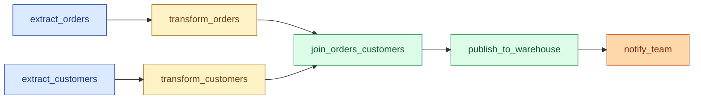

A DAG (directed acyclic graph) is the shape of every modern orchestrator: tasks connected by arrows, no loops, runs in order. The orchestrator's job is to look at the DAG, figure out which tasks are ready, run them, and not break when one fails. Airflow, Dagster, Prefect, Argo — they all do this. The differences are in how they express the DAG and how they handle failures.

**What this page will cover.**

- The five concepts behind every orchestrator: task, dependency, schedule, run, status.
- Why a DAG must be acyclic (otherwise the scheduler does not terminate).
- Time-based schedules vs event-based triggers vs sensor-based waits.
- The execution date / logical date distinction that confuses everyone for their first month.
- Retries, retry delay, max retries, alert-on-failure — the boring settings that prevent 3 a.m. pages.
- Why "the DAG is code" beats "the DAG is YAML" for everything except platform teams.

*Page coming soon.*

This concept sits in **Stage 3 (Batch pipelines and orchestration)** of the [Data Engineering Roadmap](/practice/data-engineering/roadmap/).
