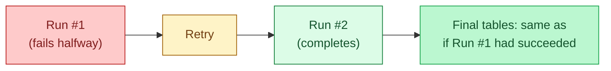
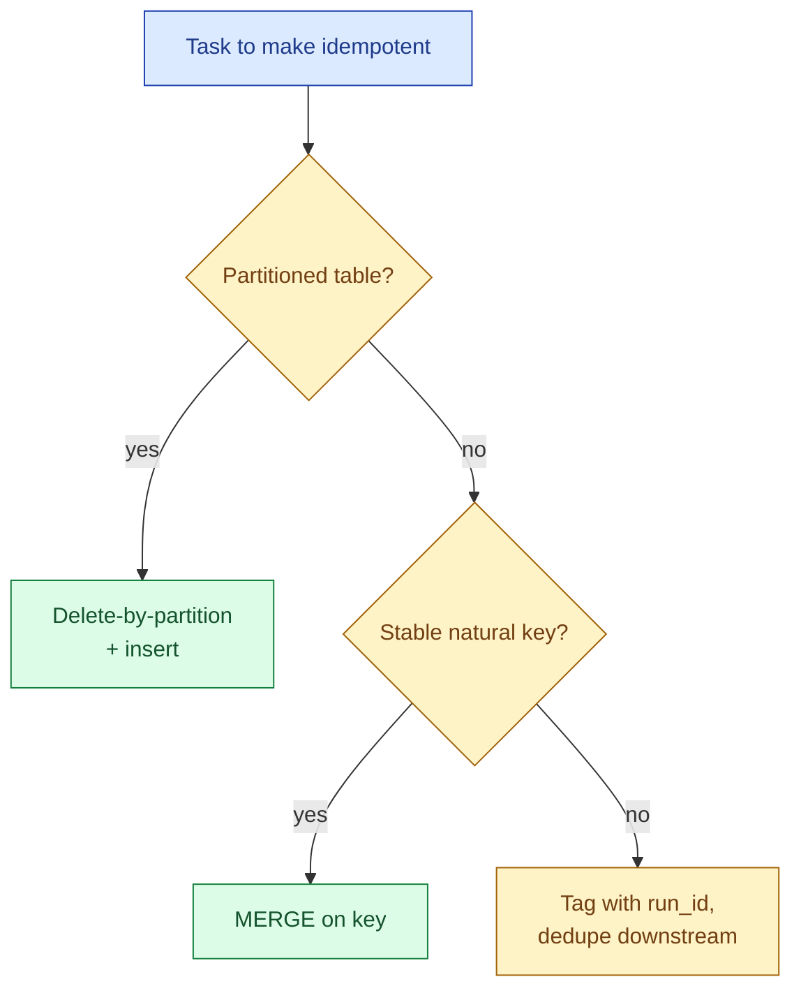

An idempotent task can run again with the same inputs and produce the same end state, no matter how many times it ran before. In an orchestrator that means a retry, a backfill, or a manual replay does not double-count rows, does not create phantom invoices, does not leave the table in a half-written state. Idempotency at the task level is the single most important property to design for, because retries are not optional. They are how the system survives the network.

## Task idempotency vs pipeline idempotency

Two slightly different ideas. Task idempotency is local: the one task can be re-run safely. Pipeline idempotency is global: the whole DAG, end to end, produces the same final tables when re-run for the same logical date.



A pipeline can be idempotent even if some individual tasks are not, as long as the failure modes line up. For example a non-idempotent `INSERT` task is fine if the very next task truncates and rebuilds the partition. But the safe design is: every task idempotent, every pipeline idempotent, no clever recovery logic to remember.

## The three patterns that make tasks idempotent

You only need three patterns to make almost any data task idempotent.

### Pattern 1: delete-by-partition then insert

The simplest pattern. The task takes a logical date or a partition key. Step one: delete every row in that partition. Step two: insert the new rows.

```sql
DELETE FROM fact_orders
 WHERE event_date = '{{ ds }}';

INSERT INTO fact_orders
SELECT *
  FROM staging.orders
 WHERE event_date = '{{ ds }}';
```

Re-running this task with the same `ds` (Airflow's date string for the logical date) wipes whatever the previous attempt wrote and replaces it. The end state is identical whether the task ran once or five times.

Works well for partitioned tables. Falls over if you do not know which partition a row belongs to, or if rows can span partitions.

### Pattern 2: MERGE on a natural key

When the data is keyed by something stable (`order_id`, `event_id`, `customer_id`), use `MERGE` (or `INSERT ... ON CONFLICT DO UPDATE`) to upsert.

```sql
MERGE INTO fact_orders t
USING staging.orders s
   ON t.order_id = s.order_id
 WHEN MATCHED THEN UPDATE SET
   total = s.total, status = s.status, updated_at = s.updated_at
 WHEN NOT MATCHED THEN INSERT
   (order_id, customer_id, total, status, updated_at)
   VALUES (s.order_id, s.customer_id, s.total, s.status, s.updated_at);
```

Re-running on the same staging data produces the same final rows. Works across partitions, handles late-arriving updates, costs a bit more than delete + insert because of the matching scan.

### Pattern 3: dedupe by run_id or event_id

If you cannot delete (immutable table, append-only log) and you cannot merge (no natural key), tag every row with the run that produced it and dedupe downstream.

```sql
INSERT INTO raw_events
SELECT *, '{{ run_id }}' AS run_id
  FROM source_events;

-- downstream view drops duplicates
CREATE OR REPLACE VIEW latest_events AS
SELECT * EXCEPT(run_id, rn)
  FROM (
    SELECT *, ROW_NUMBER() OVER (
      PARTITION BY event_id ORDER BY run_id DESC
    ) AS rn
    FROM raw_events
  )
 WHERE rn = 1;
```

A retry writes a second copy with a new `run_id`. The downstream view picks the latest. This is the most expensive of the three patterns at read time, but it works when nothing else does.



## Retries: the cheap safety net

Every orchestrator lets you set retries per task. Sensible defaults:

```python
default_args = {
    "retries": 3,
    "retry_delay": timedelta(minutes=5),
    "retry_exponential_backoff": True,
    "max_retry_delay": timedelta(minutes=30),
}
```

Three retries with exponential backoff catches the vast majority of transient failures: a connection reset, a brief warehouse pause, a flaky DNS lookup. The retry only helps if the task is idempotent. Otherwise the retry is the bug.

Do not retry on logic errors. A schema mismatch, a missing source file, a permissions error: these will fail the same way every time. Build the task to raise a fatal exception (Airflow's `AirflowFailException`) so the orchestrator skips the retry and goes straight to alert.

## The logical date trick

Every task in every modern orchestrator has access to a logical date or partition key. Airflow calls it `ds` or `data_interval_start`. Dagster calls it the partition key. Prefect passes it as a parameter.

Pass that value into every query. Never use `CURRENT_DATE` or `now()` inside a task. If you do, a retry tomorrow processes a different partition than the original run, and the pipeline stops being idempotent.

```sql
-- correct: uses logical date
WHERE event_date = '{{ ds }}'

-- wrong: uses wall clock at execution
WHERE event_date = CURRENT_DATE
```

This one habit prevents more 3 a.m. incidents than any other.

## The audit table

A small audit table answers "did this partition load successfully?" without grepping the logs.

```sql
CREATE TABLE pipeline_audit (
  dag_id        TEXT,
  task_id       TEXT,
  logical_date  DATE,
  run_id        TEXT,
  status        TEXT,       -- 'started', 'success', 'failed'
  row_count     BIGINT,
  started_at    TIMESTAMP,
  finished_at   TIMESTAMP
);
```

Every task writes a row when it starts and updates it when it finishes. To find missing partitions, query the audit table, not the warehouse. The audit row is also what tells a manual rerunner "row 47 of the backfill is the one that died."

## Common mistakes

- **Plain `INSERT` without dedup.** A retry doubles the rows. The single most common idempotency bug.
- **Using `CURRENT_DATE` inside a task body.** A retry tomorrow targets the wrong partition.
- **Truncating the whole table to "make it idempotent."** Now backfills wipe live data. Truncate the partition, not the table.
- **Retries on logic errors.** Three retries on a schema mismatch is just three failures with extra waiting. Raise fatal for logic errors.
- **Idempotent tasks behind a non-idempotent task.** The first task in the chain corrupts the data; the rest faithfully propagate the corruption.
- **Side-effects in module scope.** Sending a Slack message from the top of a DAG file fires every time the scheduler parses the file, which is every 30 seconds.
- **No audit table.** When something breaks at 03:00, you grep logs instead of running one SQL query.

## Quick recap

- Idempotent task: re-run with the same inputs, same end state. The retry-safety property.
- Three patterns cover almost every case: delete-by-partition, MERGE on key, dedupe by run_id.
- Retries are free safety only if the task is idempotent. Otherwise they make things worse.
- Pass the logical date into every query. Never `CURRENT_DATE` inside a task.
- An audit table beats grepping logs when something fails overnight.
- Design every task to be idempotent. The clever exceptions are never worth the on-call cost.

This concept sits in **Stage 3 (Batch pipelines and orchestration)** of the [Data Engineering Roadmap](/practice/data-engineering/roadmap/).
