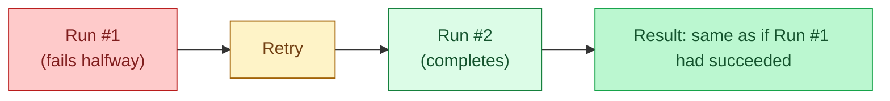

An idempotent task can be re-run safely without changing the result beyond the first successful run. In an orchestrator, this matters because retries are inevitable: a task fails, the scheduler retries it, and your data must not double up or partially apply. Idempotency at the task level is what makes a DAG repair itself instead of needing a human at 3 a.m.

**What this page will cover.**

- The pattern: delete + insert by partition, or merge by natural key.
- Task-level retries (3 with exponential backoff) as the cheap safety net.
- Why "INSERT" without a deduplication step makes retries dangerous.
- Tracking what was already processed: filenames, offsets, hashes — and where to store that state.
- The "logical date" trick: every task knows which partition it owns, even on retry.
- The audit table that lets you answer "did this partition load successfully?" without grepping logs.

*Page coming soon.*

This concept sits in **Stage 3 (Batch pipelines and orchestration)** of the [Data Engineering Roadmap](/practice/data-engineering/roadmap/).
