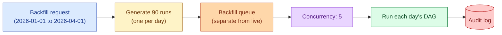

A backfill in an orchestrator is a structured set of historical DAG runs, one per missed or re-run period. Done well it picks up where it left off, throttles concurrency, runs in a separate queue, and writes an audit trail. Done badly it shares the live queue, drowns the warehouse, and quietly skips half the partitions.

**What this page will cover.**

- Airflow's `airflow dags backfill` command vs `clear` vs manual triggers.
- Dagster's partition-based backfill (the cleanest model).
- Concurrency pools / queues that isolate backfill from live work.
- Dependency-ordered backfill: upstream models first, downstream after.
- Idempotency as the precondition: a backfill rerun is just retries at scale.
- Tracking progress: what is the cheapest way to know "we are at day 47 of 90"?

*Page coming soon.*

This concept sits in **Stage 3 (Batch pipelines and orchestration)** of the [Data Engineering Roadmap](/practice/data-engineering/roadmap/).
