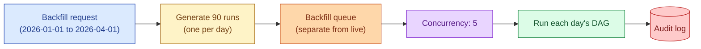
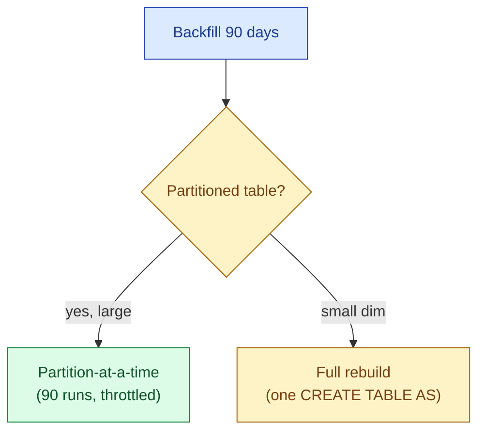
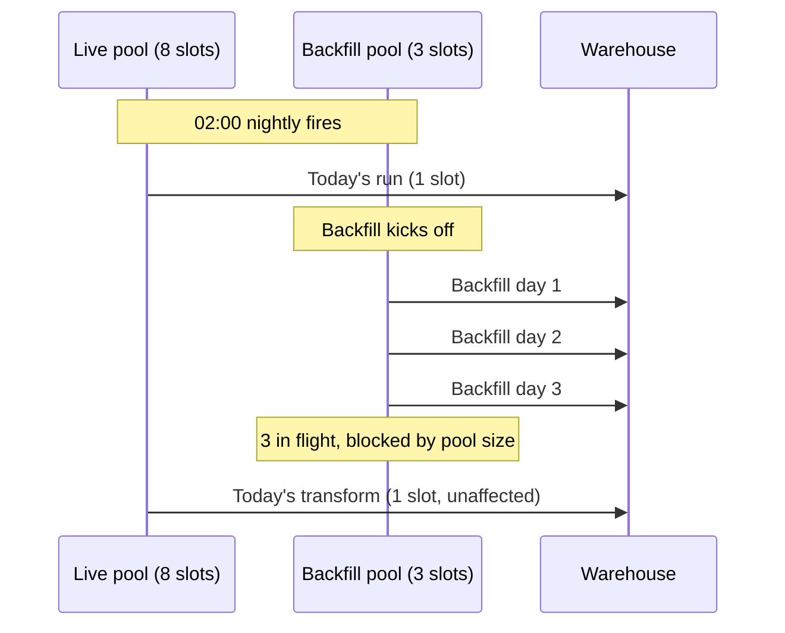

A backfill in an orchestrator is a structured set of historical DAG runs, one per missed or re-run period. Done well it picks up where it left off, throttles concurrency, runs on its own queue, and writes an audit trail. Done badly it shares the live worker pool, drowns the warehouse, and quietly skips half the partitions while the on-call team is asleep.



The precondition is idempotency. If a task cannot be safely re-run for the same logical date, a backfill is just an automated way to corrupt 90 days of data instead of one. Build idempotency first, then talk about backfills.

## The two flavours: partition-at-a-time vs full rebuild

There are two shapes of backfill, and the difference matters.

**Partition-at-a-time.** Run the DAG once per logical date, the same way the scheduler runs it nightly. If the DAG processes one day of data per run, a 90-day backfill is 90 runs. This is the default in Airflow's `dags backfill` and Dagster's partition backfills. Slower, but identical to live operation, and the failure of one partition does not block the others.

**Full rebuild.** Rebuild the whole table from scratch in one query, ignoring partitions. Faster for small tables, dangerous for big ones, and disastrous for any downstream that depends on partial state. Use this only for dimensions that fit in memory.



In practice, 90% of warehouse backfills should be partition-at-a-time. The exceptions are dimension tables where the data is small and dependencies are tight.

## Concurrency: how many partitions at once

The whole reason backfills go wrong is concurrency. A naive backfill of 90 days runs 90 DAGs in parallel, each one hammering the same warehouse, until the warehouse hits its query queue limit and starts rejecting writes.

Every orchestrator has a knob for this. Airflow: `--max-active-runs` and worker pools. Dagster: `max_concurrent` on the backfill. Prefect: concurrency tags on the work pool.

A safe rule: start with concurrency 5. Watch the warehouse for the first ten partitions. If queues are clean and slot utilisation is healthy, raise to 10. If anything looks contended, drop to 3.

```python
# Dagster: backfill 90 partitions, 5 at a time
ctx.instance.backfill(
    partition_set=daily_orders,
    partition_keys=[f"2026-01-{d:02d}" for d in range(1, 91)],
    max_concurrent=5,
    tags={"queue": "backfill"},
)
```

## A separate queue for backfill traffic

The single best operational practice for backfills is isolating them on a separate worker pool. Live runs (the nightly DAGs that produce today's dashboards) use the main pool. Backfills use a backfill pool with fewer workers and lower priority. If the backfill misbehaves, it cannot starve the live pipelines.

Airflow expresses this with pools and the `pool` argument on each task. Dagster does it with run tags and queued runs concurrency keys. Prefect does it with work pools and tags. The names differ; the pattern is the same.



Without the pool, the backfill happily grabs all eight live slots, today's run sits in the queue, and the morning dashboards are late.

## Respecting downstream dependencies

A backfill of the `fact_orders` table does not stand alone. There are downstream models (revenue marts, executive dashboards, ML features) that depend on it. Two options:

1. **Backfill upstream first, downstream after.** Cleanest. Walk the asset graph in topological order. Dagster does this for you with multi-asset backfills.
2. **Backfill the whole subgraph per partition.** For each day, run `fact_orders` then `dim_revenue` then `mart_executive_daily`. Slower per partition but produces a consistent end-to-end state per day.

The first is faster wall-clock. The second leaves the data in a useful state at every intermediate point. Pick based on whether someone might query mid-backfill.

## A worked Airflow backfill

The CLI form, with the safe flags:

```bash
airflow dags backfill \
  --start-date 2026-01-01 \
  --end-date   2026-04-01 \
  --pool       backfill_pool \
  --reset-dagruns \
  --max-active-runs 5 \
  orders_daily
```

`--pool backfill_pool` keeps it out of the live pool. `--max-active-runs 5` caps parallelism. `--reset-dagruns` wipes the previous attempts for those dates so the new run is the truth.

For a partial rerun (a specific list of dates), use `airflow tasks clear` with `--start-date` / `--end-date` and let the scheduler pick them back up.

## Tracking progress without grepping logs

The audit table from the idempotency page does double duty here. A single query tells you where the backfill is:

```sql
SELECT logical_date,
       MAX(status)        AS status,
       MIN(started_at)    AS started_at,
       MAX(finished_at)   AS finished_at,
       SUM(row_count)     AS rows_loaded
  FROM pipeline_audit
 WHERE dag_id   = 'orders_daily'
   AND logical_date BETWEEN '2026-01-01' AND '2026-04-01'
 GROUP BY logical_date
 ORDER BY logical_date;
```

This is the dashboard for the backfill. Day-by-day status, row counts, timing. If day 47 failed, that one row tells you. If day 48 onwards is still `started` from yesterday, the backfill is hung.

Dagster's UI shows this natively in the partition backfill view. Airflow needs the audit query. Either way, the question "where are we?" should be one query, not a grep.

## Rebuilding only affected partitions

A subtler pattern. A bug in the transform logic was deployed three weeks ago. Only the affected partitions need rebuilding, not the full year. Build the backfill query against the audit table:

```sql
SELECT DISTINCT logical_date
  FROM pipeline_audit
 WHERE dag_id = 'orders_daily'
   AND logical_date >= '2026-05-10'   -- when the bug landed
 ORDER BY logical_date;
```

Feed that list to the orchestrator as the partition set. Now the backfill rebuilds 21 days, not 365. The pattern generalises: any time you can isolate the affected blast radius, the backfill shrinks to match.

## Common mistakes

- **Sharing the live pool.** The single biggest operational mistake. Backfills starve the morning dashboards.
- **No concurrency cap.** 90 parallel warehouse queries melt the warehouse and your wallet.
- **No idempotency.** Now the backfill writes 90 days of duplicates.
- **Backfilling downstream before upstream.** Wastes the downstream work, which gets redone after upstream lands.
- **Rebuilding the world when 21 days would do.** Use the audit table to scope the blast radius.
- **No audit trail.** "Did we backfill day 47?" becomes a log grep instead of a SQL query.
- **Mixing `airflow dags backfill` with `airflow tasks clear` randomly.** Pick one approach and stay with it. Otherwise you do not know which runs are authoritative.

## Quick recap

- A backfill is N historical DAG runs, one per partition, with concurrency limits and isolation.
- Partition-at-a-time is the default. Full rebuilds are for small dimensions.
- Idempotency is the precondition. Without it, a backfill is automated corruption.
- Run backfills on a separate worker pool so they cannot starve live work.
- Cap concurrency. Start at 5, raise carefully, watch the warehouse.
- Use the audit table to scope the rebuild to only the affected partitions.

This concept sits in **Stage 3 (Batch pipelines and orchestration)** of the [Data Engineering Roadmap](/practice/data-engineering/roadmap/).
