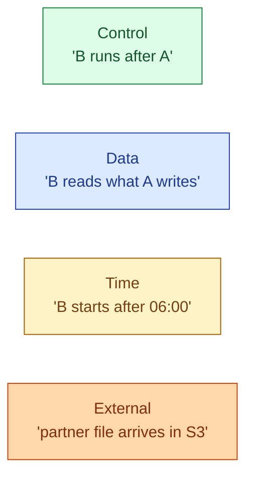
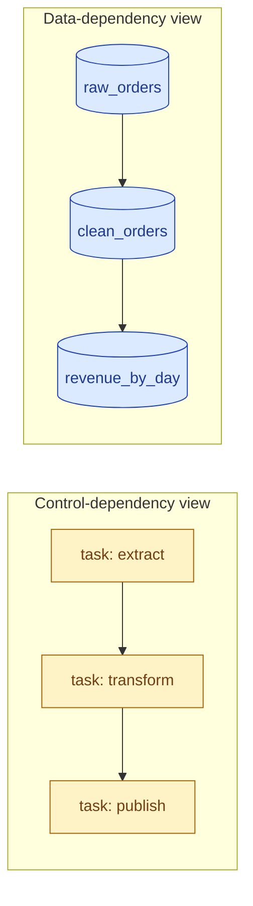
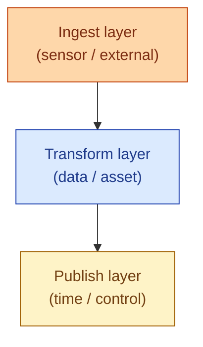

Every "wait" in a pipeline is one of four kinds. **Control**: task B starts after task A finishes. **Data**: task B starts when the table or asset it reads is fresh. **Time**: task B starts at a wall-clock condition (after 06:00, on a weekday). **Sensor / external**: task B starts when something outside the orchestrator says so (a file lands, an API returns ready). Modeling the right type makes the DAG honest. Modeling the wrong one creates phantom failures that no one can reproduce.



## Control dependencies

The original and the default. Task B's edge is "wait for task A's status to be `success`." Airflow's `>>` operator. Prefect's `wait_for=[a]`. The orchestrator does not look at the data; it looks at the state of the upstream task.

```python
extract >> transform >> publish
```

The upside: simple, fast to evaluate, no external state to check. The downside: if someone re-runs `transform` directly without re-running `extract`, the DAG happily marks `transform` as ready, because `extract` is still `success` from yesterday. The data may not match, but the status does.

Most orchestration begins here. It is also where most teams stop, and that is when the next category starts to win.

## Data (asset) dependencies

The newer model. Task B depends on the **data** that task A produces, not on task A's status. If the upstream asset is fresh, downstream is ready. If the asset is stale, downstream waits, even if a status check would have said "go."

Dagster's whole programming model is this. Each function declares the asset it produces and the assets it reads. The orchestrator builds the dependency graph from those declarations.

```python
@asset
def raw_orders():
    return extract_from_db()

@asset
def clean_orders(raw_orders):
    return raw_orders.dropna()

@asset
def revenue_by_day(clean_orders):
    return clean_orders.groupby("date").sum()
```

dbt does the same thing at SQL level through `ref()` and `source()`. Each model declares its inputs. dbt builds the DAG from the references and runs models in the right order.


```sql
SELECT order_id, total
  FROM {{ ref('raw_orders') }}
 WHERE total > 0
```


The change in mindset matters. With control dependencies, you maintain a graph of tasks. With data dependencies, you maintain a graph of tables. The latter is what the business actually cares about.



## Time dependencies

A task that starts only when the clock says so. Not because something upstream finished, but because the business calendar demands it.

A common example: the daily revenue report cannot publish before 09:00 because finance reads it at 09:00 and does not want a 03:00 version that gets revised at 04:30. The transform finishes at 03:15 but the publish task waits until 09:00.

Express this in Airflow with `TimeSensor`, in Dagster with a schedule that fires at 09:00 and reads the already-built asset, or with a simple "branch + sleep" pattern. The cleaner pattern is: split the DAG into a build phase that runs early and a publish phase that runs on the business clock.

Mixing time dependencies into the same task as data dependencies is a common foot-gun. A "publish if it's after 09:00 and the asset is fresh" condition spread across three sensors is fragile. Keep time and data dependencies in separate steps.

## External (sensor) dependencies

The task waits for something outside the orchestrator. A partner uploads a CSV to S3. A vendor API flips a flag from `pending` to `ready`. A Kafka topic emits an event.


```python
wait_for_file = S3KeySensor(
    task_id="wait_for_partner_csv",
    bucket_name="vendor-drops",
    bucket_key="daily/{{ ds }}/sales.csv",
    poke_interval=300,         # check every 5 min
    timeout=6 * 60 * 60,       # give up after 6h
    mode="reschedule",          # don't hold the worker slot
)
```


The classic sensor pattern is **polling**: every N seconds, ask "is it there yet?" Effective but expensive. The `reschedule` mode releases the worker between polls, which is critical at scale. The newer `deferrable` mode hands off to an async trigger that wakes the task when the event happens. See [#044 Sensors vs triggers](/practice/data-engineering/concepts/044-sensors-vs-triggers/) for the full story on this.

The honest critique of sensors is that they invent waits the data does not actually need. If your partner posts the CSV at 04:00 every day, just schedule the consumer at 04:30. The sensor is a hedge against the partner being late. Useful, but not free.

## Why mixing types creates fragility

Each dependency type has its own failure mode.

- A **control** dependency fires too early when someone reruns a task without re-running upstream.
- A **data** dependency fires correctly but is harder to debug (the question is "why is this asset stale?" not "why did task X fail?").
- A **time** dependency fires on a clock that has no idea whether the upstream actually has data.
- A **sensor** fires when the external system says ready, which may not match reality (the file lands but is half-written).

A DAG that mixes all four without clear boundaries is a debugging nightmare. The fix is layering: ingest is mostly sensor or schedule; transform is mostly data; publish is mostly time. Within each layer the dependency type is consistent.



## How to express each in code

A small worked example, four ways:


```python
# Control: Airflow operator chain
extract >> transform >> publish

# Data: dbt ref()
SELECT * FROM {{ ref('clean_orders') }}

# Time: Airflow TimeDeltaSensor or scheduled DAG
publish_dag = DAG(..., schedule="0 9 * * 1-5")  # 09:00 Mon-Fri

# External: Airflow S3KeySensor in reschedule mode
S3KeySensor(task_id=..., mode="reschedule")
```


Four different mental models. One DAG might use all four, but each task should be obvious which one it is.

## The 2026 direction: data first

The clear direction since around 2022 has been: lead with data dependencies, drop down to control only when data is not the right unit. Dagster is built around this. dbt is too. Airflow added Dataset triggers to catch up. Prefect added blocks and event subscriptions.

The reason: the user does not care which task succeeded. The user cares whether the table is fresh. A data-first DAG matches what people actually ask: "is the revenue mart updated?" rather than "did task `mart_revenue_publish` succeed?"

## Common mistakes

- **All-control DAGs that drift from the data.** Tasks marked success while the data is stale.
- **Sensors that hold worker slots.** Forget `mode="reschedule"` or deferrable, and a single waiting sensor blocks every other task.
- **Time dependencies inside data-build tasks.** Now the build does not run until 09:00, even though it could have run at 03:00.
- **External dependencies on systems with no SLA.** Partner uploads when they feel like it. Add a hard timeout and a fallback.
- **Mixing all four types in one task.** Each adds a failure mode. The combined task has all of them at once.
- **Data dependencies without freshness.** "Read upstream" is not enough; "read upstream that updated today" is the real requirement.
- **Sensors that re-poll without backoff.** Every 1 second times 60 minutes times 100 tasks equals a melted scheduler.

## Quick recap

- Four dependency types: control, data, time, external. Each models a different wait.
- Control: "task A succeeded." Data: "asset A is fresh." Time: "wall clock condition." External: "event from outside."
- Use data dependencies where you can. They match what users actually care about.
- Layer the dependency types: sensors at the edge, data in the middle, time at publish.
- Sensors are expensive. Prefer deferrable mode or event-driven triggers.
- A DAG that mixes types without structure inherits every type's failure modes.

This concept sits in **Stage 3 (Batch pipelines and orchestration)** of the [Data Engineering Roadmap](/practice/data-engineering/roadmap/).
