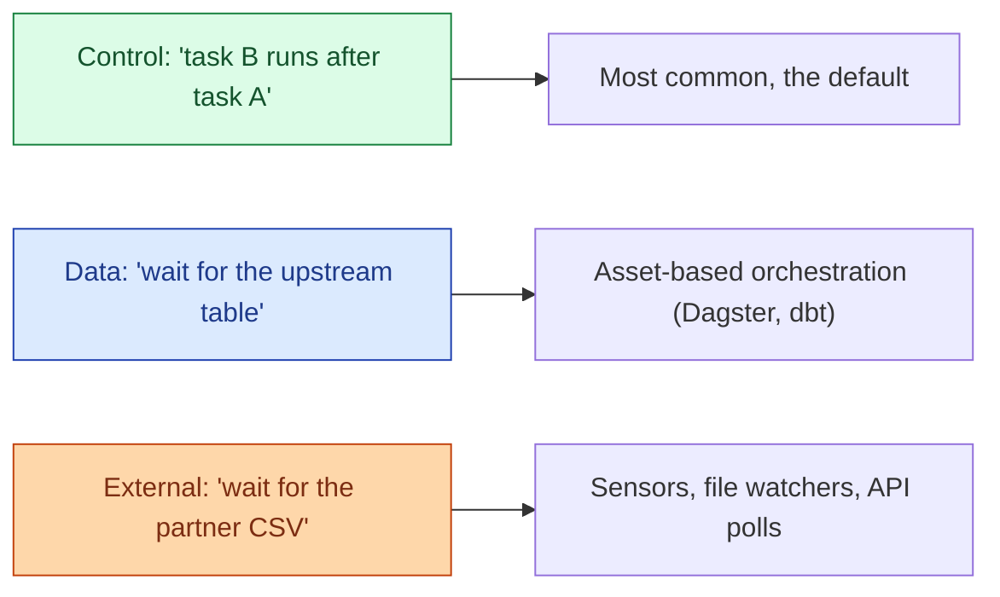

A task can wait on three different things: another task in the same DAG (control dependency), a piece of data being ready (data dependency), or an external event from outside the orchestrator (event dependency). Modeling the right type makes the DAG truthful. Modeling the wrong one creates phantom failures.

**What this page will cover.**

- Control dependencies (Airflow's `>>` / `set_downstream`).
- Data / asset dependencies (Dagster's asset graph, dbt's `ref()` and `source()`).
- External dependencies (Airflow Sensors, FileSensor, S3KeySensor).
- The honest critique of sensors: they hold a worker slot while polling.
- Event-driven alternative: a small webhook or a Kafka topic that triggers a DAG.
- Why "data dependencies" are slowly winning over "control dependencies" as the right default.

*Page coming soon.*

This concept sits in **Stage 3 (Batch pipelines and orchestration)** of the [Data Engineering Roadmap](/practice/data-engineering/roadmap/).
