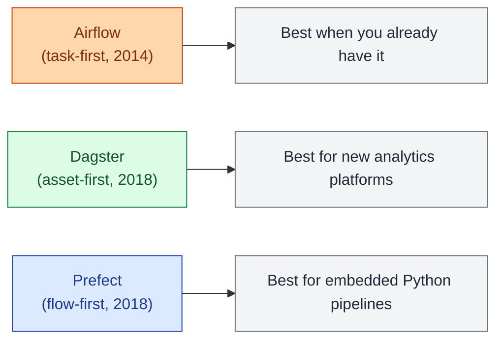
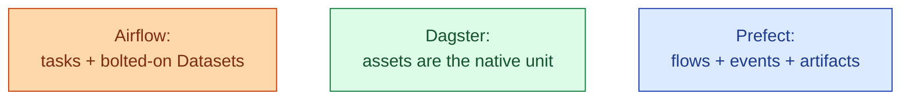

Airflow is the historical default: tasks as Python functions, schedules as cron strings, the largest community by far. Dagster reframed the world around assets (the things you produce) rather than tasks (the things you run). Prefect leaned into a Python-native DSL and a managed cloud. None is wrong. They optimise for different problems, and the right answer depends on what your team builds and how it likes to work.



## Origins

**Airflow** came out of Airbnb in 2014, donated to Apache in 2016. The model is operators (pre-built building blocks: `BashOperator`, `PythonOperator`, `BigQueryOperator`) connected into DAGs. State passes between tasks through XComs, a small key-value store. Airflow 2 (2020) modernised the scheduler, added the TaskFlow API for cleaner Python, and Airflow 2.10 (2024) added DAG-level versioning. The 2026 install base is still the largest by a wide margin.

**Dagster** launched in 2018 from a team that had watched Airflow grow up at scale. The core insight: most data pipelines are not really task graphs, they are asset graphs. A table, a file, an ML model: those are the things the business names. Dagster's `@asset` decorator declares what a function produces; the orchestrator builds the DAG from those declarations. Software-defined assets, asset checks, partitions and backfills all flow from this.

**Prefect** also launched in 2018, with a different emphasis: make orchestration feel like normal Python. Decorated functions as flows and tasks, a clean type system, and Prefect Cloud as the managed control plane. Prefect 2 (2022) rewrote the whole engine; Prefect 3 (2024) cleaned up concurrency and added typed events.

## The programming model side by side

The same pipeline in three styles.

```python
# Airflow (TaskFlow API)
@dag(schedule="@daily", start_date=datetime(2026, 1, 1))
def orders_dag():
    @task
    def extract():
        return read_db()
    @task
    def transform(rows):
        return clean(rows)
    @task
    def publish(rows):
        write_warehouse(rows)
    publish(transform(extract()))

orders_dag()
```

```python
# Dagster (assets)
@asset
def raw_orders():
    return read_db()

@asset
def clean_orders(raw_orders):
    return clean(raw_orders)

@asset
def published_orders(clean_orders):
    write_warehouse(clean_orders)
    return None
```

```python
# Prefect (flows)
@task
def extract(): return read_db()
@task
def transform(rows): return clean(rows)
@task
def publish(rows): write_warehouse(rows)

@flow
def orders_flow():
    publish(transform(extract()))
```

Same three steps, three different mental models. Airflow describes a graph of tasks; Dagster describes a graph of assets; Prefect describes a Python function that happens to be observable.

## Data-awareness

The biggest difference between the three is how each handles "is the data ready?"

- **Airflow** added Datasets in 2.4 and improved them through 2.10. A DAG can declare `outlets=[Dataset("s3://orders/")]` and another DAG can trigger on that dataset. Real, but bolted on after a decade of being task-first.
- **Dagster** is data-aware by construction. Every asset has freshness, a partition policy, asset checks, and lineage. The asset graph is the DAG.
- **Prefect** added `Artifacts` and event subscriptions for data-aware triggers but is still primarily flow-first. You can model assets, but the language is flows.

For warehouse-and-dbt-shaped work, Dagster is the closest match to the way teams actually think.



## Local dev and developer experience

The single biggest practical difference is how the orchestrator feels on a laptop.

- **Airflow** is famously painful locally. A Docker Compose with five services, a sluggish UI, and a parsing loop that re-reads every DAG file every 30 seconds. Astronomer's `astro dev` tooling helps a lot, but the baseline is heavy.
- **Dagster** has the best local dev story of the three. `dagster dev` boots a UI in seconds, hot-reloads on file save, and runs assets one at a time from the terminal.
- **Prefect** is also excellent locally. `prefect server start` and `prefect agent start` give a working stack in two commands.

For a new data engineer, the local-dev gap is real. Airflow can take a week to get truly productive on; Dagster and Prefect take an afternoon.

## Managed vs self-hosted

| | Self-hosted | Managed |
|---|---|---|
| **Airflow** | Open-source, runs anywhere | MWAA (AWS), Cloud Composer (GCP), Astronomer |
| **Dagster** | Open-source, runs anywhere | Dagster+ (the rebranded Dagster Cloud) |
| **Prefect** | Open-source, runs anywhere | Prefect Cloud |

The managed offerings are all reasonable. The operational cost of self-hosted Airflow is the highest, because the architecture (scheduler, webserver, workers, database, executor) is the most moving parts. Self-hosted Dagster is leaner. Prefect's hybrid model (Cloud as control plane, your own workers) is the lowest operational cost if you trust the SaaS bit.

## The 2026 honest take

After watching all three at multiple companies through 2026, the pattern is consistent.

**Pick Airflow if** you already have it, the team knows it, the operational pain is sunk, and the migration cost is real. Airflow is not going away. It still has the broadest ecosystem of operators and the largest hiring pool. Airflow 3 (preview as of mid-2026) cleans up several long-standing rough edges.

**Pick Dagster if** you are starting fresh and the work is warehouse-and-dbt-shaped. The asset model maps cleanly onto how data teams actually talk. The local dev is the best of the three. The operational footprint is reasonable.

**Pick Prefect if** the team is Python-first, the pipelines are not necessarily warehouse-shaped (ML training, embedded data products, hybrid cloud), and a thin orchestration layer over normal Python is what you want.

The migration cost between any two of these is real. Plan months, not weeks. Expect to rewrite every DAG and every test. The benefit needs to clear that bar.

## The honourable mentions

A few others worth knowing in 2026.

- **Argo Workflows**. Kubernetes-native, YAML DAGs, used heavily by ML teams already on Kubeflow. Strong if your team is platform-first.
- **Mage**. Notebook-style pipelines, friendly to analytics engineers. Smaller community.
- **Kestra**. YAML-first, declarative, multi-language. Growing in EU companies that want JVM-friendly orchestration.
- **Temporal**. Not strictly a data orchestrator, but useful for long-running workflows that need durable execution. The orchestration of choice for a lot of backend teams.

These are real options but narrower in fit. The three main contenders for a data engineering team in 2026 remain Airflow, Dagster, and Prefect.

## Common mistakes

- **Picking the orchestrator before understanding the work.** Asset graph or task graph or flow graph: which matches what you actually build matters more than the brand.
- **Migrating because of hype.** Airflow to Dagster is months of work. The new tool needs to solve a real problem, not just be newer.
- **Self-hosting Airflow with two engineers.** It will eat one of them. Use a managed offering if the team is small.
- **Treating Prefect like Dagster.** Prefect is great at flows, not as opinionated about assets. Modelling everything as an asset in Prefect is forcing it.
- **Treating Dagster like Airflow.** Writing imperative tasks instead of assets gives you the worst of both: Dagster's overhead without its lineage benefits.
- **Ignoring the local-dev gap.** A team that cannot iterate locally ships fewer pipelines, regardless of which orchestrator runs in prod.

## Quick recap

- Three contenders. Airflow is the install base. Dagster is the asset graph. Prefect is the Python flow.
- Dagster's asset model maps cleanest onto warehouse and dbt work.
- Prefect's flow model maps cleanest onto Python-heavy or embedded pipelines.
- Airflow's strength is ubiquity and ecosystem. Its weakness is local dev and operational weight.
- The orchestrator is code in all three. The question is which abstraction matches your work.
- Migration is expensive. Pick once, well, and stay until the cost of staying exceeds the cost of moving.

This concept sits in **Stage 3 (Batch pipelines and orchestration)** of the [Data Engineering Roadmap](/practice/data-engineering/roadmap/).
