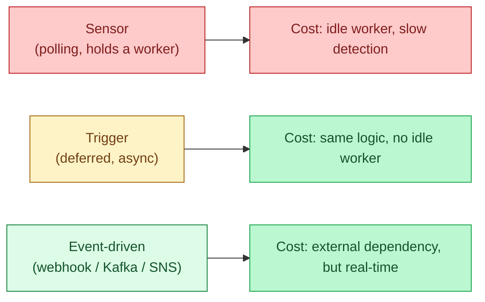

A sensor polls: every minute it asks "is the file there yet?" A trigger waits efficiently: it registers interest and is notified when the event happens. Event-driven flips it around: an external system pushes a webhook or a message that fires the DAG. Each of these has a place; sensors are the most abused tool in modern orchestration.

**What this page will cover.**

- Airflow Sensors: the original poller. Worker-slot cost.
- Deferrable operators (Airflow 2.2+) that solve the worker-slot cost.
- Dagster's asset sensors and the asset-graph way of representing "wait for upstream."
- Event-driven: SNS / SQS / Pub/Sub / Kafka triggers, plus webhook receivers.
- The honest decision tree: sensor only when no event is available, deferrable always preferred.
- The "missed event" problem and how to recover (a periodic sanity-check sensor as backup).

*Page coming soon.*

This concept sits in **Stage 3 (Batch pipelines and orchestration)** of the [Data Engineering Roadmap](/practice/data-engineering/roadmap/).
