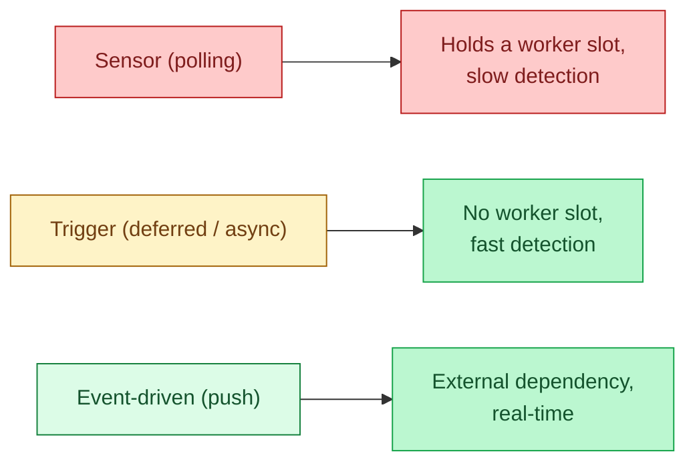
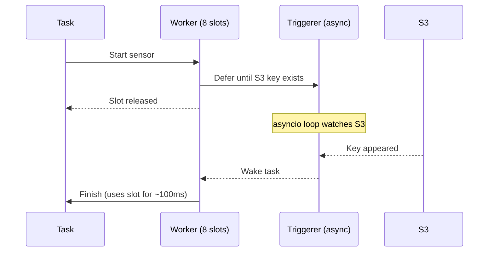
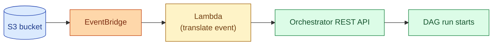
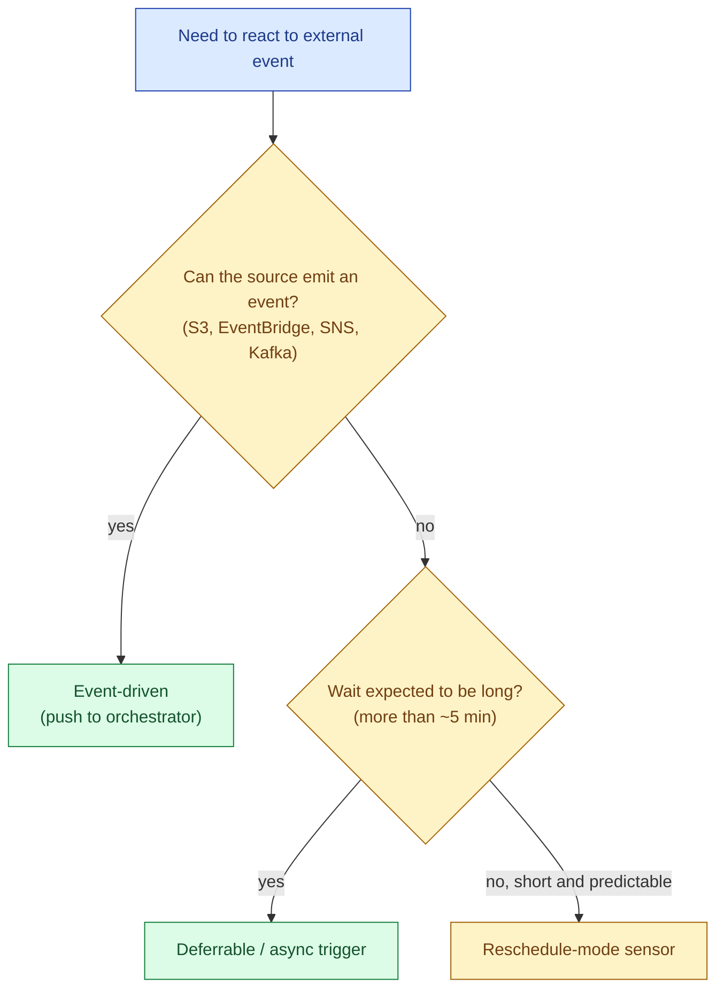

Three ways to react to "something happened outside the orchestrator." A **sensor** polls: every N seconds it asks "is the file there yet?" A **trigger** waits efficiently: it registers interest with an async loop and is woken when the event happens. An **event-driven** start flips the direction: an external system pushes a webhook or a message that fires the DAG. The choice between them is the single biggest knob on the operational cost of an orchestration platform.



## What a sensor actually does

A sensor is a task. It runs on a worker. It sleeps a bit, wakes up, checks a condition, and either continues sleeping or returns success. The classic Airflow `S3KeySensor`:

```python
wait_for_file = S3KeySensor(
    task_id="wait_for_partner_csv",
    bucket_name="vendor-drops",
    bucket_key="daily/{{ ds }}/sales.csv",
    poke_interval=300,         # 5 minutes
    timeout=6 * 60 * 60,       # 6 hours
)
```

The default mode is `poke`, which means the sensor holds the worker slot for the whole 6 hours. If you have 8 worker slots and 20 sensors waiting, 8 sensors run and 12 sit in the queue. The pipeline behind them does not move.

This is **slot starvation**. It is the most common operational failure in Airflow shops, and it almost always comes from sensors.

## The fix: reschedule mode

Airflow's `reschedule` mode says: "sleep, check once, release the slot, schedule again in 5 minutes." Between pokes the slot is free for other work.

```python
wait_for_file = S3KeySensor(
    task_id="wait_for_partner_csv",
    bucket_name="vendor-drops",
    bucket_key="daily/{{ ds }}/sales.csv",
    poke_interval=300,
    timeout=6 * 60 * 60,
    mode="reschedule",         # release the slot between pokes
)
```

This solves slot starvation but adds scheduler overhead. Every poke re-enters the scheduling loop. With hundreds of sensors at sub-minute intervals, the scheduler starts to choke.

## Deferrable operators: triggers in Airflow

Airflow 2.2 introduced deferrable operators. The task hands off to a separate process called the triggerer, which runs an asyncio event loop. The triggerer can hold thousands of pending waits in a single process because each one is a coroutine, not a worker slot.

```python
wait_for_file = S3KeyTrigger(
    task_id="wait_for_partner_csv",
    bucket_name="vendor-drops",
    bucket_key="daily/{{ ds }}/sales.csv",
    deferrable=True,
)
```

When the file lands, the trigger fires, the task is re-queued, and a worker picks it up to do the small bit of finishing work. The worker slot is occupied for milliseconds, not hours.



Deferrable is strictly better than poke for any wait longer than a few minutes. The cost is one new component (the triggerer) and a slightly more complex deployment.

## Dagster sensors and asset sensors

Dagster uses the word "sensor" for something different. A Dagster sensor is a Python function that runs every N seconds on the daemon and decides whether to launch a run. It does not hold a worker slot, because Dagster's daemon is a separate process from runs.

```python
@sensor(target=process_partner_file)
def partner_file_sensor(context):
    cursor = context.cursor or "0"
    new_files = list_s3_files(after=cursor)
    if not new_files:
        return SkipReason("no new files")
    return [
        RunRequest(run_key=f, run_config={"file": f})
        for f in new_files
    ], str(max(new_files))
```

The cursor pattern is the key: the sensor remembers where it left off, so each invocation only checks new things. This is closer to a stream consumer than to an Airflow sensor.

Dagster's **asset sensors** go further: they fire downstream automatically when an upstream asset materialises. This is data-aware orchestration in its most direct form.

## Prefect: events and automations

Prefect 3 builds around an event bus. Any flow run, task, deployment, or external system can emit an event. Automations subscribe to events and trigger actions.

```python
# A deployment that triggers on an external event
deployment.trigger = EventTrigger(
    expect={"source.s3.object.created"},
    match={"prefect.resource.id": "s3://vendor-drops/*"},
)
```

Same idea as deferrable operators, slightly different model. The Prefect cloud control plane manages the event subscription, so the polling cost is offloaded.

## Event-driven: the orchestrator does not poll at all

The cleanest model. Instead of asking "is it ready?" the orchestrator subscribes to an event and is told. S3 ObjectCreated events fire to SNS / SQS / EventBridge / Pub/Sub. Kafka topics emit events. Webhooks post to an orchestrator endpoint.

A typical pattern:

```
S3 PutObject  →  EventBridge rule  →  Lambda  →  Airflow REST API
                                                 (POST /dags/orders/dagRuns)
```

The Lambda is tiny: take the event, transform into a DAG run trigger payload, post it. The DAG starts when the file is actually there, not 0-300 seconds later when the sensor next polls.



Real-time, no polling, no worker cost. The downside: more moving parts, and you need to monitor the event pipeline too. If EventBridge silently drops a rule, the DAG never fires and the team thinks "no data today" instead of "the trigger broke."

## The missed-event problem

Every event-driven system has the same failure: what if the event is dropped? S3 events at scale can deduplicate, batch, or occasionally vanish under load. Webhooks fail. Message queues lose messages during failovers.

The pattern: pair the event-driven trigger with a periodic sanity-check sensor. The sensor runs once an hour (cheap), checks "is there any unprocessed file from the last 24 hours?", and triggers the DAG if so. The event handles the fast path; the sensor catches the slow miss.

This is belt-and-braces, and it earns its keep the first time S3 events are delayed during an AWS incident.

## The decision tree



The order is: event > trigger > reschedule sensor > poke sensor. Default to the highest you can get. Drop down only when the source genuinely cannot push.

## Backoff and timeout patterns

Whatever mode you pick, set a backoff and a timeout. A sensor that polls every second forever is a denial-of-service attack on whatever it polls. Sensible defaults:

```python
poke_interval = 60     # check at most once a minute
timeout       = 12*3600 # give up after 12 hours
exponential_backoff = True
max_wait      = 600    # cap backoff at 10 minutes
```

The timeout is the more important one. A sensor with no timeout that never fires sits in the DAG forever, blocks downstream work, and quietly fails to alert anyone.

## Common mistakes

- **Default `poke` mode in Airflow at scale.** Slot starvation in the first month of production.
- **A 1-second poll interval.** Hammers the source, melts the scheduler.
- **No timeout.** A failed upstream produces a sensor that waits forever.
- **Event-driven without a fallback.** When the event is dropped, you find out the next business day.
- **A sensor that triggers downstream work that is itself a sensor.** A pipeline of waits where every step holds a slot.
- **Polling the warehouse for "did upstream write?"** when the orchestrator already knows. Use an asset sensor or a Dataset, not a SQL poll.
- **Putting business logic in the sensor.** The sensor's job is "is X ready?" Make the conditional path a separate downstream task.

## Quick recap

- Sensor = polling task. Holds a worker slot in `poke` mode; release with `reschedule` or `deferrable`.
- Trigger / deferrable = async wait. One process holds thousands of pending events.
- Event-driven = push from the source. Real-time, no polling, more moving parts.
- Decision order: event > trigger > reschedule sensor > poke sensor.
- Always set a timeout. A sensor with no timeout silently blocks the pipeline.
- Pair event-driven with a periodic sanity sensor as fallback. Events get dropped.

This concept sits in **Stage 3 (Batch pipelines and orchestration)** of the [Data Engineering Roadmap](/practice/data-engineering/roadmap/).
