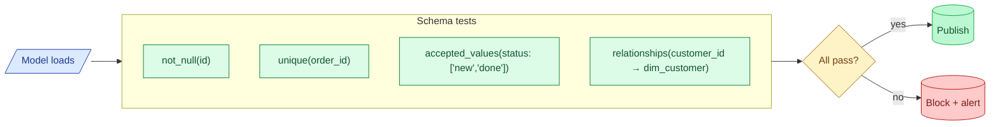
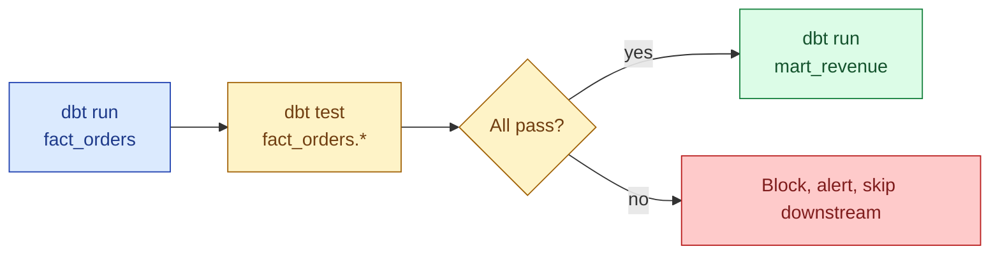

Schema tests run after every model load and assert the shape of the data: this column is never null, this column is unique, this column only contains values from a known set, this foreign key always matches a row in the parent table. Cheap to write, fast to run on most warehouses, and they catch the vast majority of pipeline bugs before anyone opens a dashboard. The discipline is not picking exotic tests; it is putting the four boring ones on every primary key and every column that downstream code depends on.



## The four tests

### not_null

The column must never be null. Most useful on primary keys, foreign keys, and any column that downstream code branches on.

```yaml
# models/orders.yml
models:
  - name: fact_orders
    columns:
      - name: order_id
        tests:
          - not_null
      - name: customer_id
        tests:
          - not_null
```

What it compiles to:

```sql
SELECT order_id FROM fact_orders WHERE order_id IS NULL
```

If the query returns zero rows, the test passes. If it returns any rows, the test fails and the orchestrator blocks the publish.

### unique

The column has no duplicate values. The single most useful test on primary keys.

```yaml
- name: order_id
  tests:
    - unique
    - not_null
```

Compiled:

```sql
SELECT order_id
  FROM fact_orders
 GROUP BY order_id
HAVING COUNT(*) > 1
```

`unique` and `not_null` belong together on every primary key. Together they assert "this column behaves like a real PK."

### accepted_values

The column only contains values from a fixed list. Useful for status columns, enums, country codes, anything with a closed set.

```yaml
- name: status
  tests:
    - accepted_values:
        values: ['new', 'paid', 'shipped', 'cancelled', 'refunded']
```

Compiled:

```sql
SELECT status
  FROM fact_orders
 WHERE status NOT IN ('new','paid','shipped','cancelled','refunded')
```

A new status appearing in the source signals that the producer added something without telling you. The test failure is the alert.

### relationships (foreign key)

Every value of `customer_id` in `fact_orders` must exist in `dim_customer.customer_id`. The classic foreign-key check that warehouses no longer enforce at write time.

```yaml
- name: customer_id
  tests:
    - relationships:
        to: ref('dim_customer')
        field: customer_id
```

Compiled:

```sql
SELECT child.customer_id
  FROM fact_orders child
  LEFT JOIN dim_customer parent
    ON child.customer_id = parent.customer_id
 WHERE parent.customer_id IS NULL
   AND child.customer_id IS NOT NULL
```

If the query returns rows, those rows are orphan facts: orders referencing customers that do not exist. Almost always a load-order bug.

## Where they live in the DAG

Schema tests run **after** the model that builds the table, **before** any downstream consumer. dbt does this automatically with `dbt build`: build the model, then run its tests, then move on to downstream models.



The blocking behaviour is the whole point. A nullable primary key in `fact_orders` should never reach `mart_revenue`. The test stops the publish.

## Severity: warn vs error

dbt tests can be `error` (default) or `warn`. An error fails the build and blocks downstream. A warn logs the failure but keeps building.

```yaml
- name: customer_id
  tests:
    - not_null:
        config:
          severity: warn
          warn_if: ">10"
          error_if: ">1000"
```

The pattern: hard structural invariants are `error`. Soft "we expect roughly N to be null, alert if it spikes" checks are `warn`. Use warn sparingly: a warn that nobody reads is the same as no test at all.

## Test on every primary key, non-negotiable

The single rule that catches the most bugs: every primary key on every table gets `unique` and `not_null`. Every foreign key gets `relationships` and (almost always) `not_null`. Every closed-set column gets `accepted_values`.

That is the floor. Below that floor, the table can be silently broken in ways no dashboard will reveal until a number on a slide is wrong.

In a real dbt project this means the `.yml` next to every model has 20-50 lines of tests. That feels heavy for two days, then disappears into the background because the tests just run and the failures get fixed before anyone notices.

## The cost on big tables

A `unique` test on a 5-billion-row table costs real money. The default form scans the whole table. Three patterns to keep the cost down.

**Test the latest partition only.** Most pipelines write one partition per day. Test that partition.

```yaml
- name: order_id
  tests:
    - unique:
        config:
          where: "event_date = current_date"
```

The compiled `WHERE` clause limits the scan to one day, which is roughly 1/365 of the cost.

**Test incrementally.** dbt's incremental models can run tests only on the rows inserted in this run. A custom test predicate keys off the run's logical date.

**Sample on huge tables.** A statistical sample of 1% catches systematic duplication for almost no money. Reserve the full scan for a weekly job.

## Custom schema tests

When the four built-ins do not cover the case, add a singular test (a SQL file under `tests/`) or a custom generic test (a Jinja macro under `macros/`). The full pattern is in [#048 dbt tests](/practice/data-engineering/concepts/048-dbt-tests/).

A common custom test: assert that a numeric column is positive.


```sql
-- macros/test_positive.sql

SELECT {{ column_name }}
  FROM {{ model }}
 WHERE {{ column_name }} <= 0

```


Now any model's YAML can use it:

```yaml
- name: total_amount
  tests:
    - positive
```

The packages `dbt-utils` and `dbt-expectations` already ship dozens of these. Most teams add them and move on.

## CI gate

The most important place to run schema tests is in CI, on every pull request. The pattern:

1. The PR changes a model.
2. CI builds the affected model and its downstream tree in a scratch schema.
3. CI runs `dbt test --select state:modified+` against the scratch build.
4. If any test fails, the PR cannot merge.

This catches the bug before it reaches production. The cost is one warehouse run per PR, which is well worth the price of not pushing a broken model live.

## Common mistakes

- **Skipping `unique` on primary keys because "the source guarantees it."** The source rarely guarantees what you think. Test it.
- **`accepted_values` without an alert on new values.** A new status appearing is information; logging it without paging is throwing the signal away.
- **`relationships` without `not_null` on the child column.** Orphan rows where the FK is null pass the relationship test silently.
- **One global severity of `error`.** Some tests are intrinsically noisy. A warn on a fuzzy check beats a constant error nobody reads.
- **Running full-table `unique` tests on billion-row facts every hour.** Test the latest partition; do the full scan weekly at most.
- **Adding the four tests once and never reviewing them.** A schema test that fails every Tuesday is broken or the data changed. Investigate.
- **Tests in YAML but no CI gate.** Tests that run in prod after the bug shipped are not as valuable as tests that block the PR.

## Quick recap

- Four canonical schema tests: `not_null`, `unique`, `accepted_values`, `relationships`.
- Together they catch the vast majority of pipeline bugs cheaply.
- Run them after the model build, before any downstream consumer. dbt does this with `dbt build`.
- Every primary key gets `unique` + `not_null`. Every FK gets `relationships`. Every closed set gets `accepted_values`.
- Manage cost on big tables with `where:` clauses, incremental testing, or sampling.
- Run schema tests in CI on every PR. The point is to block bugs before they ship.

This concept sits in **Stage 6 (Reliability, debugging, cost)** of the [Data Engineering Roadmap](/practice/data-engineering/roadmap/).
