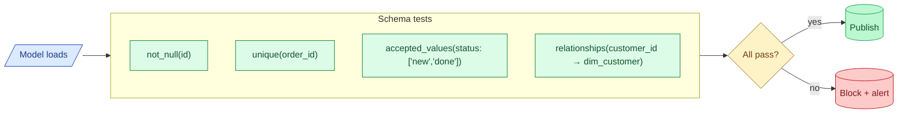

Schema tests run after every model load and assert the shape of the data: this column is never null, this column is unique, this column only contains values from a known set, and this foreign key always matches a row in the parent table. They are cheap, fast, and catch most pipeline bugs.

**What this page will cover.**

- The four canonical tests: `not_null`, `unique`, `accepted_values`, `relationships`.
- The dbt YAML where they live and the SQL they compile to.
- Why these four catch 80% of upstream bugs before any user is affected.
- Severity levels: warn vs fail vs error. When to use each.
- The "test on every model" rule and the cost trade-off it sets.
- The CI hook that runs them on every PR.

*Page coming soon.*

This concept sits in **Stage 6 (Reliability, debugging, cost)** of the [Data Engineering Roadmap](/practice/data-engineering/roadmap/).
