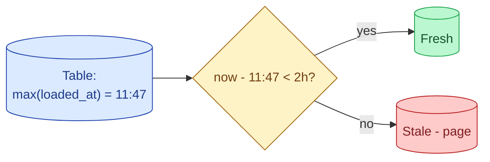
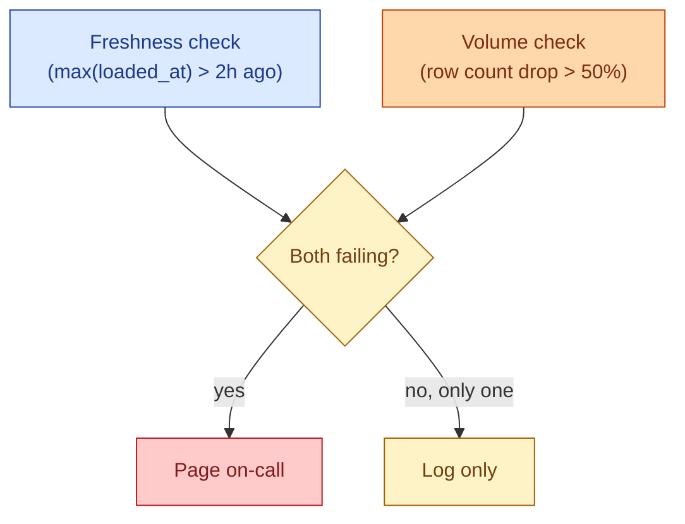

A pipeline can pass every schema test and still be wrong because it loaded yesterday's data again instead of today's. Nothing in `not_null` or `unique` catches that. A freshness test does: it asks "what is the most recent `loaded_at` in this table, and is it recent enough?" If the answer is too old, alert. This is the test that catches silent ingestion stalls, paused DAGs, and downstream tables that are stale even though the build claims success.



## Why freshness tests catch a different class of bug

Schema tests guard against incorrect data. Freshness tests guard against missing data. The two failure modes are different, and a pipeline can absolutely have one while the other looks fine.

The typical "everything is green but the data is wrong" incident:

- The DAG ran on schedule.
- It returned `success`.
- The downstream models ran on schedule.
- Schema tests all passed.
- The dashboard shows yesterday's number, because somewhere in the ingest a partition silently re-loaded the same file.

The freshness test on the table at the top of that chain says "the latest `loaded_at` is 26 hours old, but the SLA is 2 hours." Page someone.

## The dbt source freshness syntax

dbt has first-class freshness for source tables.

```yaml
# models/sources.yml
sources:
  - name: orders_raw
    database: prod
    schema: ingest
    tables:
      - name: orders
        loaded_at_field: loaded_at
        freshness:
          warn_after:  {count: 1, period: hour}
          error_after: {count: 2, period: hour}
          filter: "loaded_at >= dateadd(day, -1, current_timestamp)"
```

`warn_after` and `error_after` are the thresholds. `loaded_at_field` is the column the test reads. `filter` keeps the query off the full table.

Running `dbt source freshness` compiles each source into:

```sql
SELECT MAX(loaded_at) AS max_loaded_at,
       CURRENT_TIMESTAMP() AS snapshotted_at
  FROM prod.ingest.orders
 WHERE loaded_at >= dateadd(day, -1, current_timestamp);
```

The CLI compares `max_loaded_at` to `snapshotted_at` and reports `pass`, `warn`, or `error`. The error fails the build the same way a schema test does.

## Freshness on built models, not just sources

dbt's built-in source freshness only covers sources. For built models, write a singular freshness test as plain SQL.


```sql
-- tests/freshness_fact_orders.sql
SELECT 'fact_orders' AS model_name
 WHERE (
   SELECT TIMESTAMPDIFF(HOUR, MAX(loaded_at), CURRENT_TIMESTAMP())
     FROM {{ ref('fact_orders') }}
 ) > 2
```


Returns a row if the latest `loaded_at` is more than 2 hours old. dbt fails the test on any returned rows. The same shape works for any orchestrator: it is one SQL query that returns rows if and only if there is a problem.

## Picking the threshold

The threshold is the SLA, written in code. Two rules.

**Match the business rhythm, not the pipeline rhythm.** If finance checks the dashboard at 09:00, the SLA is "fresh by 09:00." If the pipeline runs at 06:00 and takes an hour, the headroom is two hours, and the alert fires at 09:00 if max_loaded_at is older than today's 06:00 batch.

**Be calendar-aware.** A 2-hour SLA on a Saturday evening is wrong if the source pauses on weekends. Build the threshold with a `CASE` on day-of-week, or maintain a small `expected_freshness` table that an analyst can edit.

```yaml
freshness:
  warn_after:  {count: 1,  period: hour}
  error_after: {count: 2,  period: hour}
  # Treat Sat 18:00 to Mon 06:00 as expected gap
  filter: "
    NOT (
      EXTRACT(DOW FROM CURRENT_TIMESTAMP()) IN (0, 6)
      AND EXTRACT(HOUR FROM CURRENT_TIMESTAMP()) BETWEEN 0 AND 6
    )
  "
```

A freshness test that pages every weekend at 02:00 quickly becomes a test that everyone mutes.

## Stale vs missing

Two failure modes look the same in a freshness test but mean different things.

**Stale**: the load ran but produced no new rows. `max(loaded_at)` is yesterday because today's load wrote zero rows (filter bug, source empty, schema drift swallowed all the input).

**Missing**: the load did not run at all. `max(loaded_at)` is yesterday because the DAG was paused or skipped.

The fix in both cases is "investigate," but the diagnostic path differs. A combined check separates them:

```sql
SELECT
  MAX(loaded_at)                         AS last_load,
  COUNT(*) FILTER (
    WHERE loaded_at::date = CURRENT_DATE
  )                                       AS rows_today,
  TIMESTAMPDIFF(HOUR, MAX(loaded_at),
                CURRENT_TIMESTAMP())     AS hours_since_load
  FROM fact_orders;
```

- `last_load` old, `rows_today = 0`: missing (load did not run).
- `last_load` recent, `rows_today` very low: stale (load ran but wrote almost nothing).

Two different alerts, two different runbooks.

## The composite freshness + volume check

A pure freshness test can fire on a perfectly healthy 0-row day (Sunday, holiday). A pure volume test can pass when the rows are stale duplicates. Combining the two cuts false positives:



Only when both checks fail at the same time does the system page someone. Either one alone is "log and look at it tomorrow."

This pattern dramatically cuts alert fatigue. The cost: a real failure that happens to leave the row count steady (a re-load of the previous day) sneaks past. Cover that with the duplicate-load anomaly check from [#047 Volume tests](/practice/data-engineering/concepts/047-volume-tests-anomaly/).

## Alert routing

Freshness tests are one of the few things in a data platform that should genuinely page on call out of hours. The rule:

- **Critical pipelines** (the one feeding the CFO dashboard, the model behind a live product surface): page immediately. SLA breaches are emergencies.
- **Important pipelines**: ticket with a 4-hour response, not a page.
- **Everything else**: a daily summary email of failures.

Tiering matters. A freshness test on every table that pages out of hours leads to either silenced alerts or a burnt-out team. The same test that pages on `fact_orders` should email on `dim_legacy_archive`.

## The freshness dashboard

If you only invest in one observability dashboard for the first year of a data platform, make it the freshness dashboard. One row per table, columns for SLA, current age, last alert, owner. Green if within SLA, yellow if approaching, red if breaching.

Most engineers underrate how much trust this builds. Every stakeholder can see at a glance whether the platform is healthy. Most "is the data ok?" questions stop arriving in chat because the answer is on the wall.

## Common mistakes

- **No freshness test on the source.** The single largest blind spot in most pipelines.
- **Thresholds copied across all tables.** Real tables have different SLAs. Treat them differently.
- **Ignoring calendars.** Weekend pages on a weekday-only source teach the team to mute alerts.
- **Freshness checks that scan the full table.** Add a `filter:` clause. The check should hit the latest partition only.
- **One alert tier for everything.** Page on critical only. Daily summary on the rest.
- **Forgetting downstream freshness.** A fresh source with a stale mart is still a stale dashboard.
- **Not pairing freshness with volume.** A freshness test cannot tell you that today's "fresh" load is actually yesterday's data re-imported.

## Quick recap

- Freshness test = "is `max(loaded_at)` within the SLA?" The check that catches silent ingestion failures.
- dbt source freshness covers sources directly. For built models, write a singular SQL test.
- Pick thresholds from the business rhythm, not the pipeline rhythm.
- Be calendar-aware. Weekend pages on a weekday source destroy trust in alerts.
- Distinguish stale (zero rows loaded) from missing (load did not run). Different runbooks.
- Combine freshness with volume to cut false positives. Page only when both fire.

This concept sits in **Stage 6 (Reliability, debugging, cost)** of the [Data Engineering Roadmap](/practice/data-engineering/roadmap/).
