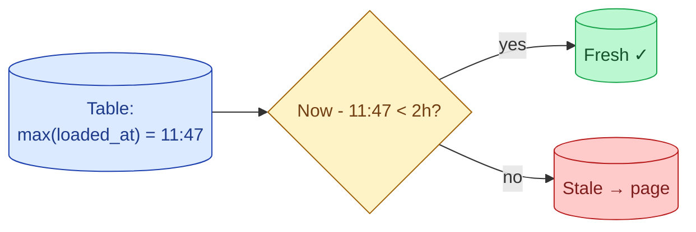

A pipeline can pass every schema test and still be wrong, because it loaded yesterday's data again instead of today's. A freshness test checks the maximum `loaded_at` or `event_time` against a threshold: "the data must be no more than 2 hours old." If it is older, alert. This catches the silent stalls that no other test will.

**What this page will cover.**

- dbt source freshness vs custom freshness tests.
- Picking the right threshold: business-hours-aware, weekend-aware, hourly-aware.
- The "stale" vs "missing" distinction (was the load skipped, or did it run with zero rows?).
- Alerting on freshness without paging the team for every minor delay.
- The composite freshness check that pings only when both freshness AND row-count anomalies trigger.
- Why a freshness dashboard beats every other observability investment for the first year.

*Page coming soon. Until then, see [#093 Dashboard stale despite a healthy job](/practice/data-engineering/093-dashboard-stale-despite-healthy-job/) for the practice problem.*

This concept sits in **Stage 6 (Reliability, debugging, cost)** of the [Data Engineering Roadmap](/practice/data-engineering/roadmap/).
