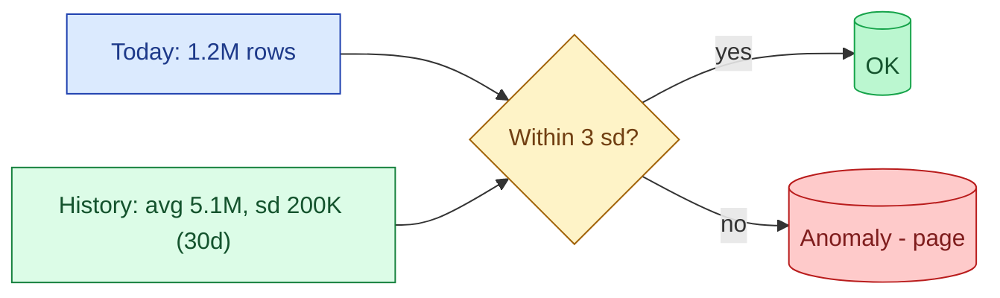
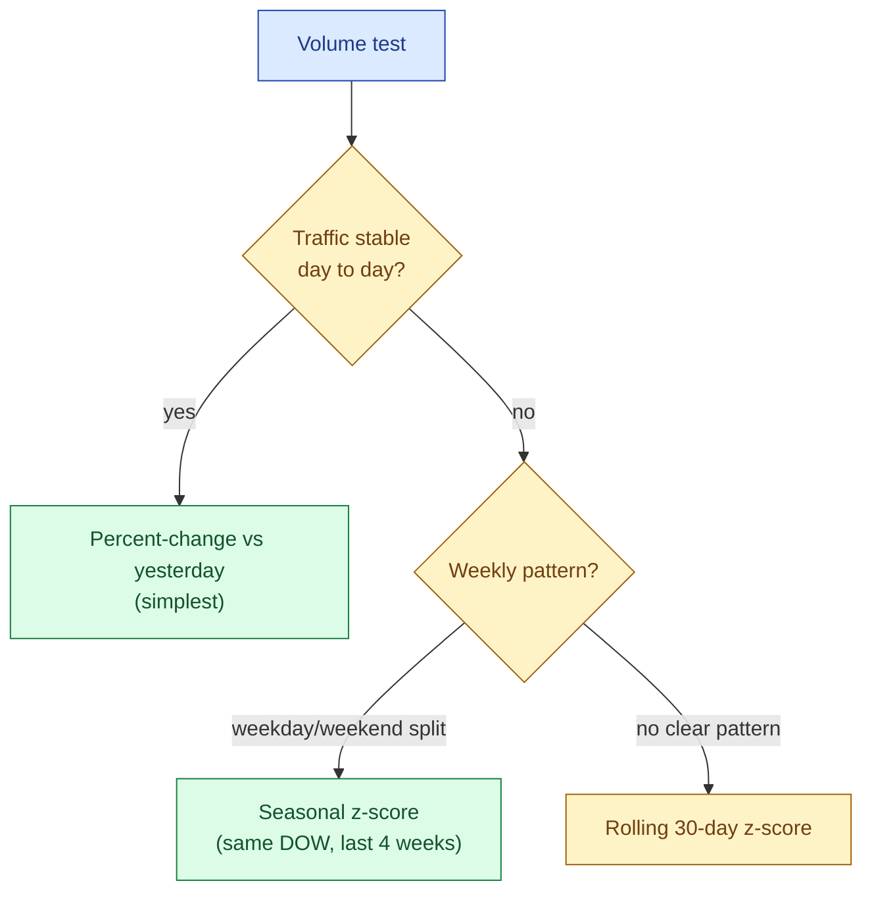

A volume test compares today's row count against expected. The expectation can be a hard threshold ("at least 1,000,000 rows") or a statistical bound ("within 3 standard deviations of the trailing 30-day average"). Sudden drops mean a source died, a filter went wrong, or a partition silently failed. Sudden jumps mean a duplicate load or a producer-side bug. Both should page someone. Schema and freshness tests cannot catch either.



## Hard threshold tests

The simplest volume test: assert a minimum row count. Cheap, predictable, almost no false positives if you pick the floor low enough.


```yaml
# dbt-utils
- dbt_utils.equal_rowcount:
    compare_model: ref('orders_staging')

- dbt_utils.expression_is_true:
    expression: "(SELECT COUNT(*) FROM {{ ref('fact_orders') }}) > 1000000"
```


Use a hard threshold when the table has a guaranteed floor: every day always has at least N rows. Useful on high-traffic facts that have never been below a known number in the last year.

The downside: a hard threshold cannot catch a "today the table has 1.2M rows when it should have 5M" failure if 1.2M is above the floor. That is the drift case.

## Drift-based anomaly tests

The more useful test compares today's count against the recent history. Three common forms.

**Percent change vs yesterday.** Simple, catches obvious cliff drops, noisy on naturally bursty traffic.

```sql
WITH counts AS (
  SELECT event_date, COUNT(*) AS row_count
    FROM fact_orders
   WHERE event_date >= CURRENT_DATE - 7
   GROUP BY event_date
),
pct_change AS (
  SELECT event_date,
         row_count,
         LAG(row_count) OVER (ORDER BY event_date) AS prev,
         (row_count * 1.0 - LAG(row_count) OVER (ORDER BY event_date))
           / NULLIF(LAG(row_count) OVER (ORDER BY event_date), 0) AS pct
    FROM counts
)
SELECT *
  FROM pct_change
 WHERE event_date = CURRENT_DATE
   AND ABS(pct) > 0.30;        -- 30% change vs yesterday
```

**Z-score vs rolling window.** Better. Adapts to the table's natural variance.

```sql
WITH counts AS (
  SELECT event_date, COUNT(*) AS row_count
    FROM fact_orders
   WHERE event_date >= CURRENT_DATE - 30
   GROUP BY event_date
),
stats AS (
  SELECT
    AVG(row_count)    AS mu,
    STDDEV(row_count) AS sigma
    FROM counts
   WHERE event_date < CURRENT_DATE
)
SELECT today.row_count, stats.mu, stats.sigma,
       (today.row_count - stats.mu) / NULLIF(stats.sigma, 0) AS z
  FROM counts today CROSS JOIN stats
 WHERE today.event_date = CURRENT_DATE
   AND ABS((today.row_count - stats.mu) / NULLIF(stats.sigma, 0)) > 3;
```

If today is more than 3 standard deviations from the 30-day average, the row appears and the test fails.

**Seasonal-adjusted z-score.** Best. Compares today's row count against the same day-of-week from the trailing 4 weeks.

```sql
WITH same_dow AS (
  SELECT row_count
    FROM daily_counts
   WHERE EXTRACT(DOW FROM event_date)
       = EXTRACT(DOW FROM CURRENT_DATE)
     AND event_date BETWEEN CURRENT_DATE - 28 AND CURRENT_DATE - 1
)
SELECT (today.row_count - AVG(same_dow.row_count))
       / NULLIF(STDDEV(same_dow.row_count), 0) AS z_seasonal
  FROM ...
```

A Saturday has a different baseline from a Tuesday. The seasonal version learns that automatically and stops paging on every Saturday.



## Per-source vs aggregated tests

A volume test on the aggregated `fact_orders` table may pass even when one source is broken, because other sources mask the drop. Per-source tests catch source-level failures earlier.

```sql
SELECT source_system,
       COUNT(*) AS row_count
  FROM fact_orders
 WHERE event_date = CURRENT_DATE
 GROUP BY source_system
HAVING COUNT(*) < (
  SELECT 0.5 * AVG(daily_count)
    FROM daily_per_source
   WHERE source_system = fact_orders.source_system
     AND event_date BETWEEN CURRENT_DATE - 28 AND CURRENT_DATE - 1
);
```

Any source that drops below 50% of its trailing average shows up. Cheap and catches the "one of five sources silently died" case that the aggregate misses.

## The duplicate-load signature

The most common "jump" anomaly is a duplicate load. Today's row count is roughly twice yesterday's, exactly twice if the load is fully duplicated.

A specific check for this:

```sql
WITH counts AS (
  SELECT event_date, COUNT(*) AS row_count
    FROM fact_orders
   WHERE event_date >= CURRENT_DATE - 7
   GROUP BY event_date
)
SELECT today.row_count, prev.row_count AS prev_count,
       today.row_count * 1.0 / NULLIF(prev.row_count, 0) AS ratio
  FROM counts today
  JOIN counts prev ON prev.event_date = CURRENT_DATE - 1
 WHERE today.event_date = CURRENT_DATE
   AND today.row_count * 1.0 / NULLIF(prev.row_count, 0) BETWEEN 1.8 AND 2.2;
```

The "ratio close to 2" signature is unusual enough that this test almost never false-positives, and it catches a class of bug that generic z-score tests miss in their noise floor.

## Where these break

Anomaly detection works best when the underlying signal is stable enough that "today is unusual" actually means something. Two cases where it fails.

**Small tables.** A dimension with 12 rows yesterday and 15 today has a 25% jump that means nothing. Below a few hundred rows per day, anomaly tests are noise. Fall back to hard thresholds or skip the test.

**Naturally bursty traffic.** A B2B platform that has 50% of its weekly volume on Tuesday cannot use a generic 30-day rolling test; it pages every Tuesday. Use seasonal adjustment or move to manual thresholds.

The honest rule: drift-based tests work on big, mostly-stable streams. Everything else needs hard thresholds or no test at all.

## Tools that ship anomaly tests

Writing the z-score SQL by hand is fine for ten tables. At scale, four tools ship anomaly detection out of the box.

- **Elementary** (dbt-native): row counts and freshness anomalies stored in the dbt project.
- **Soda**: YAML-defined volume and drift checks, integrates with CI and Soda Cloud.
- **Monte Carlo**: managed observability platform with ML-based anomaly detection across the whole warehouse.
- **Anomalo**: also managed, also ML-based, with stronger emphasis on column-level value drift.

Pick by team size. A 3-person platform sticks with dbt + Elementary. A 30-team enterprise often ends up on Monte Carlo or Anomalo because the cost of writing tests does not scale linearly.

See [#049 Data quality tools](/practice/data-engineering/concepts/049-data-quality-tools/) for the full comparison.

## Alert tuning

The same tiering as freshness tests applies here. Page on critical tables only. Daily-digest the rest. A z-score test with a 3-sigma threshold on 500 tables will produce ~3 false alerts per day from chance alone. Without tiering you teach the team to ignore the channel.

Two practical tunings:

- **Require two consecutive anomalies before paging.** A real failure persists; chance noise does not.
- **Combine with freshness.** Page only when both freshness and volume are anomalous on the same table.

## Common mistakes

- **Z-score tests on small tables.** Pure noise. Use a hard threshold or no test.
- **Generic 30-day rolling on bursty traffic.** Pages every Monday. Use seasonal adjustment.
- **No per-source breakdown on aggregated facts.** A dead source hides in the noise.
- **Missing the duplicate-load check.** Z-scores can mistake a clean doubling for a "growth spike."
- **Same alert tier on every table.** Drowns the channel; the real alerts get muted.
- **Anomaly tests without a runbook.** "Row count is anomalous" is a question; what do you do next?
- **No backfill of the baseline.** A fresh test against a 3-day history has no real variance estimate.

## Quick recap

- Volume tests catch the failures that schema and freshness tests miss.
- Hard thresholds are simple and predictable; drift-based tests adapt to the table.
- Seasonal z-scores against the same day-of-week beat generic rolling averages on bursty traffic.
- Per-source breakdowns catch source-level deaths that the aggregate masks.
- Duplicate loads have a ratio-close-to-2 signature. Worth its own dedicated check.
- Tier the alerts. Combine with freshness. Two consecutive anomalies before paging.

This concept sits in **Stage 6 (Reliability, debugging, cost)** of the [Data Engineering Roadmap](/practice/data-engineering/roadmap/).
