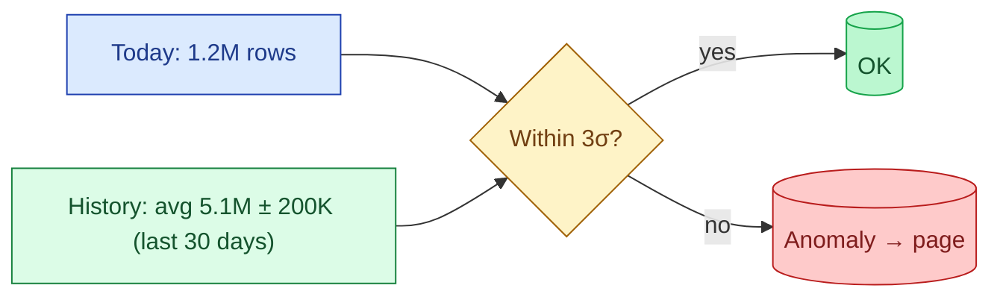

A volume test compares today's row count against expected. The expectation can be a hard threshold ("at least 1,000,000 rows") or a statistical bound ("within 3 standard deviations of the trailing 30-day average"). Sudden drops mean a source died. Sudden jumps mean a duplicate load. Both should page someone.

**What this page will cover.**

- Hard threshold vs rolling-window vs ML-based anomaly detection.
- The "trailing 30 days" rule and why it adapts to seasonality automatically.
- Per-source vs aggregated volume tests: where each catches different bugs.
- The duplicate-load signature: row count exactly doubles.
- Quiet failure detection: zero-row days that pass freshness but fail volume.
- Tools that ship anomaly detection out of the box (Monte Carlo, Anomalo, Soda, Elementary).

*Page coming soon.*

This concept sits in **Stage 6 (Reliability, debugging, cost)** of the [Data Engineering Roadmap](/practice/data-engineering/roadmap/).
