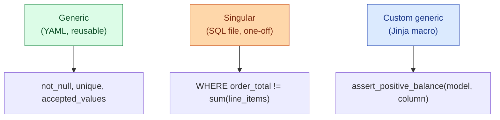

dbt has three test flavours. **Generic tests** are reusable across models, declared in YAML (`not_null`, `unique`, `accepted_values`, `relationships`). **Singular tests** are one-off SQL queries that should return zero rows if the data is correct. **Custom generic tests** are user-written, reusable building blocks. Knowing when to reach for which one is the whole skill.

**What this page will cover.**

- The four shipped generic tests and what they compile to.
- Writing a singular test: a SQL file under `tests/` that returns zero rows on success.
- Writing a custom generic test as a macro: parameterised, reusable, lives in `macros/`.
- The `dbt-expectations` and `dbt-utils` packages: the most useful additions.
- Test severity (`warn` vs `error`) and the CI gate that fails the PR.
- The "test every model, not just sources" rule and what it costs.

*Page coming soon. Until then, see [#089 Great Expectations vs dbt tests](/practice/data-engineering/089-great-expectations-vs-dbt-tests/) for the practice problem.*

This concept sits in **Stage 6 (Reliability, debugging, cost)** of the [Data Engineering Roadmap](/practice/data-engineering/roadmap/).
