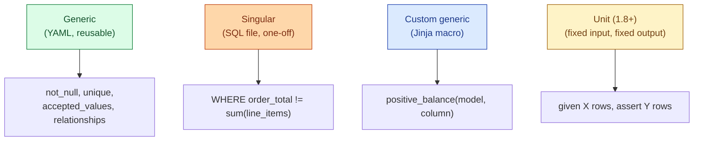
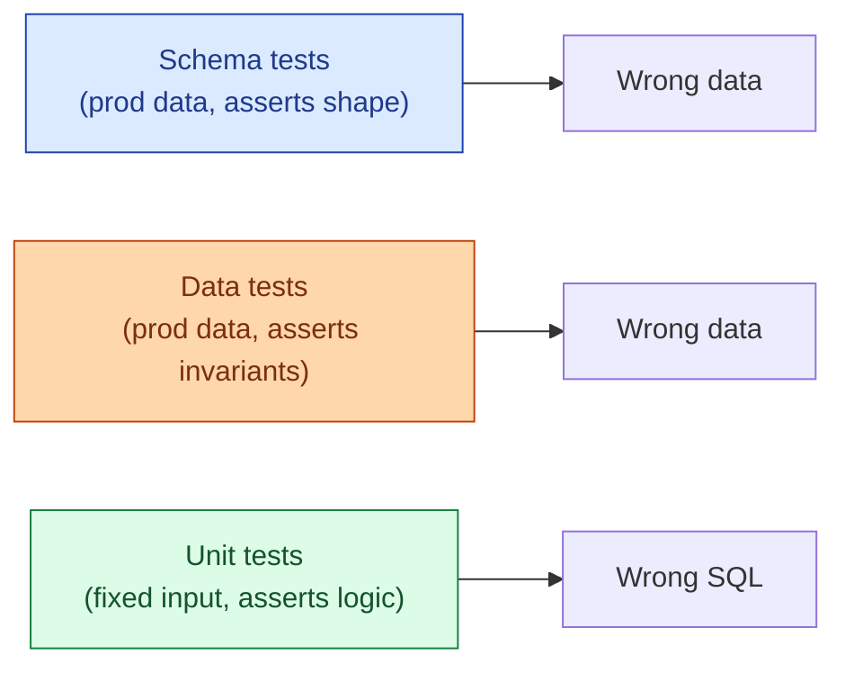

dbt has three test flavours, plus a fourth introduced in dbt 1.8. **Generic tests** are reusable, declared in YAML, parameterised by model and column. **Singular tests** are one-off SQL queries that should return zero rows when the data is correct. **Custom generic tests** are user-written, parameterised, reusable building blocks. **Unit tests** (dbt 1.8+) assert that a model produces a specific output for a specific input. Knowing which one to reach for is most of the skill.



## Generic tests

The four shipped tests. Declared in YAML, compiled into SQL that returns rows on failure.

```yaml
# models/schema.yml
models:
  - name: fact_orders
    columns:
      - name: order_id
        tests:
          - not_null
          - unique
      - name: status
        tests:
          - accepted_values:
              values: ['new','paid','shipped','cancelled']
      - name: customer_id
        tests:
          - relationships:
              to: ref('dim_customer')
              field: customer_id
```

Each generic test is a Jinja macro under the hood. `not_null` compiles to a `WHERE col IS NULL` query, `unique` to a `GROUP BY ... HAVING COUNT(*) > 1`, and so on. Full coverage of the four built-ins lives in [#045 Schema tests](/practice/data-engineering/concepts/045-schema-tests/).

## Singular tests

One SQL file under `tests/`. The query returns zero rows when the data is correct. dbt fails the test on any returned row.


```sql
-- tests/order_total_matches_line_items.sql
SELECT o.order_id,
       o.total                       AS order_total,
       SUM(l.line_total)             AS sum_lines
  FROM {{ ref('fact_orders') }} o
  JOIN {{ ref('fact_order_lines') }} l
    ON l.order_id = o.order_id
 GROUP BY o.order_id, o.total
HAVING o.total <> SUM(l.line_total)
```


Use a singular test when:

- The check is specific to one model and not worth generalising.
- The logic is business-specific (revenue reconciliation, regulatory rule, custom invariant).
- A quick "does this anomaly we saw last week reappear?" check.

A singular test that gets reused twice should be promoted to a custom generic test.

## Custom generic tests

When the same shape of check applies to many models or columns, write a custom generic test. It is a Jinja macro under `macros/` (or, more conventionally, under `tests/generic/`) that takes `model` and `column_name` as arguments.


```sql
-- tests/generic/positive.sql

SELECT {{ column_name }}
  FROM {{ model }}
 WHERE {{ column_name }} <= 0
   AND {{ column_name }} IS NOT NULL

```


Use it the same way as a built-in:

```yaml
- name: total_amount
  tests:
    - positive
- name: price
  tests:
    - positive
```

This is how teams build a vocabulary of domain-specific tests: `positive`, `within_tolerance`, `monotonically_increasing`, `not_in_future`. Once written, they are reusable across the whole project.

Two packages provide most of what teams write by hand:

- **dbt-utils**: `equal_rowcount`, `recency`, `at_least_one`, `expression_is_true`, and dozens more.
- **dbt-expectations**: port of Great Expectations into dbt, with statistical tests like `expect_column_values_to_be_between`.

Install one or both, write a custom test only when neither covers the case.

## Unit tests (dbt 1.8+)

The newest flavour, added in 2024. Unit tests assert that a model produces a specific output for a specific input. They run without touching the warehouse data; the test provides fixed rows and checks the SQL logic.

```yaml
# models/marts/mart_revenue.yml
unit_tests:
  - name: revenue_excludes_refunds
    model: mart_revenue
    given:
      - input: ref('fact_orders')
        rows:
          - {order_id: 1, total: 100, status: 'paid'}
          - {order_id: 2, total: 50,  status: 'refunded'}
          - {order_id: 3, total: 75,  status: 'paid'}
    expect:
      rows:
        - {revenue: 175}
```

The test runs the `mart_revenue` SQL against just those three rows and asserts the result is `{revenue: 175}`. The refund row is excluded; the two paid rows sum to 175.

Unit tests catch logic bugs that data tests cannot. A data test on production data can pass for years while the SQL is subtly wrong because the wrong values happen never to occur. A unit test exercises the logic with constructed inputs.



The rule of thumb: unit-test any model where the SQL implements meaningful business logic. Skip them on pure passthrough `SELECT * FROM ref(...)` models.

## Where tests run in the DAG

The `dbt build` command interleaves runs and tests in topological order. For each model: build it, run its tests, then move on. If a test fails (and severity is `error`), downstream models are skipped.

```
dbt build
├── run    fact_orders
├── test   fact_orders.order_id.not_null      PASS
├── test   fact_orders.order_id.unique        PASS
├── test   fact_orders.customer_id.rel        PASS
├── run    mart_revenue
└── test   mart_revenue.revenue.positive      PASS
```

This is the right order. The publish of `mart_revenue` waits on `fact_orders` having clean data. If `fact_orders` fails its tests, `mart_revenue` does not build, and no consumer sees a corrupt downstream.

## Severity and store_failures

Every test has a severity (`error` or `warn`) and an optional `store_failures`. The defaults are reasonable; the overrides matter at scale.

```yaml
- name: customer_id
  tests:
    - not_null:
        config:
          severity: error
          store_failures: true
          warn_if: ">0"
          error_if: ">10"
```

`store_failures: true` writes the failing rows to a small audit table. Now when the test fails, the runbook is "go look at `audit.dbt_test__fact_orders_customer_id_not_null` to see which rows."

This single setting saves hours of debugging per failure. Worth setting globally in `dbt_project.yml`:

```yaml
# dbt_project.yml
tests:
  +store_failures: true
  +schema: dbt_test_failures
```

## The "test every model" rule

The first-month version of the rule: every primary key gets `unique` + `not_null`. Every foreign key gets `relationships`. Every closed-set column gets `accepted_values`. Every model that participates in business logic gets at least one singular or custom test that captures an invariant.

The discipline ends up adding 30-50 lines of YAML per model. That feels like a lot. After a quarter, you notice the team has stopped finding bugs in dashboards because the tests catch them first. The payoff is bigger than the cost.

## CI gate, again

The single most valuable place to run all of these is in CI on every pull request.

```bash
# .github/workflows/dbt-ci.yml
- name: Run dbt build on modified models
  run: |
    dbt build --select state:modified+ \
              --defer --state ./prod-manifest \
              --vars '{"is_ci": true}'
```

`state:modified+` builds and tests the changed models and everything downstream. `--defer` uses the production manifest for unchanged upstreams, so the CI run does not rebuild the whole warehouse. A failing test blocks the merge.

The combination of unit tests in CI plus data tests in prod catches both classes of bug at the earliest possible moment.

## Common mistakes

- **Singular tests that should be custom generic.** Copy-pasting the same SQL into three test files is a sign to promote to a macro.
- **`store_failures: false` everywhere.** When the test fails, you have nothing to debug from.
- **Unit tests on passthrough models.** Wasted effort; the model has no logic to test.
- **Data tests on logic that needs unit tests.** Production data may never exercise the bug; unit tests force it.
- **Running `dbt test` separately from `dbt run`.** Use `dbt build`. The interleaving is the whole point.
- **No CI gate.** Tests in prod after the bug shipped are weaker than tests that block the PR.
- **One severity for everything.** Some checks are intrinsically noisy. Warn on those; error on hard invariants.

## Quick recap

- Four test flavours: generic (YAML), singular (one SQL file), custom generic (Jinja macro), unit (fixed input/output).
- Generic for shape, singular for one-offs, custom generic for shared patterns, unit for SQL logic.
- `dbt build` interleaves run and test so failures block downstream automatically.
- `store_failures: true` writes failing rows to an audit table. Set it everywhere.
- Install dbt-utils and dbt-expectations; write a custom test only when neither covers the case.
- Run the full test suite in CI on every PR. The cost is one CI build; the upside is no broken merges.

This concept sits in **Stage 6 (Reliability, debugging, cost)** of the [Data Engineering Roadmap](/practice/data-engineering/roadmap/).
